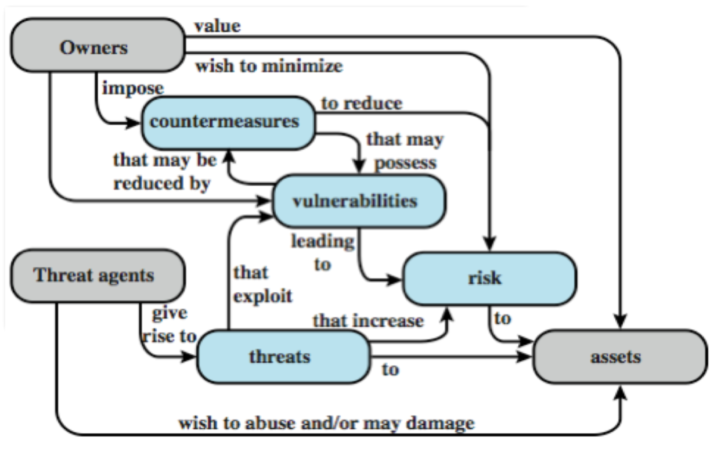

Computer security focuses on three fundamental questions:

- What assets are we protecting?
- How are those assets threatened?
- What can we do to counter those threats?

## Security for Individuals

Information security we want/expect from our personal computers and devices

- Our private data is not seen by others, and we want to define what 'others' means.
- Our data remains unchanged
- We can access our data when we want
  - Access is important

Therefore, we want **c**onfidentiality + **i**ntegrity + **a**vialability = CIA (lol).

### Example

Given a company, what will require protection? From what/whom?

**Confidentiality**:

- Stored data
- Communication (data in-flight)

**Integrity**:

- All stored data, all communication

**Availability**:

- Access to data, communications & services: for employees, for users/customers

## Computer Security Overview

The NIST defines the term **Computer Security** as

> The protection afforded to an automated information system in order to attain the applicable objectives of preserving the integrity, availability and confidentiality of information system resources.

That includes hardware, software, firmware, information/data, and telecommunications.

### Key Security Concepts

**Confidentiality**:

- Preserving authorized restriction on information access and disclose, including means for protecting personal privacy and proprietary information.

**Integrity**:

- Guarding against improper information modification or destruction, including ensuring information nonrepudiation and authenticity.

**Availability**:

- Ensuring timely and reliable access to, and use of, information.

---

Computer security is both fascinating and complex. Requirements seem straightforward, but the mechanisms used to meet those requirements can be complex and subtle.
When developing a security mechanism, one must always consider potential attacks (often unexpected) on such mechanism. Procedures used to provide particular services are often counter-intuitive. It is necessary to decide where to use which security mechanisms (both logical & physical).
Security mechanisms typically involve more than a particular algorithm or protocol, but also require participants to have secret information, leading to issues of creation, distribution, and protection of that secret information.

Computer security is essentially a battle between perpetrator who tries to find weaknesses and the designer or administrator, who tries to close them.
Attackers only need to find a single weakness, whereas the developer needs to find all the weaknesses. Many users and administrators perceive little benefit from security investment until a failure occurs.

Security requires regular monitoring which is difficult in today's short term environment. Unfortunately, security is still too often an afterthought - incorporated after the design is complete. **Security is a process, never a finished product**.

---

### Terminology

- **adversary** or **threat agent** - an entity that attacks, or is a threat to a system
- **attack** - an assault on system security that derives from an intelligent threat; a deliberate attempt to evade security services and violate security policy of a system
- **countermeasure** - an action, device, procedure, or a technique that reduces a threat, a vulnerability, or an attack by eliminating or preventing it, by minimizing the harm it can cause, or by discovering and reporting it so that corrective action can be taken
- **risk**: an expectation of loss expressed as the probability that a particular threat will exploit a particular vulnerability with a particular harmful result
- **security policy** - a set of rules and practices that specifies how a system or organization provides security services to protect sensitive and critical system resources
- **system resource** or **asset** - data; a service provided by a system; a system capability; an item of system equipment; a facility that houses system operations and equipment
- **threat** - a potential for violation of security, which exists when there is a circumstance, capability, or action that could breach security and cause harm
- **vulnerability** - flaw or weakness in a system's design, implementation, or operation and management that could be exploited to violate the system's security policy

#### Concepts and their relationships

### Vulnerability, Threats and Attacks

General vulnerability categories:

- *Corrupted* - e.g. does the wrong thing, stores the wrong data (loss of integrity)
- *Leaky* - revealing partial information (loss of confidentiality)
- *Unavailable* or very slow - system gets slow & overwhelmed (loss of availability)

Threats:

- Represent potential security harm
- Exploit vulnerabilities

Attacks

- Attacks are threats carried out
- Passive or active attempts to alter/affect system resources

### Countermeasures

Countermeasures are actions taken to mitigate or deal with an attack.

- prevention - using cryptography, firewalls
- detection/response - using intrusion detection systems, turn off services, trace intruder
- recovery - making backups
- residual vulnerabilities - countermeasures can introduce new vulnerability (e.g. Spectre vulnerability)
  - goal is to minimize residuals

### Outside and Inside Attacks

Who carries out attack?

**Insider**:

- Someone authorized to use the system
- Disgruntled employee?

**Outsider**:

- Someone who is not authorized to use the system

### Threat Consqeuences

**Unauthorized disclosure**

A circumstance or event whereby an entity gains access to data for which the entity is not authorized.

**Deception**

A circumstance or event may result in an authorized entity receiving false data and believing it to be true.

**Disruption**

A circumstance or event that interrupts or prevents the correct operation of system services and functions.

**Usurpation**

A circumstance or event that results in control of system services or functions by an unauthorized entity.

---

**Unauthorized disclosure** is a threat to confidentiality.

- Exposure: can be deliberate or can be the result of a human, hardware, or software error
- Interception: unauthorized access to data
- Inference: traffic analysis, use of limited access to get detailed information
- Intrusion: unauthorized access to sensitive data

#### Deception

A circumstance or event may result in an authorized entity receiving false data and believing it to be true.

**Deception** is a threat to either system or data integrity.

- Masquerade
- Falsification
- Repudiation

#### Disruption

A circumstance or event that interrupts or prevents the correct operation of system services and functions.

**Disruption** is a threat to availability or system integrity.

- Incapacitation
- Corruption
- Obstruction

#### Ususrpation

A circumstance or event that results in control of system services or functions by an unauthorized entity.

**Usurpation** is a threat to system integrity.

- Misappropriation
- Misuse
