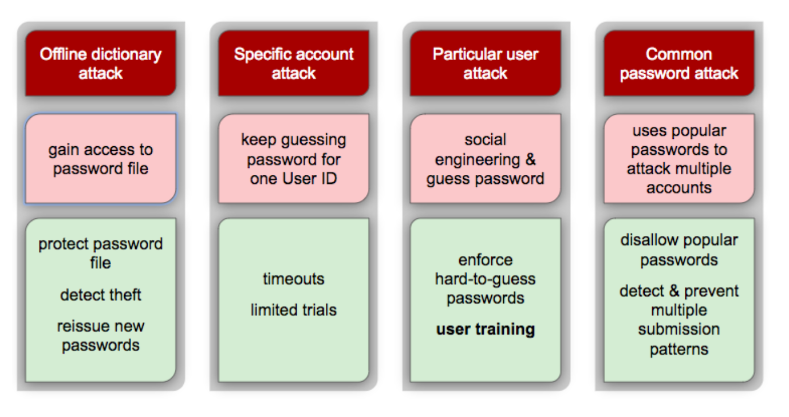
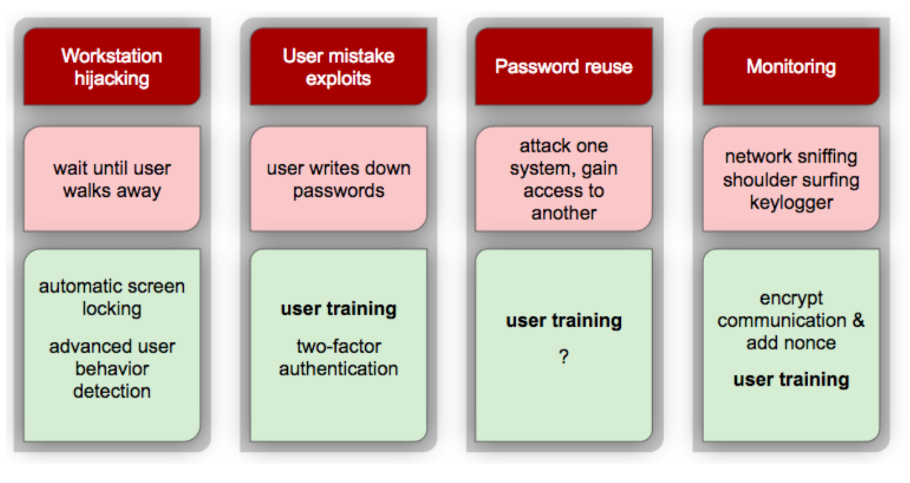
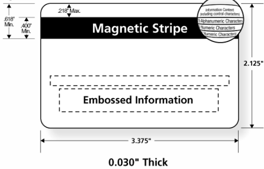

## Password Vulnerabilities & Attacks

## Means of Authenticating User Identity

| Something the individual knows   | Something the individual possesses (token) | Something the individual is | Something the individual does |
|----------------------------------|--------------------------------------------|-----------------------------|-------------------------------|
| Password                         | Barcode                                    | Fingerprint                 | Voice pattern                 |
| PIN                              | Smartcard                                  | Retina                      | handwriting                   |
| Answers to prearranged questions | Electronic keycard, physical key           | Face                        | typing rhythm                 |
|                                  |                                            |                             | gait                          |

### Physical token

Some physical thing that you have, for example:

- SecurID / Authenticator app
- Student ID card
- Credit card
- Password

Uses:

- Quick identification
- Authentication

Desired properties for authentication: **Difficult to forge, easy to use, cheap to manufacture**.

Physical tokens store digital information, e.g: barcodes, magnetic stripes. Some also include processing, e.g. smart card, RFID, SIM, smartphone authenticator.

#### Barcodes

Barcodes are very popular, they improve efficiency in retail, grocery stores. They are nothing more than printed labels that are scanned optically. Barcode reader scans pattern and convertes to code (number to string). Provides *Automatic identification and data capture* (AIDC).

- **1D Barcodes**: Linear barcodes
  - Data encoded by line widths and spacing of lines
  - Limited data capacity, ~10 digits
- **2D Barcodes**: Matrix barcodes
  - Many varieties
  - Grid based
  - Modern phones can read them
  - More data capacity than 1D codes, ~3kb binary
- **QR Codes**
  - Most popular 2D barcode
  - Used in ads, retail, packaging
  - Easy to sync
  - Two-factor authentication

##### Vulnerabilities

Barcodes are easy to read, which results in information leakage, and easy to generate, which can lead to forgery.

There are number of QR vulnerabilities:

- QR codes can and often encode a URL
  - Phone app scans barcode
  - Passes URL to browser
  - Browser goes directly to URL
- URL can point to a hacker's website $\to$ profit
- Phishing attack (**QRishing**)
- Drive by download exploit
  - using towelroot
- Automatically send SMS to premium #'s
- Browser exploits
  - access to camera, mic
  - browse data
  - send emails
  - join botnet & DDOS
- Exploit XSS
- Exploit other applications

##### Barcodes for Authentication

2D Barcodes are used in boarding passes:

- Created at flight check-in
- Scanned before boarding
- Main function: improve efficiency
- Originally had no cryptographic protection

Such barcodes were exploited and there existed boarding pass generator - **The Northwest Airlines Boarding Pass Generator**:

- created by a comp. sci. student
- it allowed users to create fake boarding passes
  - avoid no-fly-list
  - upgrade to business class

As a outcome, DHS/TSA revised their system. 2D barcode on boarding passes now includes cryptographic protection. Barcode is signed by a digital signature, using airline's private key. Therefore, TSA can check validity of the barcode by verifying the signature using public key.

---

Most coupons are just scannable barcodes:

- if you know the format of the barcode, you could forge your own coupons

---

**Lesson**: Barcodes alone do not provide the following

- Secure authentication
- Confidentiality

But in combination, with well designed process, they can still be useful.

#### Magnetic Stripe Card

Stripe cards were developed in 1960's. They store information and the information is readable by a scanner, Magnetic stripe cards have widespread use:

- Debit/credit cards
- Driver's license
- Student IDs

A magnetic stripe card is just a plastic card with magnetic tape. It was invented by an IBM engineer, his wife and hot iron. Magnetic tape contained in a plastic film. It was standardized by ISO:

- Size of card, location of stripe
- Data format of encoded information

Magnetic stripe contains multiple tracks, e.g.:

- *Track 1*: Card holder's full name, account number, format info
- *Track 2*: Account number, expiration date
- *Track 3*: Parity check

How secure are magnetic stripe cards?

- Nowadays, they are similar to barcodes
- Reader/writer devices and blank cards are cheap
- It's easy to reproduce

From security perspective they are the same as barcodes. To get security, additional factors are needed:

- PIN numbers
- Cryptography

#### Smart Cards

Smart cards include a computer chip + some memory. Memory is read & write and chip (microprocessor) reads & writes to memory. Smart cards use the same technology as SIM cards. They are **tamper resistant**.

Smart cards are capable of computation & communication:

- Executing protocols
- Often used with a PIN for 2-factor auth
- Application flexibility, security, storage, resistant to magnetic fields.

Types: contact, contactless, hybrid, dual.

##### Vulnerabilities

- System design flaw:
  - protocol design
  - protocol implementation
  - example:
    - EMV = a standard system for smart card payments. PIN is securely stored on the card encrypted, no PIN = no transaction. Due to poor EMV implementations, such as counters, timestmaps or proprietary algorithms to generate nonce, cards can be exposed to a "pre-play" attack, which is indistinguishable from card cloning from the standpoint of the logs available to the card-issuing bank, and can be carried out even if it is impossible to clone a card physically. ([Source](https://www.cl.cam.ac.uk/~rja14/Papers/unattack.pdf))
- Eavesdropping and communication tampering
  - between card and reader
  - between reader and backend
  - example:
    - A MITM attack can be planted between card and an ATM using hacked terminal.

Smart cards store secret keys and are capable of performing cryptographic operations. It is difficult to extract keys, but possible via reverse engineering.

- Intrusive methods:
  - Destroys the card (detectable)
  - Expensive and time consuming
  - Each card requires same amount of effort
  - Works on any card, without prior knowledge of hardware/software
- Non-intrusive methods:
  - Leaves card intact (undetectable)
  - Can be time consuming for the first card, but once a method is discovered for one type, it can be applied to multiple cards
  - Attacker may benefit from knowledge of hardware/software
  - **Side channel attacks**: information gained from physical implementation of a cryptosystem
    - Timing
    - Power consumption
    - Electromagnetic leaks
    - Sound

#### SIM Cards

SIM card is a type of smart card used in mobile devices, stands for Subscriber Identity Module. It is issued by a network provider. SIM cards typically store:

- Network specific information to identify & authenticate user
- Preferred roaming partners
- Emergency numbers
- Contact list

Each SIM card is uniquely tied to a record in the database of subscribers maintained by the network provider, through the following information:

- **ICCID**: Integrated Circuit Card ID
  - unique 20-22 digit hardware number
- **IMSI**: International Mobile Subscriber Identity
  - unique to each user
  - identifies the owner's country, network, and personal information
- **Ki**: 128-bit secret authentication key
  - unique to each user, used to authenticate a phone to a mobile network

Many SIM cards store a *personal PIN code*. It's required to access information on the card. Additionally, there exists a **PUC** (personal unblocking code) in case user forgets PIN.

##### GSM Challenge Response

To connect to a network:

1. Phone sends **IMSI** to base station
2. Base station looks up **IMSI** in the database
3. Base station sends back a challenge **C**
    - **C** is a random 128 bit number
4. Phone computes and sends back a response **R**
    - $R = A3(C, Ki)$
    - **A3** is a proprietary encryption algorithm
    - **R** is encrypted **C**
5. Base station computes its own response **R'** and compares to **R**
    - if $R = R'$, then the phone is authenticated

Communications between the subscriber and the base station can be encrypted. GSM uses proprietary crypto algorithms: A5/1, A5/2, A5/3. All have been reverse engineered and found to be weak.

#### RFID

**RFID** are small transponders that transmit identification information. RFID provides functionality similar to barcodes. Range: few cm to several meters. Consists of 2-3 components:

- Chip: stores information & performs basic computations
- Coiled antenna: receives/transmits information, also supplies power - **passive chip**
- Can include battery - **active chip**

RFID tags are used in various domains:

- Product tagging & tracking
- Animal tracking
- Car key fobs
- Books in libraries
- Electronic toll transponders

##### Privacy issues

- Sniffing
  - privacy implications
- Cloning
  - theft, authentication
- Modifying
  - integrity
- Disabling
  - DOS

These are difficult problems to solve. Must consider many disciplines: signal processing, hardware design, supply-chain logistics, privacy rights, cryptography

#### ePassports

Modern passports have embedded RFID chip. For example Canadian ePassport:

- Passive chip
- 10cm scanning distance
- Stores personal information, same as page 2, and a digitized picture
- No biometrics yet

ePassport provides tampering protection: *passive authentication* (PA)

- During production all readable data is digitally signed by government
- During verification the signature is verified

Unauthorized reading protection: *basic access control* (BAC)

- At most 10cm distance
- The birthdata, expiration date and passport number from a key
- The key needs to be fed into the reader to access the data

Clone protection: *active authentication* (AA):

- Unique public/private key for each RFID chip
- Private key cannot be read therefore cannot be copied
- Challenge-response protocol verifies the passport has the correct private key
  - The public key is signed by the government and included in the PA
