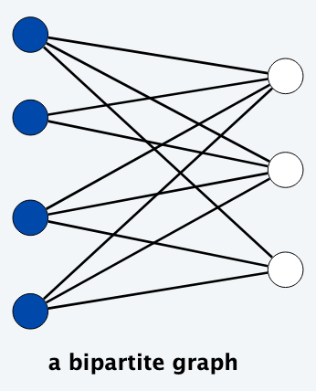
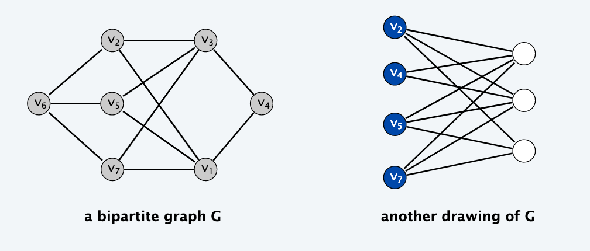
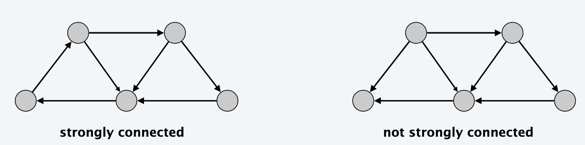
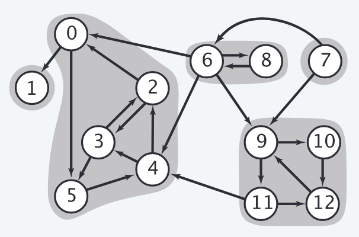
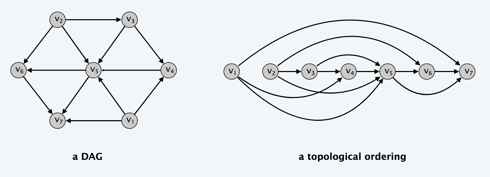

Notation for graphs: $G = (V, E)$

- $V$ - set of nodes/vertices
- $E$ - set of edges between pairs of nodes

Graphs capture pairwise relationship between objects. Graph size parameters: $n = |V|$, $m = |E|$.

## Adjacency matrix

Adjacency matrix is a n-by-n matrix with $A_{uv} = 1$, if $(u, v)$ is an edge:

- There are two representations of each edge
- Space proportional to $n^2$
- Checking if $(u, v)$ is an edge takes $\Theta(1)$ time
- Identifying all edges takes $\Theta(n^2)$ time

## Adjacency list

Adjacency lists are node-indexed arrays of lists:

- Two representations of each edge
- Space is $\Theta(m + n)$
- Checking if $(u, v)$ is an edge takes $O(degree(u))$ time, where degree is number of neighbors of $u$
- Identifying all edges takes $\Theta(m + n)$ time

## Paths and connectivity

A **path** is an undirected graph $G$ that contains a sequence of nodes with property that each consecutive pair $v_{i - 1}, v_i$ joined by an edge in $E$. A path is **simple** if all nodes are distinct. An undirected graph is **connected** if for every pair of nodes $u$ and $v$, there is a path between $u$ and $v$.

A **cycle** is a path in which $v_1 = v_k$, $k > 2$ and the first $k - 1$ nodes are all distinct.

### Trees

An undirected graph is a **tree** if it is connected and does not contain a cycle. Let $G$ be an undirected graph on $n$ nodes. Any two of the following statements imply the third:

- $G$ is connected
- $G$ does not contain a cycle
- $G$ has $n - 1$ edges

## Connectivity

**$s-t$ connectivity problem** given two nodes $s$ and $t$, is there a path between them?. **$s-t$ shortest path problem** given two nodes $s$ and $t$, what is the length of a shortest path between $s$ and $t$?

### Breadth-first search (BFS)

The simplest algorithm to determine $s-t$ connectivity. BFS explores nodes outward from $s$ in all possible directions, adding nodes one layer at a time. Steps performed by BFS:

1. $L_0 = \{s\}$
2. $L_1 = \text{ all neighbors of } L_0$
3. $L_2 = \text{ all nodes that do not belong to  } L_0 \text{ or } L_1 \text{ and that have an edge to a node in } L_1$
4. $L_{i + 1} = \text{ all nodes that do not belong to an earlier layer and that have an edge to a node in } L_i$

```
BFS(s):
  discovered[s] = true
  for all nodes v:
    discovered[v] = false

  initialize L[0] = [s]
  layer counter i = 0
  BFS tree T = {}

  while L[i] is not empty:
    L[i + 1] = []

    for each node u in L[i]:
      (u, v) = edge incident to u 
      if not discovered[v]:
        discovered[v] = true
        T.push((u, v))
        L[i + 1].add(v)

    i += 1
```

The above implementation of the BFS algorithm runs in $O(m + n)$ if the graph is given by the adjacency list representation.

**Theorem**. For each $i$, $L_i$ consists of all nodes at distance exactly $i$ from $s$. There is a path from $s$ to $t$ if and only if $t$ appears in some layer.

BFS produces a tree $T$, rooted at $s$ on the set of nodes reachable from $s$. Specifically, for each node $v$ (other than $s$).

**Property**. Let $T$ be a BFS tree of $G = (V, E)$ and let $(x, y)$ be an edge of $G$. Then, the levels of $x$ and $y$ differ by at most 1.

**Analysis of BFS**:

**Theorem**. The above implementation of BFS runs in $O(m + n)$ time if the graph is given by its adjacency representation.

**Proof**:

- Easy to prove $O(n^2)$ running time:
  - at most $n$ lists $L[i]$
  - each node occurs on at most one list; for loop runs $\leq n$ times
  - when we consider node $u$ there are $\leq n$ incident edges $(u, v)$
  - and we spend $O(1)$ processing each edge
- Actually runs in $O(m + n)$ time:
  - when we consider node $u$, there are $degree(u)$ incident edges $(u, v)$
  - total time processing edges is $\Sigma_{u \in V} degree(u) = 2m$

#### Connected Component

The set of nodes discovered by the BFS algorithm is precisely those reachable from the starting node $s$. Let $R$ be the **connected component** of $G$ containing $s$. Once the connected component is known, we can simply check whether $t$ belongs to it in order to determine $s-t$ connectivity.

```
R will consist of nodes to which s has a path
R = {s}
while there is an edge (u, v), where u in R and v not in R:
  add v to R
```

Upon termination, $R$ is the connected component containing $s$.

### Depth-first Search (DFS)

DFS algorithm explores $G$ by going as deeply as possible and only retreating when necessary.

```
DFS(u):
  mark u as 'explored' and add u to R
  for rach edge (u, v) incident to u:
    if v is not 'explored':
      DFS(v)
```

To apply this to $s-t$ connectivity problem, we simply declare all nodes initially to be not explored and invoke `DFS(s)`.

DFS and BFS are similar in a way that they both build the connected component containing $s$. While DFS visits the same set of nodes that BFS does, it does it in a different order.

## Bipartite Graphs

An undirected graph $G = (V, E)$ is **bipartite** if the nodes can be colored blue or white such that every edge has one white and one blue end.



Many graph problems become:

- **Easier** if the underlying graph is bipartite (matching)
- **Tractable** if the underlying graph is bipartite (independent set)



**Lemma**. If a graph $G$ is bipartite, it cannot contain *odd-length cycle*.

**Lemma**. Let $G$ be a connected graph and let $L_0, ..., L_k$ be the layers produced by BFS starting node $s$. Exactly one of the following holds:

- No edge in $G$ joins two nodes of the same layer, and $G$ is bipartite
  - **Proof**. Suppose no edge joins two nodes in same layer. By BFS property, each edge joins two nodes in adjacent levels. Bipartition: white = nodes on odd levels, blue = nodes on even levels.
- An edge of $G$ joins two nodes of the same layer, and $G$ contains an odd-length cycle and hence not bipartite
  - **Proof**. Suppose $(x, y)$ is an edge with $x, y$ in the same level $L_j$. Let $z = lca(x, y)$ = lowest common ancestor. Let $L_i$ be a level containing $z$. Consider cycle that takes edge from $x$ to $y$, then path from $y$ to $z$, then path from $z$ to $x$. Its length is $1 + (j - i) + (j - i)$ which is odd.


**Corollary**. A graph is bipartite if and only if it contains no odd-length cycle.

## Connectivity in Directed Graphs

**Direct reachability**: Given a node $s$ find all nodes reachable from $s$. **Directed $s-t$ shortest path problem**: given two nodes $s$ and $t$ what is the length of a shortest path between them.

BFS extends naturally to directed graphs.

### Strong Connectivity

Nodes $u$ and $v$ are **mutually reachable** if there is both a path from $u$ to $v$ and also a path from $v$ to $u$. A graph is **strongly connected** if a pair of nodes is mutually reachable.

**Lemma**. Let $s$ be any node. $G$ is strongly connected if and only if every node is reachable from $s$ and $s$ is reachable from every node.

**Algorithm**:

**Theorem**: Can determine if $G$ is strongly connected in $O(m + n)$ time.

**Proof**:

- Pick any node $s$
- Run BFS from $s$ in $G$
- Run BFS from $s$ in $G^{reverse}$ (reverse orientation of every edge in $G$)
- Return `true` iff all nodes reached in both BFS executions
- Correctness follows immediately from previous lemma.



#### Strong Components

A **strong component** is a maximal subset of mutually reachable nodes.

**Theorem**: can find all strong components in $O(m + n)$ time.



**Theorem**. Can find all strong components in $O(m + n)$ time.

## Directed Acyclic Graphs and Topological Ordering

A **DAG** is a directed graph that contains no directed cycles. A **topological order** of a directed graph $G = (V, E)$ is an ordering of its nodes as $v_1, v_2, \ldots, v_n$ so that every edge $(v_i, v_j)$ we have $i < j$.



**Precedence constraints**: edge $(v_i, v_j)$ means task $v_i$ must occur before $v_j$.

**Lemma**. If $G$ has a *topological order*, then $G$ is a DAG. **Proof** (by contradiction):

- Suppose that $G$ has a topological order $v_1, v_2, ..., v_n$ and that $G$ also has a directed cycle $C$.
- Let $v_i$ be the lowest indexed node in $C$ and let $v_j$ be the node just before $v_i$, therefore $(v_j, v_i)$ is an edge
- we have $i < j$
- Since $(v_j, v_i)$ is an edge and $v_1, v_2, ..., v_n$ is a topological order, we must have $j < i$, a contradiction

**Lemma**. If $G$ has a topological order, then $G$ is a DAG.

**Lemma**. If $G$ is a DAG, then $G$ has a node with no entering edges. **Proof** (by contradiction):

- Suppose that $G$ is a DAG and every node has at least one entering edge
- Pick a node $v$ and begin following edges backwards from $v$. Since $v$ has at least one entering edge $(u, v)$ we can walk backward to $u$
- Then since $u$ has at least one entering edge $(x, u)$ we can walk backward to $x$
- Repeat until we visit $w$ twice
- Let $C$ denote the sequence of nodes encountered between successive visits to $w$. $C$ is a cycle.

**Lemma**. If $G$ is a DAG, then $G$ has a topological ordering. **Proof** (by induction on n):

- Base case: true if n = 1
- Given DAG on $n > 1$ find a node $v$ with no entering edges
- $G - \{v\}$ is a DAG since deleting $v$ cannot create cycles
- By inductive hypothesis, $G - \{v\}$ has a topological ordering
- Place $v$ first in topological ordering, then append nodes of $G - \{v\}$
- In topological order. This is valid since $v$ has no entering edges

**Theorem**. Algorithm finds a topological order in $O(m + n)$ time. **Proof**:

- Maintain the following information;
  - `count(w)` = remaining number of incoming edges
  - S = set of remaining nodes with no incoming edges
- Initialization: $O(m + n)$ via a single scan through graph
- Update: to delete $v$:
  - remove $v$ from $S$
  - decrement `count(w)` for all edges from $v$ to $w$ and add $w$ to $S$ if `count(w) == 0`
  - $O(1)$ per edge
