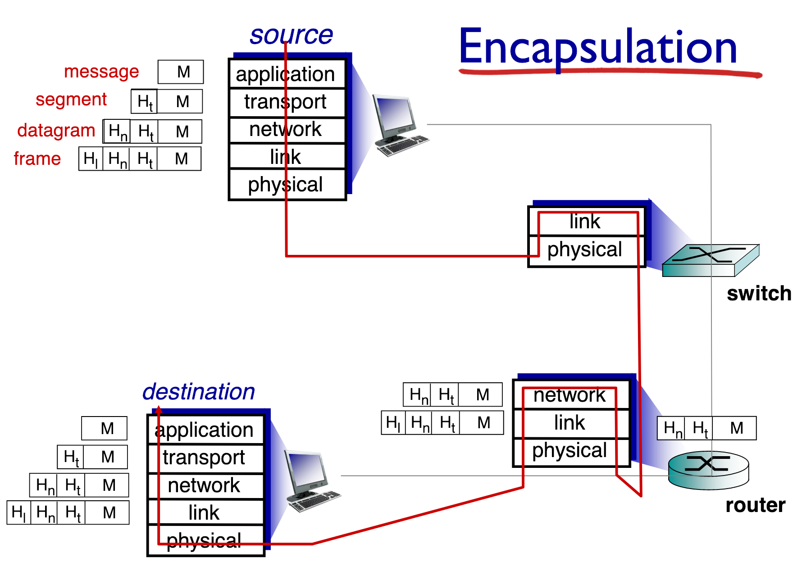

## What is the Internet?

The Internet is a computer network that interconnects millions of devices throughout the world. All of these devices are called **hosts** or **end systems**.

End systems are connected together by a network of **communication links** and **packet switches**. Different links can transmit data at different rates, with the **transmission rate** of a link measured in bps (bits/second). When one host sends data to another, the sending host segments the data and adds header bytes to each segment. The resulting packages of information, called **packets**, are then sent through the network to the destination host, where they are reassembled into the original data.

A packet switch takes a packet arriving on one of its incoming communication links and forwards packeton one of its outgoing communication links. **Routers** and **link-layer switches** are used the most for forwarding packets toward their ultimate destinations.

### A Services Description

End systems attached to the Internet provide **API** that specifies how a program running on one end of the system asks the Internet to deliver data to a specific destination program running on another end system.

### Network Protocols

A **protocol** defines the format and the order of messages exhanged between two or more communicating entities, as well as the actions taken on the transmission and/or receipt of a message or other event.

## The Network Edge

Network edge contains hosts, clients and servers. Servers often in data centers. At the edge, networks organized as small **access networks**. Edge is connected to the core through **edge routers**.

### Access networks

**Access network** is the network that physically connects an end system to the first router (known as **edge router**) on a path from the end system to any other end system.

#### Digital Subscriber Line (DSL)

A residence typically obtains DSL Internet access from the same telephone company that provides its wired local phone. Each customer's DSL modem uses the same telephone cable. DSL connection therefore is dedicated to the user (e.g. not shared like cable).

## The Network Core

The core is a mesh of interconnected routers. **Packet-switching**: hosts break down data in packages.

### Packet-switching

Delay is calculated using this formula: $D = \frac{L}{R}$

End to end (E2E) transmission delay, with router in the midle:

$$
\frac{L}{R} + \frac{L}{R} = \frac{2L}{R}
$$

### Transmitting Multiple Packets

If we have to send N packets:

<!--```sequence-->
<!--A->B-->
<!--```-->


$$
D = N \times \frac{L}{R} + \frac{L}{R}
$$

### Delay, Loss, and Throughput in Packet-Switched Networks

1. Delay calculation:

$$
d_{propagaion} = \frac{d}{S} \\
d_{packet} = \frac{L}{R} \\
d = d_{packet} + d_{propagarion}
$$

2. Another calculation example

```
     d
[L]   <--->
[A] --- (x) --- [B]
     R       R

```

### Queueing delay

Router with a lot of load will have queueing delay.

- $R$: Link bandwidth (bps)
- $L$: Packet length (bits)
- $\lambda$: average packet arrival

<mark>**Traffic intensity**</mark> = $\frac{L\lambda}{R}$

- $\frac{L\lambda}{R}$ ~ 0: average queueing delay small
- $\frac{L\lambda}{R}$ >= 1: average queueing delay large
- $\frac{L\lambda}{R}$ > 1: more "work" arriving, than can be serviced, average delay infinite.

### Throughput

**Throughput** rate (bits/time unit) at which bits transferred between sender/receiver. There are two different "types" of throughput:

- **Instantaneous**: rate at given point in time
- **Average**: rate over longer period of time

Throughput: what is the maximum data you can send? you want to see how fast you can send, while sending as much as you can.

- Scenario 1:
  ```
  [A] ----- [B]
        R
  ```

  - You can send bits at $R$
  - $Tput = R$

- Scenario 2:

    ```
    [A] --- (x) --- [B]
         R1      R2
    ```

    - $Tput = min(R_1, R_2)$

---

## Protocol Layers, Service Models

Networks are complex. There are many pieces to it:

- hosts
- routers
- links of various media
- applications
- protocols
- hardware, software

### Protocol Layers

Network components are organized into "layers". Each of these layers are stored in specific order. Also called *protocol stack*. Each layer implements some service:

- via its own internal-layer actions
- relying on service provided on layer below

Layering helps dealing with complex systems. Explicit structure allows identification, relationship of complex system's pieces.

<!-- finish -->

#### Internet protocol stack

```
web browser process  App   Web Server
                     TCP
[a]                 ----- [b]
 |
 | TCP
 |
[c] Facebook
```

#### ISO/OSI Reference model

### Encapsulation



What if an application wants to send a message to the destination application running on another end system. They are separated by a number of switches & routers.

- have to break it down to packets
  - packets at the application layer called: layer packet
  - packets at the transport layer called: segments
  - network layer: IP datagram
  - link: frames
  - physical: no notion of packets, just signals

Every layer encapsulates layer from above by adding headers. Then we de-encapsulate it.
