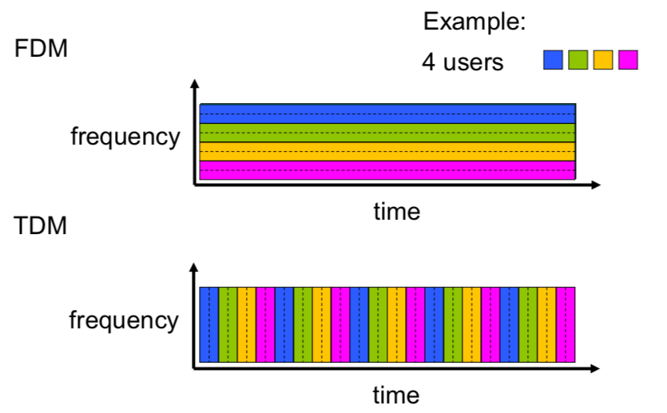
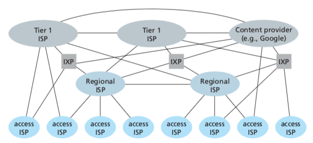
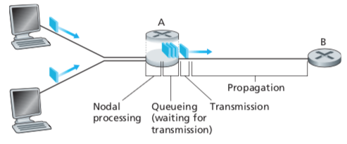

## What is the Internet?

The Internet is a computer network that interconnects millions of devices throughout the world. All of these devices are called **hosts** or **end systems**.

End systems are connected together by a network of **communication links** and **packet switches**. Different links can transmit data at different rates, with the **transmission rate** of a link measured in bps (bits/second). When one host sends data to another, the sending host segments the data and adds header bytes to each segment. The resulting packages of information, called **packets**, are then sent through the network to the destination host, where they are reassembled into the original data.

A packet switch takes a packet arriving on one of its incoming communication links and forwards packeton one of its outgoing communication links. **Routers** and **link-layer switches** are used the most for forwarding packets toward their ultimate destinations.

### A Services Description

The Internet can be described as an infrastructure that _provides services to applications_. End systems attached to the Internet provide **API** that specifies how a program running on one end of the system asks the Internet to deliver data to a specific destination program running on another end system.

### Network Protocols

A **protocol** defines the _format and the order of messages_ exchanged between two or more communicating entities, as well as the actions taken on the transmission and/or receipt of a message or other event. The **Transmission Control Protocol** and the **Internet Protocol** are two of the most important protocols in the Internet.

## The Network Edge

Network edge contains hosts, clients and servers. Servers often located in data centers. At the edge, networks organized as small **access networks**. Edge is connected to the core through **edge routers**.

### Access networks

**Access network** is the network that physically connects an end system to the first router (known as **edge router**) on a path from the end system to any other end system.

#### Home access to the Internet

**Digital Subscriber Line (DSL)**

A residence typically obtains DSL Internet access from the same telephone company that provides its wired local phone. Each customer's DSL modem uses the same telephone cable. DSL connection therefore is dedicated to the user (e.g. not shared like cable).

**Cable network**

The Internet is obtained through existing television (_coaxial_) cable. A network of cable (or fiber) attaches houses to ISP, however the connection is **shared** between the users, unlike DSL, which provides dedicated access.

#### Wireless access networks

Shared wireless access network connects end system to router via "access point" station.

## The Network Core

The core is a mesh of interconnected routers. **Packet-switching**: hosts break down data in packages. The goal of packet switching is to forward packets from one router to the next, across links on path from source to destination. Each packet transmitted at _full link capacity_.

Key network core functions:

- **Routing**: determines source-destination route taken by packets.
- **Forwarding**: move packets from router's input to appropriate router output.

### Packet-switching

In a network application, end systems exchange **messages** with each other. To send a message from a source end system to destination end system, the source breaks long messages into smaller chunks of data known as **packets**. Between source and destination, each packet travels through communication links and **packet switches**.

**Store-and-forward**

Most packet switches use **store and forward** transmission at the inputs, which means a packet switch must receive the entire packet before it can begin to transmit the first bit of the packet onto the outbound link.

Consider the general case of sending one packet from source to destination over a path consisting of $N$ links each of rate $R$ (thus, there are $N - 1$ routers). End-to-end (E2E) delay is calculated using the following formula:

$$
D_{end-to-end} = N \cdot \frac{L}{R}
$$

**Queueing delay, loss**

Each packet switch has multiple links. For each attached link, the packet switch has an **output buffer** (also called **output queue**), which stores packets that the router is about to send into that link. If the link is busy, the arriving packet must wait in output buffer. In addition to the store-and-forward delays, packets suffer **queueing delays**. Packets can be dropped (lost) if buffer fills up, which results in **packet loss**.

### Circuit switching

In circuit switched networks, the resources needed along the path to provide for communication between end systems, are _reserved_ for the duration of the communication between end systems. There is no sharing of connection between different end systems: each end system gets its own connection.

A circuit in a link is implemented with either **frequency-division multiplexing (FDM)** or **time-division multiplexing (TDM)**.

**FDM**

The frequency spectrum of a link is divided up among the connection established across the link. Specifically, the link dedicates a frequency band to each connection _for the duration of the connection_.

**TDM**

For a TDM link, time is divided into frames of fixed duration, and each frame is divided into a fixed number of slots. When the network establishes a connection across a link, the network dedicates one time slot in every frame to this connection.



### Packet switching vs. Circuit switching

For example, consider:

- 1 Mb/s link
- each user:

  - uses 100 kb/s
  - active 10% of the time

- Circuit switching
  - 10 users (1Mbps/100kbps)
- Packet switching
  - with 35 users, the probability that there are 11 or more active users is approximately 0.0004.

In this example, packet switching provides same performance as circuit switching but allows more users.

Packet switching is more suitable for bursty data: resource sharing, simpler setup.

### Network of networks

End systems connect to the Internet via **access ISPs**. Access ISPs must be interconnected, so that any two hosts can talk to each other. Evolution of resulting network of networks was driven by economics and national policies.



## Delay, Loss, and Throughput in Packet-Switched Networks

As a packet travels from one node to the subsequent node in the network, the packet suffers from several types of delays at _each_ node:

- **Processing delay**
- **Queueing delay**
- **Transmission delay**
- **Propagation delay**



---

**Processing delay**

The time required to examine the packet's header and determine where to direct the packet is part of the <mark><b>processing delay</b></mark>.

**Queueing delay**

At the queue, the packet experiences a <mark><b>queueing delay</b></mark> as it waits to be transmitted onto the link. The length of the queueing delay of a specific packet will depend on the number of earlier-arriving packets that are queued and waiting for transmission onto the link.

**Transmission delay**

<mark><b>Transmission delay</b></mark> is the amount of time required to push (transmit) all of the packet's bits into the link.

$$
d_{trans} = \frac{L}{R}
$$

Where, $L$ is packet length in bits, and $R$ is the link capacity in bps.

**Propagation delay**

The time required to propagate from beginning of the link to router B is the <mark><b>propagation delay</b></mark>. The bit propagates at the propagation speed of the link, usually $2 \cdot 10^8 m/s$ to $3 \cdot 10^8 m/s$.

$$
d_{prop} = \frac{d}{s}
$$

Where, $s$ is propagation speed, and $d$ is distance between two end systems.

---

Total **nodal delay**

$$
d_{nodal} = d_{proc} + d_{queue} + d_{trans} + d_{prop}
$$

1. Delay calculation:

$$
d_{prop} = d/S \\
d_{packet} = L/R \\
d = d_{packet} + d_{prop}
$$

### Queueing delay

Router with a lot of load will have queueing delay.

- $R$: Link bandwidth (bps)
- $L$: Packet length (bits)
- $\lambda$: average packet arrival

<mark><b>Traffic intensity</b></mark> = $\frac{L\lambda}{R}$

- $\frac{L\lambda}{R}$ ~ 0: average queueing delay small
- $\frac{L\lambda}{R}$ >= 1: average queueing delay large
- $\frac{L\lambda}{R}$ > 1: more "work" arriving, than can be serviced, average delay infinite.

**Packet loss**

Queue preceding link in buffer has finite capacity. Packet arriving to full queue is dropped (or lost). Lost packet may be retransmitted by previous node, by source end system, or not at all.

### Throughput

**Throughput** rate (bits/time) at which bits transferred between sender/receiver. There are two different "types" of throughput:

- **Instantaneous**: rate at given point in time
- **Average**: rate over longer period of time

Throughput: what is the maximum data you can send? you want to see how fast you can send, while sending as much as you can.

- Scenario 1:

  ```
  [A] ----- [B]
        R
  ```

  - You can send bits at $R$
  - $Tput = R$

- Scenario 2:

  ```
  [A] --- (x) --- [B]
       R1      R2
  ```

  - $Tput = min(R_1, R_2)$

---

## Protocol Layers, Service Models

Networks are complex. There are many pieces to it:

- hosts
- routers
- links of various media
- applications
- protocols
- hardware, software

### Protocol Layers

Network components are organized into "layers". Each of these layers are stored in specific order. Also called _protocol stack_. Each layer implements some service:

- via its own internal-layer actions
- relying on service provided on layer below

Layering helps dealing with complex systems. Explicit structure allows identification, relationship of complex system's pieces.

#### Internet protocol stack

- Application: supporting network applications
  - FTP, SMTP, HTTP(S)
- Transport: process-process data transfer
  - TCP, UDP
- Network: routing of datagrams from source to destination
  - IP, routing protocols
- Link: data transfer between neighbouring network elements
  - Ethernet, 802.11 (wifi), PPP
- Physical: bits on the wire

#### ISO/OSI Reference model

The ISO proposed computer network organization called **Open Systems Interconnection (OSI)**, that's organized around seven layers:

- application
- **presentation**
- **session**
- transport
- network
- link
- physical

**Presentation**

Allow applications to interpret meaning of data, e,g, encryption, compression

**Session**

Synchronization checkpointing, recovery of data exchange.

Internet stack missing these layers, however, they can be implemented in application layer, if needed.

### Encapsulation


What if an application wants to send a message to the destination application running on another end system. They are separated by a number of switches & routers.

- have to break it down to packets
  - packets at the application layer called: **layer packet**
  - packets at the transport layer called: **segments**
  - network layer: **IP datagram**
  - link: **frames**
  - physical: no notion of packets, just **signals**

Every layer encapsulates layer from above by adding headers. Then we de-encapsulate it.
