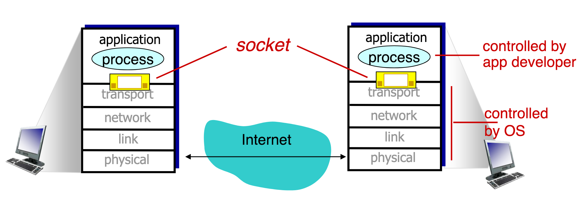
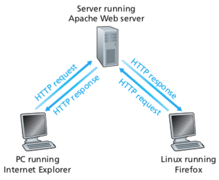
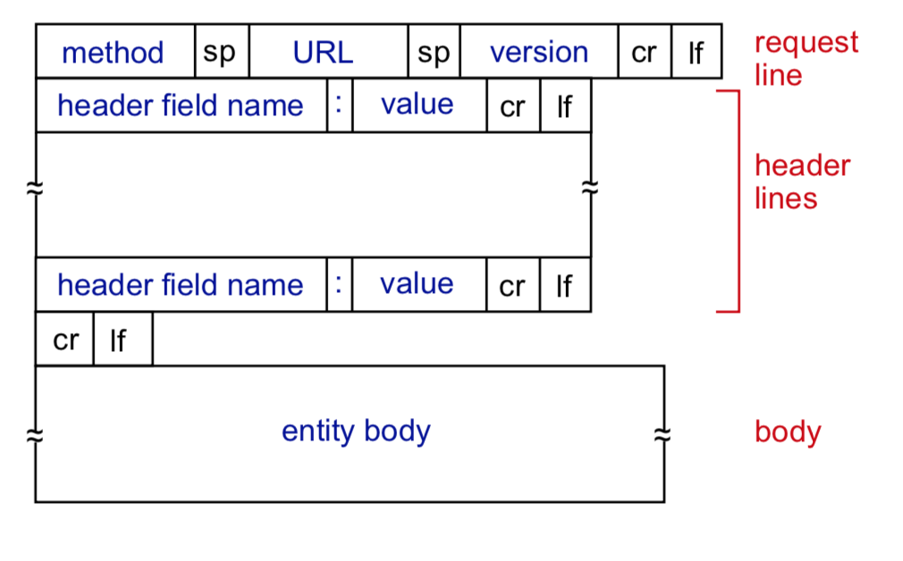
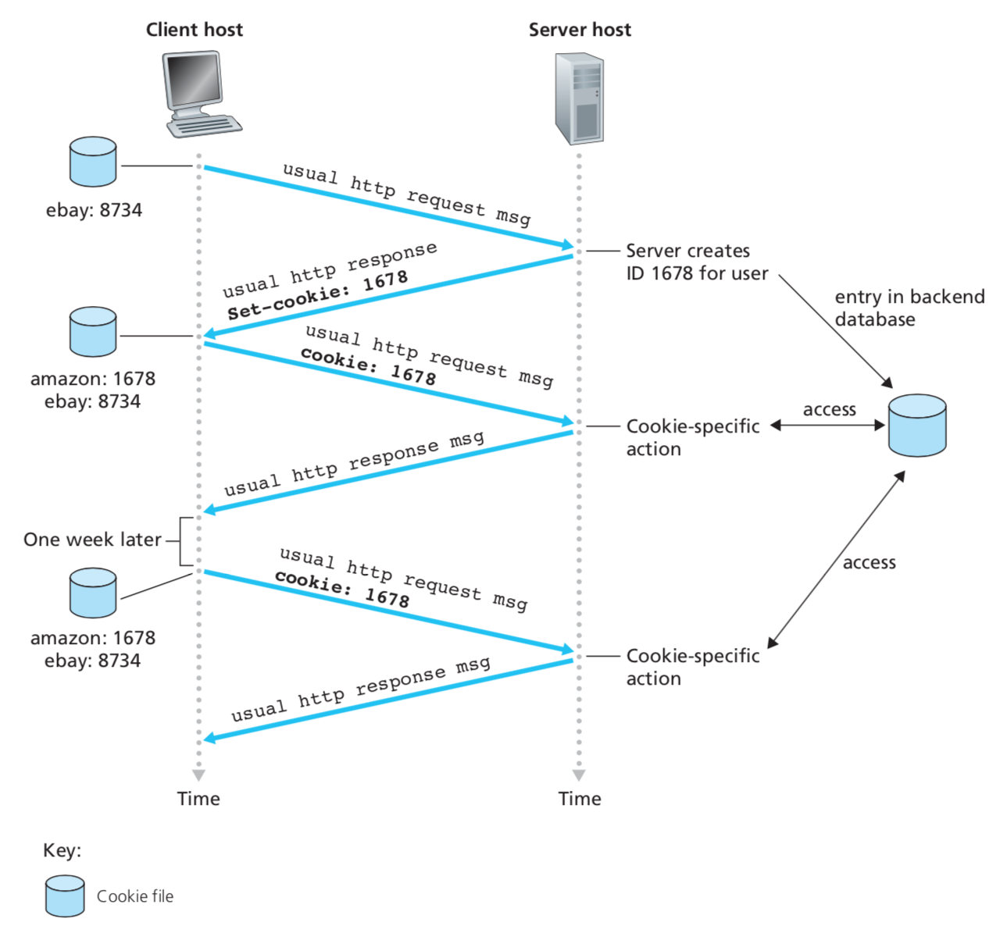
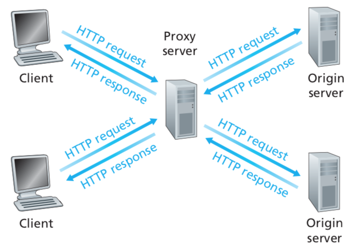

At the core of network application development is writing programs that run on different hosts and communicate with each other over the network. One example is communication between browser and server.

There is no need to write software for network-core devices. Network core devices do not run user applications. Applications on end systems allow for rapid app development propagation.

Because of the layer design, when developing application, we need only to know is how to talk to transport layer. There is no need to learn other layers. When you want to develop a network application, you don't have to worry _how_ transport layer is implemented.

Possible structure of applications:

- Client-server
- Peer-to-peer (P2P)

### Client-server architecture

In a **client-server** architecture, there is an always-on host, *server*, which serves requests from many other hosts called *clients*.

**Client**:

- Communicate with server
- May be intermittently connected
- May have dynamic IP addresses
- Do not communicate directly with each other

**Server**:

- Always-on host
- permanent IP address
- data centers for scaling

### P2P architecture

There's no always-on server. In P2P, regular end-systems contain both server and client sides. Peers request service from other peers, provide service in return to other peers. One good aspect of P2P, is **self-scalability** - new peers bring new service capacity as well as service demands. Peers are intermittently connected and change IP addresses. In terms of management, P2P is complex.

## Processes communicating

**Process** is a programm running within a host. Within same host, two processes communicate using **inter-process communication** (defined by OS).

Process that starts communicating called **client process**. The process that's waiting for communication, called **server process**.

### Sockets

The API of the transport layer is called **Socket**. Process sends/receives messages to/from its **socket**. Socket is analogous to door:

- sending processes shoves message out of the door
- sending process relies on transport infrastructure on other side of door to deliver message to socket at receiving process



The socket API was initially developed as a part of Unix system. The socket API on Windows was implemented later. Due to differences between two OS, Windows implements different API, called WinSocket.

### Addressing Processes

We need addressing mechanism to uniquely identify hosts and servers. To receive messages, processes must have some **identifier**. Host device has unique 32-bit IP address.

Process IDs are called port numbers. The combination of IP and port will uniquely identify host in the network. By default, HTTP servers use port 80.

## Transport servers for applications

Many networks, including the Internet, provide more than one transport-layer protocol. Developer must choose one of the available protocols.

### What transport service does an app need?

- **Data integrity**:
  - if protocol provides guaranteed data delivery service, it is said to provide data integrity or *reliable data transfer*.
  - some apps can tolerate some amount of loss (e.g. audio)
- **Timing**:
  - some applications require low delay in order to be effective
- **Throughput**:
  - some applications guaranteed to request $r bps$ of throughput, so protocol would then ensure that the available throughput is always at least $r bps$
    - useful for VoIP
  - *elastic applications* make use of whatever throughput they get
    - useful for email, web transfers
- **Security**:
  - service that provides various security services (e.g. encryption, data integrity)

### Internet transport protocol layers

The Internet makes two transport protocols available to applications: UDP and TCP.

#### TCP Services

The TCP service model includes a connection-oriented service and a reliable data transfer service. Therefore, application that invokes TCP receives both of these services from TCP.

- *Connection-oriented service*. TCP has the client and server exchange transport layer control information with each other *before* the application-level messages begin to flow. After the handshaking phasem a **TCP connection** is established between the sockets of two processes.
- *Reliable data service*. The communicating processes can rely on TCP to deliver all data sent without errors and in the proper order.

TCP also includes a congestion-control mechanism. The TCP congestion-control mechanism throttles a sending process when the network is congested between sender and receiver.

#### UDP Services

UDP is a lightweight transport protocol, providing minimal services. UDP is connectionless, therefore there's no handshaking process before two processes start to communicate.

UDP provides unreliable data transfer service - when a process sends a message into a UDP socket, UDP provides no guarantee that the message will ever reach the receiving process. Messages also do not arrive in the order they were sent in.

UDP service does not include a congestion-control mechanism, so the sending side of UDP can keep sending data at any rate.

## Web and HTTP

Web page consists of base HTML file which includes several referenced objects. Objects can be pretty much anything. Each object is addressable by a URL.

### HTTP Overview

HTTP stands for Hypertext transfer protocol. HTTP is web's application layer protocol. HTTP follows client-server model:

- **client**: applications that request, receive (using HTTP protocol) and display web objects
- **server**: Web server sends (using HTTP protocol) objects in response to requests.

HTTP uses TCP as its transport protocol. The client first initiates a TCP connection with the server (using port 80). Once the connection is established, the browser and the server processes access TCP through their socket interfaces.



HTTP is stateless: server maintains no information about past client requests.

### Non-Persistent and Persistent HTTP Connections

When client-server interaction is taking place over TCP, it should be decided whether each request/response pair has to be sent over *separate* TCP connections, or all of the requests and their responses have to be sent over the *same* TCP connection. In the former approach, the application is said to use **non-persistent connections** and in the latter approach, **persistent connections**.

#### Non-persistent HTML

Suppose a user wants to browse a page that consists of a HTML and 10 images. All 11 objects reside on the same server.

1. The HTTP client process initiates a TCP connection to the server on port 80. Associated with the TCP connection, there will be a socket at the client and a socket at the server
2. The client sends an HTTP request to the server via socket. The request includes the path name to `index.html`
3. The server process receives the request message via its socket, retrieves the `index.html` object, encapsulates the object in an HTTP response message and sends the object back via its socket
4. The server process tells TCP to close the TCP connection
    - **Note**: TCP connection doesn't terminate until client has received the response message intact
4. The client receives the message. TCP connection terminates. The message indicates that the encapsulated object is an HTML file. The client extracts the file from the response message, parses `index.html`, and finds references to the 10 images
5. First four steps are repeated for each referenced image/object

The connection **does not persist** for all objects - for every object there has to be a TCP connection open.

RTT - time that it takes for package to travel from client to server and back.

Non persistent HTTP response time is $2RTT + \text{File transmission time}$. If object is small, then time is negligible, however if object is large then response time would be big. For example, time to get the page with 10 images would take:

$$
\text{base html} = 2RTT \\
\text{each object will} = 2RTT \\
\text{total time to get page} = 2RTT + 10*2RTT
$$

##### Non persistent connection with pipelining

As a result, a client will need to open multiple parallel TCP connections and then send one request for each connection. For previous example, it will take $4RTT$.

#### Persistent HTML

With persistent connections, the server leaves TCP connection open after sending a response. Subsequent requests and responses between same client and server can be sent over the same connection. In particular, an entire page can be sent over a single persistent TCP connection. Typically, the HTTP server closes a connection when it isn't used for some time.

For previous example them, the total time will be $3RTT$.

### HTTP messages

There are two types of HTTP messages: **request** and **response**. Both request and response messages have same format, both have a request line, and HEAD lines.

#### Request



Request messages are written in **ASCII** text. Messages also consist of several lines. The first line of an HTTP request message is called **request line**; the subsequent lines are called the **header lines**. Request line contains the method type. There can be several different values:

- `GET`
  - The majority of HTTP request messages use `GET` method. The `GET` method is used when the browser requests an object
- `POST`
  - An HTTP client uses `POST` requests to send forms. With a `POST` message, the user is still requesting a web page from the server, but the specific contents of the web page depend on what user entered into the form fields
- `HEAD`
  - Similar to `GET`; when a server receives `HEAD`, it responds with an HTTP message, but leaves out the requested object
- `PUT`
  - Allows user to upload an object to a specific path (directory) of a web server
- `DELETE`
  - Allows user to delete an object from the server

Header lines can contain various parameters. The information provided by the host header line is required for Web proxy caches. By including `Connection: close`, the browser is telling the server to close connection after sending the requested object. The `User-agent:` specifies client's browser type.

#### Response

Response message contains three sections: initial **status line**, **header lines**, and the **entity body**. The entity body contains the requested object itself. The status line contains the protocol version a status code and a corresponding status message.

#### Cookies

HTTP server is stateless, it allows simples server design and permits to develop high performance servers that can handle many simultaneous TCP connections. However, websites sometimes need to identify users, either because server wishes to restrict some access or because it wants to serve content to that specific user. For these purposes, HTTP uses cookies.

Cookies allow sites to keep track of users. Cookie technology has four components:

1. A cookie header line in the HTTP response message
2. A cookie header line in the HTTP request message
3. A cookie file kept on the **user's** end system and managed by the user's browser
4. a backend database of the website



### Web caches (proxy server)

A **web cache** - also called **proxy server** - is a network entity that processes HTTP requests on behalf of origin server. The web cache has its own disk storage and keeps copies of recently requested objects in the storage. 



As an example, suppose a browser is requesting the object `http://www.example.com/file.gif`:

1. The browser establishes a TCP connection to the web cache and sends HTTP request for the object to the web cache.
2. The web cache checks to see if it has a copy of the object stored locally. If it does, web cache returns the object within an HTTP response message to the client browser.
3. If the web cache doesn't have the object, the web cache opens a TCP connection to the origin server. The web cache then sends an HTTP request for the object into the cache-to-server TCP connection. After receiving this request, the origin server sends the object within an HTTP response to the web cache.
4. When the web cache receives the object, it stores a copy in its local storage and sends a copy within an HTTP response message to the client browser over the existing TCP connection between web cache and client.

Web cache acts as a client *and* server at the same time. When it receives requests from and send responses to a browser, it is a *server*. When it sends requests to and receives responses from an origin server, it is a *client*.

## Email Protocol

Email infrastructure has three components. **User agents**, **mail servers**, **SMTP, simple mail transfer protocol**.

SMTP uses (secure) TCP to transfer email messages, it operates on port 25.

<!-- mail server <-> webserver  <-> client -->

## DNS

DNS is one of the core functionalities, but it is provided on the application level. Hosts has to implement it.

The primary functionality of DNS is to map human readable URLs to IP addresses, that are understandable by the network layer protocol.

**Domain Name System (DNS)** is a distributed database. It is implemented in hierarchy of many *name servers*.

Application-layer protocol: hosts <!-- FINISH -->

### Structure, services

- DNS provides host aliasing.
- DNS can be used for load distribution
  - replicates web servers: many IP addresses correspond to one name

DNS isn't centralized due to several reasons:

- single point of failure
- traffic volume
- distant centralized database
- maintenance

**Example** of DNS hierarchical database:

#### Root name servers

#### TLD, authoritativ servers

Top-level domain (TLD) servers are responsible for com, org, net, edu, .. etc and all top level country domains, e.g.: uk, ca, ru. Network Solutions maintains servers for .com TLD.

Authoritative DNS servers contain organization's own DNS serve(s), providing authoritative hostname to IP mappings for organization's named hosts.

#### Local DNS name server

Each ISP has one local DNS, also called "default name server". When host makes DNS query, query is sent to its local DNS server. It contains local cache of recent name-to-address translation pairs. Also acts as proxy, forwards query into hierarchy.

```mermaid-svg
a --> local dns
local dns --> server
```

## P2P Applications

<!-- TODO -->

## Video streaming and Content Distribution Networks (CDNs)

### DASH

**DASH** stands for **D**ynamic, **A**daptive **S**treaming over **H**TTP. Server divides video into multiple chunks and each chunk is stored, each chunk is also encoded at different rates. *Manifest file* provides URLs for different chunks.

Client periodically measures server-to-client bandwidth, consults manifest, requests one chunk at a time. Client chooses maximum coding rate sustainable given current bandwidth. Client can also choose different coding rates at different points in time (depending on available bandwidth at time).

### CDN

How to stream content to hundreds of thousands of simultaneous users? The solution is to store multiple copies of videos at multiple geographically distributed sites - CDN. So, CDN servers are pushed closer to users.

<!-- TODO: add info from the book -->


