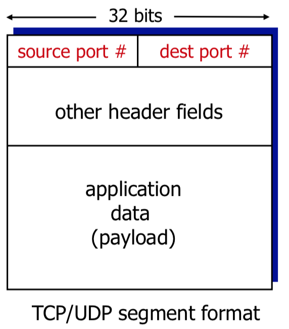
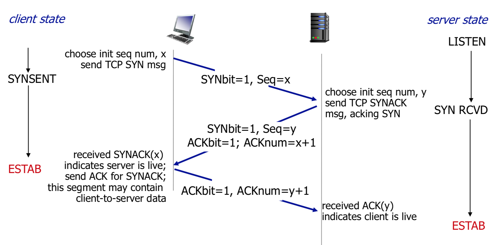
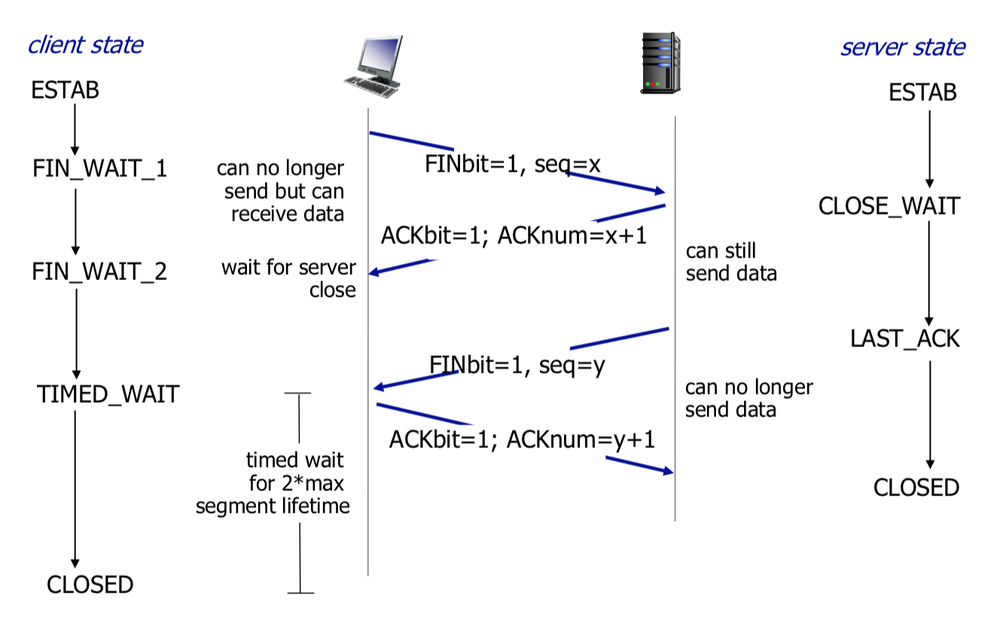

A transport layer protocol provides for **logical communication**. *Logical communication* means that from an application's perpective, it is as if the hosts running the processes were directly connected; in reality, the hosts may be far away from each other, connected via numerous routers. Application processes use the logical communication provided by the transport layer to send messages to each other, without having to worry about physical infrastructure used to deliver these messages.

Transport layer protocols are implemented in the end systems, but not in networks routers:

- On the *sending side*, the transport layer converts the application layer messages it receives from a sending application process into transport layer **segments**.
- On the *receiving side*, the network layer extracts the transport layer segment from the datagram and passes the segment up to the transport layer. The transport layer then processes the received segment and sends it to the receiving application.

There are more than one transport protocol available to applications. The ones that are used in the Internet are TCP and UDP.

**Relationship between transport and network layers**:

- *Network layer*: logical communication between hosts.
- *Transport layer*: logical communication between processes. It relies on and enhances network layer services.

## Overview of the Transport Layer in the Internet

The Internet makes two distinct transport layer protocols available to the application level. One of those is **UDP** (User Datagram Protocol), which provides unreliable, connectionless service to the invoking application. The second one is **TCP** (Transmission Control Protocol), which provides a reliable, connection oriented service to the invoking application. When designing a network application, an application developer must specify one of these two protocols.

The Internet’s network-layer protocol has a name—IP, for Internet Protocol. IP provides logical communication between hosts. The IP service model is a **best-effort delivery service**. This means that IP makes its “best effort” to deliver segments between communicating hosts, *but it makes no guarantees*. In particular, it doesn't guarantee segment delivery, it doesn't guarantee orderly delivery of segments, and it doesn't guarantee the integrity of the data in the segments. For these reasons the IP is said to be an **unreliable service**.

The most fundamental responsibility of UDP and TCP is to extend IP’s *delivery service* between two end systems to a delivery service between two processes running on the end systems. Extending host-to-host delivery to process-to-process delivery is called **transport-layer multiplexing** and **demultiplexing**.

## Multiplexing and demultiplexing

At the destination host, the transport layer has the responsibility of delivering the data in the received segments. Each received transport-layer segment has a set of fields in the segment to determine appropriate socket for each segment. At the receiving end, the transport layer examines these fields to identify receiving sockets and direct segments to those sockets.

**Demultiplexing** is the process of delivering the data in a transport-layer segment to the correct socket. The job of gathering data chunks at the source host from different sockets, encapsulating each data chunk with header information, that later will be used in *demultiplexing*, to create segments, and passing the segments to the network layers is called **multiplexing**.

In a host, transport-layer multiplexing requires:

1. that sockets have unique identifiers
2. that each segment have special fields taht indicate the socket to which the segment is to be delivered

Therefore, a **source port number** and **destination port number** is specified in a segment. Each port number is a 16-bit number. The port numbers ranging from 0 to 1023 are reserved and called **well-known port numbers**.

Each socket in the host could be assigned a port number, and when a segment arrives at the host, the transport layer examines the destination port number in the segment and directs the segment to the corresponding socket. The segment's data then passes through the socket into the attacked process.

Mux/demux communication:

- one-to-many communication, with UDP server
- one-to-many communication, TCP communication:
  - TCP: one socket to one client

---

- **Multiplexing (mux) at sender**: handle data from multiple sockets, add transport header (later used for demultiplexing).
- **Demultiplexing (demux) at receiver**: use header info to deliver received segments to correct sockets.

**How demultiplexing works?**

Host receives IP datagrams:

- each datagram has source IP address, destination IP address
- each datagram carries one transport-layer segment
- each segment has source port and destination port

Host uses **IP addresses & port numbers** to direct segment to appropriate socket.



### Connectionless multiplexing and demultiplexing

> Connectionless multiplexing and demultiplexing is done using UDP protocol

Suppose a process in Host A, with UDP port 19157, wants to send a chunk of application data to a process with UDP port 46428 in Host B. The transport layer in Host A creates a transport-layer segment that includes the application data, the source port number, the destination port number, and two other values. The transport layer then passes the resulting segment to the network layer. The network layer encapsulates the segment in an IP datagram and makes a best effort attempt to deliver the segment to the receiving host. If the segment arrives at the receiving Host B, the trasnport layer at the receiving host examines the destination port number and deliveres the segment to its socket identified by destination port. As UDP segments arrive from the network, Host B directs, or *demultiplexes*, each segment to the appropriate socket by examining the segment's destination port number.

The source port number serves as part of a "return address" - when B wants to send a segment back to A, the destination port in the B-to-A segment will take its value from the source port value of the A-to-B segment.

### Connection-oriented multiplexing and demultiplexing

> Connection-oriented multiplexing and demultiplexing is done using TCP protocol

A TCP socket is identified by a four-tuple: (source IP, source port, destination IP, destination port). Thus when a TCP segment arrives from the network to a host, the host uses all four values to direct, or *demultiplex*, the segment to the appropriate socket. In contrast with UDP, two arriving TCP segments with different IP addresses or source ports will be directed to two different sockets.

Server host may support many simultaneous TCP sockets since with each socket attached to a process and with each socket identified by its own four-tuple. When a TCP segment arrives at the host, all four fileds are used to direct the segment to appropriate socket.

## Connectionless transport: UDP

UDP does as little as a transport protocol can do. Aside from multiplexing/demultiplexing function and some light error checking it adds nothing to IP. UDP takes messages from application process, attaches source and destination port number fields for multiplexing/demultiplexing service and two other small fields, and passes the resulting segment to the network layer. The network layer then encapsulates the transport layer segment into an IP datagram and then makes the **best effort** attempt to deliver the segment to the receiving host. If the segment arrives at the receiving host, UDP uses the destination port to deliver the segment's data to the correct application process. *Note* since that there is no handshaking between sending and receiving transport layer entities, UDP is said to be **connectionless**.

For some application UDP is better suited for following reasons:

- *Finer application-level control over what data is sent and when*. As soon as an application process passes data to UDP, UDP will package the data inside a UDP segment and immediately pass the segment to network layer. Useful when building real-time applications, since we do not want delay segment transition and can tolerate some data loss. TCP will not be good fit due to its congestion control and packet delivery guarantee (p.199).
- *UDP doesn't establish connection, therefore less or no delay*. In case with TCP there's a three-way handshake before the data is transferred. UDP simply sends the data. Thus UDP does not introduce any delay to establish a connection. (hence why DNS is using UDP rather than TCP - DNS would be much slower if it ran over TCP).
- *No connection state*. TCP maintains connection state in the end systems. State information is needed for TCP congestion control. UDP on the other hand does not track any of parameters.
- *Smaller header size*. TCP segment has <mark>**20 bytes**</mark> of overhead, UDP has only <mark>**8 bytes**</mark>

### UDP Segement Structure

The UDP header has only four fields, each consulting of 2 byes:

- Source port number
- Destination port number
- Length field, specifies number of bytes in UDP segment (header + data)
- Checksum, used by the receiving host for error checking

#### UDP Checksum

The goal of checksum is to detect errors in transmitted sender. The checksum is used to determine whether bits within the UDP segment have been altered. UDP at the sender performs **1s complement of the sum of all the 16bit words in a segment** with any overflow encountered during the sum being wrapped around. The result is put in a checsum field.

For example, calculation of checksum at *sender*:

```
     1 1 1 0 0 1 1 0 0 1 1 0 0 1 1 0
+    1 1 0 1 0 1 0 1 0 1 0 1 0 1 0 1
     - - - - - - - - - - - - - - - -
   1 1 0 1 1 1 0 1 1 1 0 1 1 1 0 1 1   // wrap around extra 1
+                                  1
     - - - - - - - - - - - - - - - -
sum  1 0 1 1 1 0 1 1 1 0 1 1 1 1 0 0
csum 0 1 0 0 0 1 0 0 0 1 0 0 0 0 1 1
```

UDP provides a checksum because there is no guarantee that all the links between source and destination provide error checking.

**Sender**:

- Treat segment contents, including header fields, as sequence of 16-bit integers
- Checksum: addition (one's complement sum) of segment contents
- Sender puts checksum value into UDP checksum field

**Receiver**:

At the receiver, 16bit words are added, including the checksum. If no errors are introduced into the packet, then the sum at the receiver will be all 1's. If one of the bits is a 0, then we know that there is an error

Checking checksum at the receiver:
```
     1 1 1 0 0 1 1 0 0 1 1 0 0 1 1 0
+    1 1 0 1 0 1 0 1 0 1 0 1 0 1 0 1
     0 1 0 0 0 1 0 0 0 1 0 0 0 0 1 1
     - - - - - - - - - - - - - - - -
   1 1 0 1 1 1 0 1 1 1 0 1 1 1 0 1 1   // wrap around extra 1
+                                  1
     - - - - - - - - - - - - - - - -
     1 0 1 1 1 0 1 1 1 0 1 1 1 1 0 0
+    0 1 0 0 0 1 0 0 0 1 0 0 0 0 1 1
     - - - - - - - - - - - - - - - -
     1 1 1 1 1 1 1 1 1 1 1 1 1 1 1 1
```

## Principles of reliable data transfer

### RDT 1.0

### RDT 2.0

- In real life there are probabilities that checksum will get corrupted, but for this example, checksum is perfect.
- Add a sequence number to packets to deal with packet duplicates
  - checksum will detect sequence number corruption
  - only two sequence numbers are needed (0 & 1)

#### Flaw

What happens if ACK/NAK corrupted?

- sender doesn't know what happened at the receiver
- can't just retransmit possible duplicate

To handle duplicate packets:

- sender retransmits current packet if ACK/NAK corrupted
- sender adds **sequence number** to each packet
- receiver discards (doesn't deliver up) duplicate packet

### RDT 2.1

### RDT 2.2: a NAK-free protocol

Same functionality as RDT2.1, using ACKs only. Instead of NAK, receiver sends ACK for last packet received OK. Receiver must *explicitly* include sequence number of packet being ACKed. Duplicate ACK at sender results in same action as NAK: *retransmit current packet*.

NAK behavior is implemented through *duplicate ACK*.

### RDT 3.0: Channels with errors *and* loss

New assumption: underlying channel can also lose packets (data, ACKs). Checksum, sequence number, ACKs, retransmissions will help, but not by much. Approach: Sender will have a timer; sender waits "reasonable" amount of time for ACK. The time is average round-trip time for packet to get to the server and back. It will retransmit if no ACK received in this time. If packet (or ACK) just delayed and not lost: retransmission will be duplicate, but sequence numbers already handles this. This approach requires countdown timer.

#### Performance

Thruput = amt of data transmitted in 1 round / duration of 1 round = L/(L/R + RTT) (more important to know than U_{sender})

RDT 3.0 is correct, but performance is bad. e.g. 1 Gbps link, 15 ms prop. delay, 8000 bit packet:

$$
D_{trans} = \frac{L}{R} = \frac{8000 \text{bits}}{10^9 \text{bits/s}} = 8 \cdot 10^{-6} s
$$

$U_{sender}$: **Utilization** - fraction of time sender busy sending:

$$
U_{sender} = \frac{D_{trans}}{RTT + D_{trans}} = \frac{0.008}{30.008} = 0.00027
$$

And throughput:

$$
Tput = \frac{8000}{D_{trans} + 30 \cdot 10^{-3}} = 33 kB(yes)/s
$$


if $RTT = 30msec$, 1 KB packet every 30 msec: $33 kB/s$ throughput over 1Gbps link.

### Pipelined protocols

**Pipelining**: sender allows multiple "in-flight", yer ro be acknowledged packets.

Go-back-N (easier to implement for both sender and receiver):

- Sender can have up to $N$ unacked packets in pipeline
- receiver only sends **cumulative ack**
  - doesn't ack packet if there's a gap
- Sender has timer for oldest unacked packet
  - when timer expires, retransmit *all* unacked packets

Selective Repeat:

- Sender can have up to $N$ unacked packets in pipeline
- Receiver sends **individual ack** for each packet
- Sender maintains timer for each unacked packet
  - when timer expires, retransmit only that unacked packet


#### Go-Back-N


#### Selective Repeat


## Connection-oriented transport: TCP

### Segment structure

### Reliable data transfer

### Connection management

## TCP congestion control

### Segment structure

SampleRtt

$$
EstimatedRTT = (1 - a) * EstimateRTT + a * SampleRTT
$$

$$
dev = |EstimatedRTT - SampledRTT| \\
DevRTT = (1 - b) * DevRTT + b_{dev}
$$

## Connection-Oriented Transport: TCP

TCP creates reliable data transfer service on top of IP's unreliable service:

- pipelined segments
- cumulative acks
- single retransmission timer

### TCP Sender events

Data received from app:

- create segment with sequence number
- sequence number is byte-stream number of first data byte in segment
- start timer if not already running
  - think of timer as for oldest unacked segment
  - expiration interval `TimeOutInterval`

Timeout:

- **retransmit segment that caused timeout**
- restart timer

ack received:

- if ack acknowledges previously unacked segments
  - update what is known to be acked
  - start timer if there are still unacked segments

### TCP Fast Retransmit

Time-out period often relatively long: long delay before resending lost packet. Detect lost segments via duplicate ACKs:

- sender often sends many segments back-to-back
- if segment is lost, there will likely be many duplicate ACKs

**TCP fast retransmit**: If sender receives 4 ACKs for same data ("triple duplicate ACKs"), resend unacked segment with smallest seq #:

- likely that unacked segment lost, so don't wait for timeout

### Connection Management

Before exchanging data, sender/receiver establish a **handshake**:

- agree to establish connection (each knowing the other willing to establish connection)
- agree on connection parametes

```java
Socket client = new Socket("hostname", "port nuumber");
Socket connectionSocket = serverSocket.accept();
```

#### 3-way handshake



#### Closing a connection

Client, server each close their side of connection: send TCP segment with FIN bit = 1. Respond to received FIN with ACK.



## TCP Congestion Control

Informally, congestion is when too many sources sending too much data too fast for **network** to handle. Manifestations:

- lost packets (buffer overflow at routers)
- long delays (queueing in router buffers)

The solution for resolving congestion control is to ask sources to reduce their **sending rate**.

Let say there's a sender and a receiver with $R bps$ link between them:

```
[] ===== []
     R
```

the goal is to fluxuate around available bandwidth. every time a packet loss is occured, sending rate is decreased by 2. (e.g. was at 10, moved to 5).
First part called slow start, the fluxuation part is called congestion avoidance

**Approach**: sender increases transmission rate (window size), probing for usage bandwidth, until loss occurs:

- **additive increase**: increase `cwnd` (congestion window) by 1 MSS every RTT unltil loss detected
- **multiplicative decrease**: cut `cwnd` in half after loss

$$
TcpTput = \frac{cwnd}{RTT} bytes/s
$$

By default `cwnd` is measured in bytes.

### Detecting, reacting to loss

- Loss indicated by timeout
  - `cwnd` set to 1 MSS
  - window then grows exponentially (as in slow start) to a threshold, then grows linearly
- Loss indicated by 3 duplicate ACKs
  - duplicate ACKs indicate network is capable of delivering some segments
  - `cwnd` is then cut in half, window then grows linearly

### Throughput

W - max window for tcp connection - max possible throughput
W/2 - min window for tcp connection - min possible throughput
3/4(W) - avg window - average possible throughput
W = R * RTT

max throughput = max w/rtt = w / rtt (max throughput in any round)
min throughput = min w/rtt = w/2 / rtt
avg throughput = avg w/rtt = 3/4w / rtt
