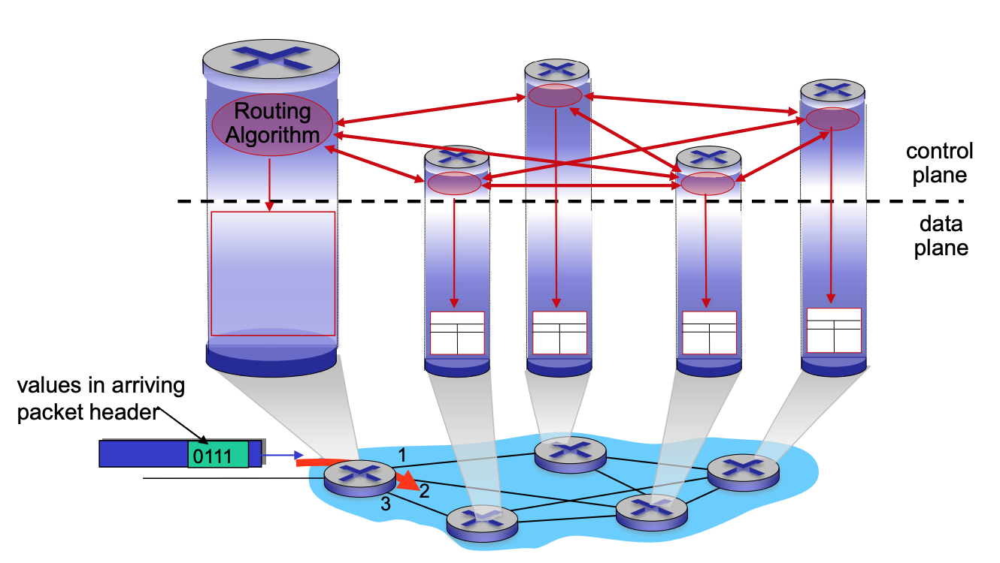
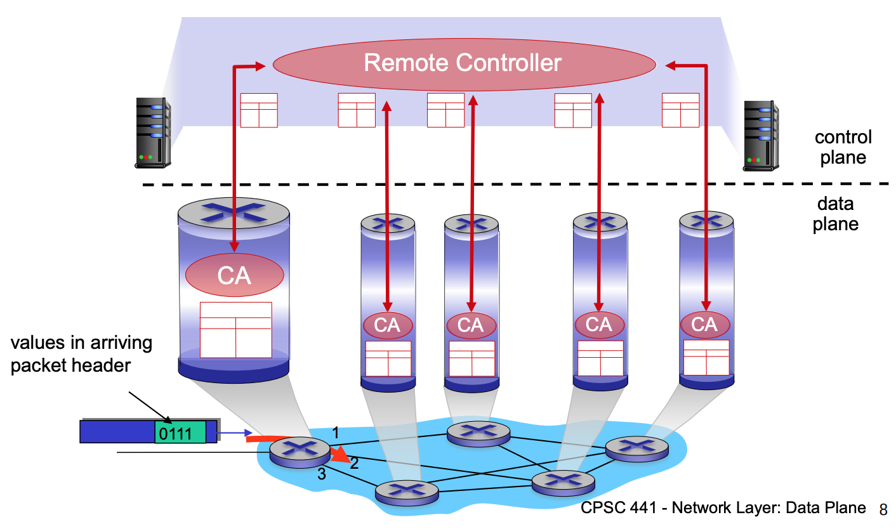
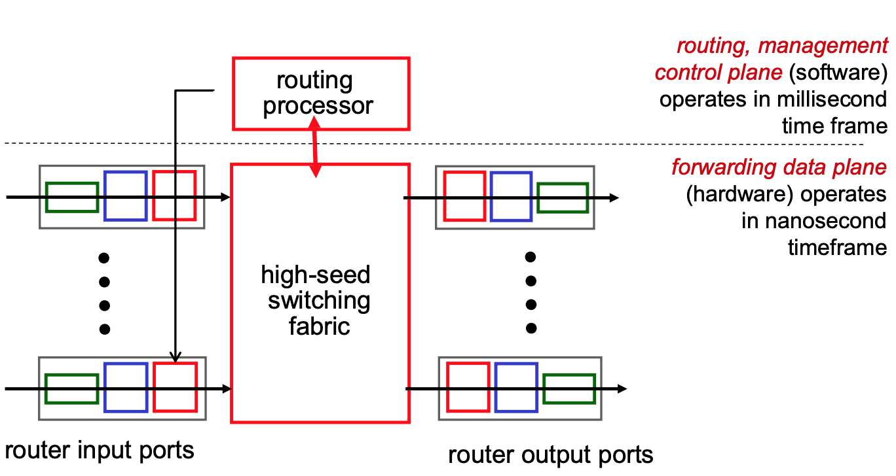
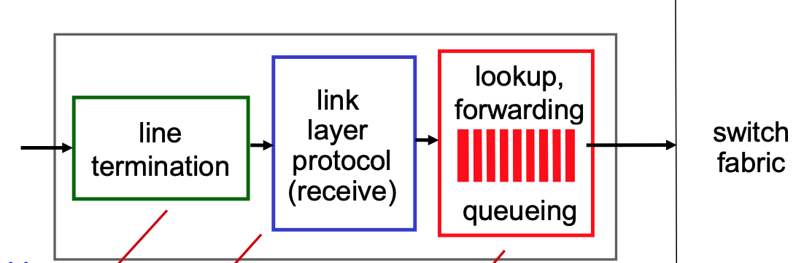
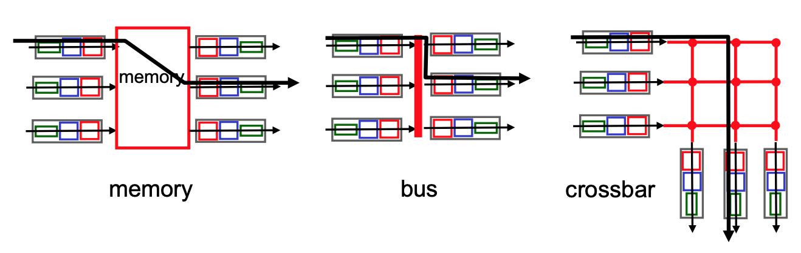
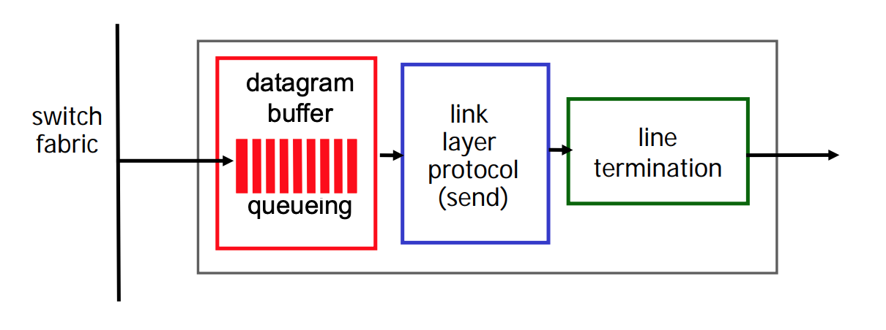

<!-- TODO: Reading -->

Goals:

- understand principles behind network layer services, focusing on data plane:
  - forwarding vs. routing
  - how a router works
  - generalized forwarding
- instantiation, implementation in the Internet

Data layer & control plane functionality.

Network layer is divided two sets of functionality *data plane* and *control plane*.

Network layer provides single logical channel between two hosts. Responsibility of a network layer is to receive data packets, convert them to datagram and transport them to destination host.

## Overview of a Network Layer

Network layer needs to transport from sending to receiving host. On **sending side**, it encapsulates segments into datagrams. On **receiving side**, it delivers segments to transport layer. Network layer protocols are implemented in *every* host, router. Router examines header fields in all IP datagrams that are passing through it.

**Network-layer functions**:

- **Routing**: Determine route taken by packets from source to destination.
  - *Analogy*: process of planning a trip from source to destination.
- **Forwarding**: Move packets from router's input to appropriate router output.
  - *Analogy*: process of getting through single interchange.

### Data Plane & Control Plane

**Data Plane**

Data plane is in charge of local packets, per-router function, aka *local forwarding*. It determines how a datagram arriving on router input port is forwarded to router output port.

**Control Plane**

All about controlling the network; how to find the right path. Control plane is network-wide logic. It determines how datagram is routed among routers along eng-end path from source to destination host.

Two control plane approaches:

- *Traditional routing algorithms*: implemented in routers (hardware).
- *Software-defined network (SDN)*: implemented in (remote) servers.

#### Per-router control plane

Individual routing algorithm components in **each and every router** that interact in router plane. Every router configures routing (forwarding) table.

#### Logically centralized control plane

A distinct (typically remote) controller interacts with local control agents (CAs). We separate control functionality and implement it in software in remote controller, e.g. NAS. Remote controller computes routing tables and sends them to other routers.

A switch/router in this scenario is "dumb", e.g. doesn't rely on hardware control plane implementation, rather makes use of software.

## Router Architecture Overview

The core is composed of routers.

**Input ports functions**:

At the input port the router has to implement: a physical layer, link layer and a network layer. Each of them has its own copy of forwarding table, that makes these ports to work independently from each other.

- **Physical layer**: bit level reception
- **Data link layer**: e.g. Ethernet
- **Decentralized switching**:
  - Using header field values, lookup output port using forwarding table in input port memory.
  - Queuing: if datagrams arrive faster than forwarding rate into switch fabric
  - *Destination-based forwarding*: forward based only on IP address (traditional).
  - *Generalized forwarding*: forward based on any set of header field values.

**Destination-based forwarding**:

Forwarding table:

| Destination | Interface |
|-------------|-----------|
| IP          | 0         |
| ...         | ...       |

There are $2^32$ IP addresses. Therefore we will need to store all of them in a table, which is *not feasible*.

Instead, store ranges of destinations, e.g.:

| Destination Address Range                                                  | Interface |
|----------------------------------------------------------------------------|-----------|
| 11001000 00010111 00010000 00000000 to 11001000 00010111 00010111 11111111 | 0         |
| 11001000 00010111 00011000 00000000 to 11001000 00010111 00011000 11111111 | 1         |
| 11001000 00010111 00011000 00000000 to 11001000 00010111 00011111 11111111 | 2         |
| otherwise                                                                  | 3         |

<mark>Longest prefix matching</mark>: when looking for forwarding table entry for given destination address, use **longest** address prefix that matches destination address.

| Destination Address Range              | Interface |
|----------------------------------------|-----------|
| `11001000 00010111 00010*** *********` | 0         |
| `11001000 00010111 00011000 *********` | 1         |
| `11001000 00010111 00011*** *********` | 2         |
| otherwise                              | 3         |

### Switching Fabrics

Transfer packet from input buffer to appropriate output buffer. **Switching rate**: rate at which packets can be transferred from inputs to outputs. There are three types of switching fabrics:

- **Memory**: implemented in software
- **Bus**: uses hardware based bus, puts packet on the bus
- **Crossbar**: hardware controller that enables appropriate buses

#### Output ports

Packet loss can happen at both input ports and output ports.

**Buffering** required from fabric faster rate. Most of buffering is happening at output ports. Datagram (packets) can be lost due to congestion, lack of buffers. Buffering happening because capacity is less than amount of incoming traffic. **Scheduling** datagrams. Priority scheduling - who gets best performance, network neutrality. Net neutrality - do not discriminate packets based on sender.

**What is the right amount of buffer size?**

$$
max tput = C = \frac{W}{RTT} \\
max W = C \cdot RTT \text{ (Delay bandwidth (DB)) }
$$

RFC 3439 rule of thumb: average buffering equals to $RTT$ times link capacity $C$, aka **Delay-Bandwidth Product**.

## IP: Internet Protocol

Internet Protocol is simple but important protocol. 
