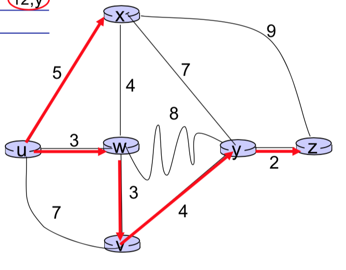

The job of routing is to determine good paths from senders to receivers, through the network of routers. Typically a host is attached directly to one router, the **gateway router** for the host (also called the **first-hop router**). Whenever a host sends a packet, the packet is transferred to its default router. The gateway router is also referred to as the **source router** and the default router of the destination host as the **destination router**. Only routers in network are involved in routing process.

---

Routers are represented as a graph $G = (V, E)$. Links between nodes have cost, denoted by $c(x, x')$. Cost could always be 1, or inversely related to bandwidth or directly related to congestion.

A _path_ is a sequence of routers packets will traverse in going from given initial source host to given destination host. The cost of the path is

$$
(x_1, x_2, x_3, ..., x_p) = c(x_1, x_2) + c(x_2, x_3) + ... + c(x_{p - 1}, x_{p})
$$

## Classification of Routing Algorithms

**Global** (also _centralized algorithms_)

- All routers have complete topology, link cost info
- _Link state_ algorithms
  - Every router has to tell other routers the state of the link

**Decentralized**

- Router knows physically (directly) connected neighbors, link costs to neighbors.
- Iterative process of computation exchange of information with neighbours.
- _Distance vector_ algorithms.

**Static**

Compute routes only once. Used if routes change slowly over time.

**Dynamic**

- Routers change more quickly
  - Updated periodically
  - Done in response to link cost changes

## Routing Algorithms

### Link State Routing

In a link state algorithm, the network topology and all link costs are known and available to the LS algorithm. In practice, this is accomplished by having each node broadcast link-state packets to _all_ other nodes in the network, with each link state packet containing the identities and costs of its attached links.

**Dijkstra's Algorithm**

Dijksta's algorithm computes the least-cost path from one node to all other nodes in the network. Dijkstra's algorithm is iterative and has property that after the $k^{th}$ iteration of the algorithm, the least-cost paths to all destination nodes, these $k$ paths will have the smallest $k$ smallest costs.

- $D(v)$: cost of the least-cost path from the source node to destination $v$ as of this iteration of algorithm.
- $p(v)$: previous node (neighbour of $v$) along the current least-cost path from the source to $v$.
- $N'$: subset of nodes; $v$ in $N'$ if the least cost path from the source to $v$ is definitely known.

**Example**:

| Step | N'     | D(v), p(v) | D(w), p(w) | D(x), p(x) | D(y), p(y) | D(z), p(z)         |
| ---- | ------ | ---------- | ---------- | ---------- | ---------- | ------------------ |
| 0    | u      | 7, u       | 3, u       | 5, u       | $\infty$   | $\infty$, $\infty$ |
| 1    | wu     | 6, w       |            | 5, u       | 11, w      | $\infty$, $\infty$ |
| 2    | xwu    | 6, w       |            |            | 11, w      | 14, x              |
| 3    | vxwu   |            |            |            | 10, v      | 14, x              |
| 4    | yvxwu  |            |            |            |            | 12, y              |
| 5    | zyvxwu |            |            |            |            |                    |

### Distance Vector

There's no topology discovery. Routers only know their _direct neighbours_. The idea is, by exchanging information with each other, routers compute the network topology.

**Bellman-Ford equation**

Recursive algorithm, that calculates least cost path, however it is more costly compare to Dijkstra's.

Let $d_x(y)$ cost of least-cost path from $x$ to $y$, $c(x, v)$ cost to neighbour $v$, $d_v(y)$ cost from $v$ to $y$.

$$
d_x(y) = min(c(x, v) + d_v(y))
$$

Minimum is taken over all neighbours $v$ of $x$.

**Distance Vector Algorithm**

<!-- NOTE: will be on final -->

Let $D_x(y)$ be the estimate of least cost from $x$ to $y$. $x$ maintains distance vector $D_x = [D_x(y): y \in N]$.

Node $x$ knows cost to each neighbour $v$, given by $c(x, v)$. It also maintains its neighbours' distance vectors for each neighbour $v$, $x$ maintains $D_v = [D_v(y): y \in N]$.

_Key idea_:

From time to time, each node sends its own distance vector estimate to neighbours. When $x$ receives new distance vector estimate from neighbour, it updates its own distance vector using **Bellman-Ford equation**:

$$
\forall y \in N, D_x(y) = min_v(c(x, v) + D_v(y))
$$

Under minor, natural conditions, the estimate $D_x(y)$ converges to the actual least cost $d_x(y)$.

<!-- TODO -->

### Comparison of Link State and Distance Vector Algorithms

<!-- TODO -->

## Intra-AS rounting in the Internet: OSPF

<!-- TODO -->

### Interconnected Autonomous Systems

Forwarding table configured by both intra- and iter-AS routing algorithm. Intra-AS routing determine entries for destinations within AS. Inter-AS & intra-AS determine entries for external destinations.

**Inter-AS tasks**

### Intra-AS Routing

Also know as <mark><b>interior gateway protocol</b></mark>. Most common intra-AS routing protocols:

- RIP: Routing Information Protocol
- IGRP: Interior Gateway Routing Protocol
- OSPF: Open Shortest Path First

### OSPF (Open Shortest Path First)

It is open, publicly available algorithm. Uses link-state algorithm:

- Link state packet dissemination
- Topology map at _each_ node
- Route computation is done via **Dijkstra's algorithm**

Router floods OSPF link-state advertisements to all other routers in **entire AS**.

## Internet inter-AS routing: BGP

BGP uses TCP for communication.

<!-- TODO -->

## Software Defined Networking (SDN)

<!-- TODO -->

## ICMP: Internet Control Message Protocol

<!-- TODO -->
