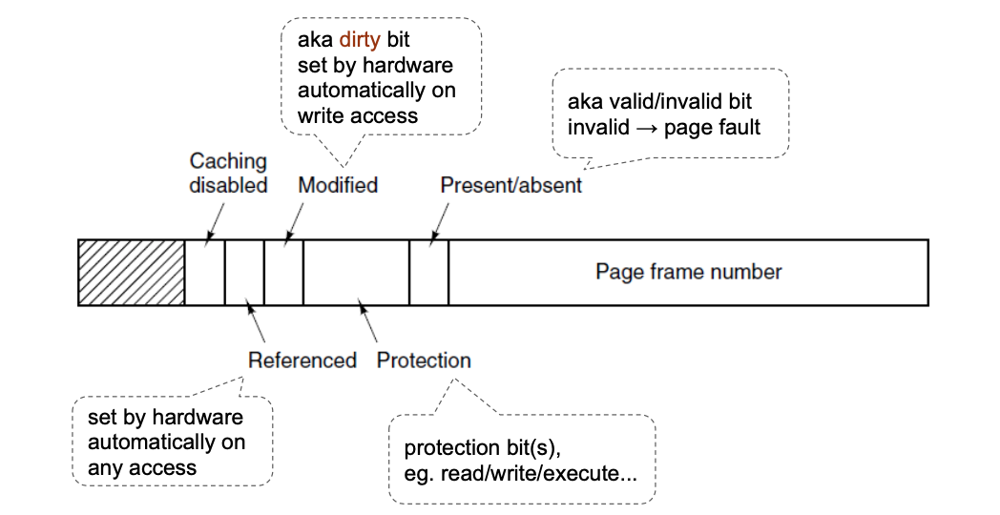

**Virtual memory** is a memory management technique that allows the OS to present a process with contiguous logical address space, while the corresponding physical address space can be discontiguous. Some parts of logical address space can be mapped to a backing store, allowing OS to overallocate memory. Some logical address can map to 'nowhere'.

It is implemented as a combination of SW & HW and implemented in all modern systems. Virtual memory improves memory management.

## Paged virtual memory

**Paged virtual memory** is the most common implementation of virtual memory. Virtual address space is divided into **pages**. **Page** is fixed size blocks, typically 4KiB, almost always power of 2. Physical memory is divided into (page) **frames**, fixed sized blocks, same size as pages. Pages ma to frames via **page table** (logical $\to$ physical address ). Paging avoids external fragmentation, since there are no holes. Each process can have its own page table (a pointer in PCB) or there can be a system wide page table.

**Paging example**:

- virtual address space = 64 KB
- physical address space = 32 KB
- page size = 4 KB

Frame size = 4 KB (same as page size), number of pages = 64 / 4 = 16, number of frames = 32 / 4 = 8.

Assume page size is 2KB and a process needs 71 KB to load. How many pages do we need?

- We need ceil(71 / 2) = 36 free frames (pages).
- Frames do not need to be contiguous. OS will adjust page table to reflect the frame locations. Logical address space remains contiguous.

### Address translation

Address generated by CPU is split into: 1. **Page number (p)**, index into a page table which contains base address of corresponding frame in physical memory and; 2. **Page offset (d)**, combined with base address to define physical memory address that is sent to the memory unit.

If page sizes are powers of 2, recovering page number and offser is simple:

- m-bit logical address space ($2^m$ possible addresses)
- n-bit page size ($2^n$ bytes in one page)

**Example**:

Assume 16 bit logical address space and 1KB page size. Whar is the page number and offset for logical address `10853`?.

1. Represent `10853` in binary = `0b0010101001100101`
2. Last 10 bits represent offset = `0b1001100101` = 613
3. First 6 bits represent page number = `0b001010` = 10
4. Another way of solving this is: offset = `10853 % 1024` = 613 & page number = `10853 / 1024` = 10.

### Page Fault

When a program tries to access a page that does not map to physical memeory, CPU issues a trap, called **page fault**. OS then suspends a process and located the missing page on disk, if that page is not on disk, then it is **invalid page fault**, resulting in crash, seg. fault, core dump. OS loads the missing page from disk into a free frame. If no free frames available - OS will evict one by saving it to the backing store. OS then updates the page table and resumes the process. If OS only loads pages as a result of page fault, it is called **demand paging**.

### Paging performance

Paging performance is evaluated via **Effective access time (EAT)** for memory access. Let $p$ be probability of a page fault, or **page fault rate** (\$$0 \leq p \leq 1). If $p = 0$, then all pages in memory, no page fault. If $p = 1$, all pages are on disk, all memory accesses are page faults. Let $ma$ be the memory access time and $pfst\$ page fault service time, i.e. how long does it take to service a page fault. Then:

$$
EAT = (1 - p) \cdot ma + p \cdot (pfst + ma)
$$

### Page table implementation

Page table is kept in main memory. **Page table base register (PTBR)** points to the page table, **Page table length register (PTLR)**, indicates size of the page table. In this scheme, every data/instruction access requires **at least** two memory accesses, one for page table lookup and one more for instruction fetch. This can be reduced by using a **tranlation lookaside buffer (TLB)**. TLB is a special hardware cache, that is extremely fast, but has small capacity. TLBs can remember a small part of the page table, only about 64 to 1K entries. On TLB miss, value is loaded into TLB for faster access next time.

#### TLB as associative memory

TLB is often implemented as **associative memory**, hardware capable of fast parallel search, based on content. Given a page number, TLB will return corresponding frame number in constant amount of time, **TLB hit**. If TLB does not contain entry for given page number, the search continues in page table in memory, **TLB miss**.

$$
\text{Effective memory access time} = (1 - p) \cdot (tlbs + 2 \cdot ma) + p \cdot (tlbs + ma)
$$

- $p$ is probability of TLB hit
- $tlbs$ is TLB search time
- $ma$ is memory access time

### Page table entry structure

#### Memory protection

Memory protection is usually implemented by associating a **protection bit** with each frame. The bit indicates if read-only or read-write access is allowed. **Valid bit** is another bit in page table entry, that indicates that the corresponding frame is in physical memory (`valid = 1`) and if corresponding frame is not in physical memory (`valid = 0`). Any violations result in a trap to the kernel, e.g. accessing page with invalid bit set $\to$ page failt.

### Paging

Page table is used to translate logical addresses to physical addresses. To tun a program of size $N$ pages, OS needs to find $N$ free frames and then load the program into them. If no free frames left, we can use the backing store. The OS must keep track of all free frames, so we need memory management.
