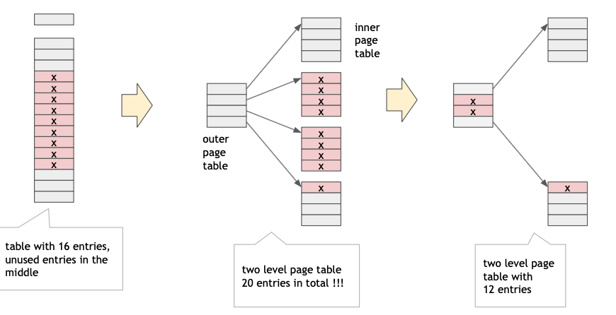

## Shared pages

Sometimes it can be useful for processes to share some memory with other processes. It can be implemented using **shared pages**.

**Example 1**: running multiple instances of the same program, or programs using a shared library; only one copy of the executable code needs to be in physical memory; implemented using **shared read-only** pages with **read-only** bit set in page table entry.

**Example 2**: shared read/write memory for interprocess communication; implemented using **shared read-write pages**.

## Copy-on-Write

**Copy-on-Write** allows parent and child processes to initially share pages in memory. If either process tries to modify a shared page, the page is copied first, then modified. Page table entries need a **copy-on-write bit**. COW allows very efficient process implementation of `fork()`, since only modified pages are copied - on demand.

## Page Table Size

Page table can get huge using straightforward methods:

- consider a 64 bit logical address space
- page size of 4KB ($2^{12}$)
- page table would have $\frac{2^{64}}{2^{12}}$ entries
- 52 bits to address it $\to$ each entry would need to be at least $ceil(52/8) = 7$ bytes long
- page table would need at minimum $2^{52} * 7$ (petabyte range)

Some solutions:

- hierarchical paging
- inverted page tables
- hashed inverted page tables

### Hierarchical Page Tables

Most programs do not use all virtual address space at the same time. Instead, only some entries in the page table are used at any given time. Also, the used entries tend to be grouped together into multiple groups of consecutive pages.

Page table can be broken up into multiple smaller page tables, with the hope that not all of the smaller page tables will be used. The ones that are not used, don't have to be in memory.

### Two-level Page Table

A simple technique is a **two-level page table** - think of it as paging the page table. We save space by not storing small page tables if all their entries are invalid.



A 32-bit logical address with 4K page size is divided into:

- A page number consisting of 20 bits
- A page offset consisting of 12 bits

Since the page table is used, the page number is further divided into:

- A 10 bit outer page number `p1`
- A 10 bit inner page number `p2`

`p1` is an index into the **outer page table** and `p2` is an index into **inner page table**. Also known as **forward-mapped page table**.

#### Address Translation Scheme

3 memory accesses per request. On 64 bit system, outer page table would still have $2^{42}$ entries. We could add 2nd outer page table, that will result in $2^{32}$ entries for outer PT and 4 memory accesses per request.

### Inverted page table

Rather than each process having its own page table, all physical pages can be tracked in one global **inverted page table**. This global inverted page table has one entry for each real page of memory, containing virtual addresses and owning PID. IPT decreases memory needed to store a page table. IPT size is proportional to the amount of physical memory available, e.g. 16GB memory with 4KB page size and 8B/entry results in only 32MB page table. However, IPT increases time needed to search the table when a page reference occurs. With above example, on average a traslation would require ~2 million accesses. TLB could accelerate the process, but it is tiny.

### Hashed inverted page table

The virtual page number and PID is hashed into a page table. This page table contains chains of elements which hash to the same location. Each element contains: PID, virtual page number and a pointer to the next element. Virtual page numbers are compared in the chain until a match is found. If a match is found, the corresponding physical frame is extracted, otherwise page fault occurs.

## Page replacement

To deal with **over-allocation of memory** OS needs to make room by evicting existing frame. OS finds an occupied frame in memory and pages it out.

### Basic page replacement

1. Find the location of the desired page on disk
2. Find free frame
   - If there is a free frame, goto step 3
   - if there is no free frame, use a page replacement algorithm to select victim frame
   - if victim frame is dirty, write it to backing store
   - set the invalid bit in page table of corresponding victim frame
3. Load desired page into the free frame and update the page and frame tables
4. Restart the instruction that caused the trap

### Fixed allocation

- **Equal allocation** - for example, if there are 100 frames (after allocating frames for the OS) and 5 processes, OS gives each process 20 frames
- **Proportional allocation** - allocate according to the size of the process

## Page replacement

If a process generates a page fault and there are no free frames available, OS needs to replace a frame

- **Global replacement**
  - OS selects a replacement frame from the set of all frames
  - one process can steal a frame from another process
  - disadvantage: process execution time can vary greatly
  - advantage: greater throughput, more common
- **Local replacement**
  - each process selects only from its own set of allocated frames
  - more consistent per-process performance
  - can lead to unerutilized memory

### First in first out algorithm

FIFO - replaces page that has been in memory for the longest time. Can be implemented using a FIFO queue.

#### Belady's anomaly

Belady's anomaly occurs when increasing the number of page frames results in an increase in the number of page frames results in an increase in the number page faults for certain memory access patterns. Example FIFO with 3 frames would result in 9 page faults and with 4 frames - with 10 page faults.

### Optimal algorithm (OPT)

Reference page that will not be used for longest period of time.

- not practical - requires knowing the _future_.
- useful for measuring how well other non-optimal algorithms perform
- e.g. no algorithm can do better than 9 page faults for the above reference string and 3 available frames.

### Least Recently Used Algorithm (LRU)

- Uses _past knowledge_ to predict _future_
- Replaces page that has not been used in the most amount of time
- Associates time of last use with each page

```
reference string: 7 0 1 2 0 3 0 4 2 3 0 3 2 1 2 0 1 7 0 1

[7] [7] [7] [2]  [2]  [4]  [4]  [4]  [0]  [1]  [1]  [1]
[ ] [0] [0] [0]  [0]  [0]  [0]  [3]  [3]  [3]  [0]  [0]
[ ] [ ] [1] [1]  [3]  [3]  [2]  [2]  [2]  [2]  [2]  [7]

# 12 page faults
```

- 12 faults, better than FIFO, but worse than OPT
- Generally good algorithm and frequently used

**Implementations**:

- Counter implementation (counter per page)
- Stack implementation

LRU and OPT are examples of replacement algorithms that **don't exhibit Belady's anomaly**. Pure LRU needs special hardware and is still slow, but there are fast approximations of LRU.

### CLOCK algorithm

Clock replacement is an approximation of LRU. It uses the reference bit in page table entry, which is automatically set by hardware any time page is accessed. Frames are organized as circular buffer. Page is replaced if its reference bit is 0, otherwise bit is set to 0 and move to the next page.

### Thrashing

If a process does not have enough pages, the page fault rate is very high. **Thrashing process**, process progressing slowly due to frequent page swaps. A process spends more time waiting for page faults than it spends executing. This can lead to entire **system thrashing**:

- many processes thrashing leads to low CPU utilization
- OS thinks that it needs to increase the degree of multiprogramming
- OS adds another process to the system making things even worse

#### Dealing with thrashing

- Local page replacement
  - when a process is thrashing, OS precents it from stealing frames from other processes
  - at least the thrashing process cannot cause the entire system to thrash
- Working set model
  - OS keeps track of pages that are actively used by a process (working set)
  - working set of processes changes over time
  - OS periodically updates the working set for each process, using a moving time window
  - before resuming a process, OS loads the entire working set of process
- Page fault frequency
  - establish acceptable bounds on page fault rate
  - if actual page fault rate of a process too high $\to$ process gains a frame
  - if actual page fault rate of a process too low $\to$ process loses a frame

<!-- - optimal
- given more pages, things get worse
- FIFO
- thrashing is when process spends more time waiting for page fault
- copy on write: delay the copy until copy needs to be modified -->
