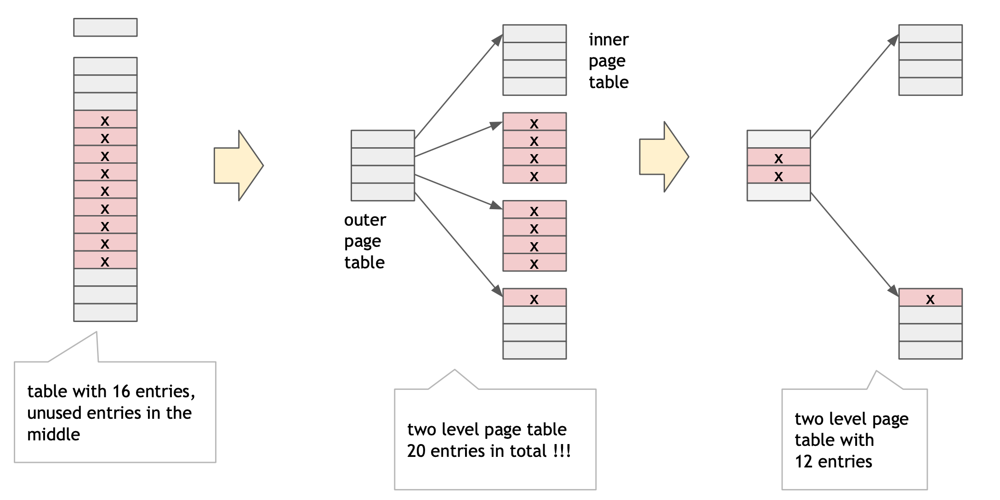

<!--Content-->

## Copy-on-Write

**Copy-on-Write** allows parent and child processes to initially share pages in memory. If either process tries to modify a shared page, the page is copied first, then modified. Page table entries need a **copy-on-write bit**.

COW allows very efficient process implementation of `fork()`, since only modified pages are copied - on demand.

## Page Table Size

Page table can get huge using straightforward methods:

- consider a 64-bit logical address space
- page size of 4KB ($2^{12}$)
- page table would have $\frac{2^{64}}{2^{12}}$ entries
- 52 bits to address it $\to$ each entry would need to be at least $ceil(52/8) = 7$ bytes long
- page table would need at minimum $2^{52} * 7$ (petabyte range)

Some solution:

- hierarchical paging
- inverted page tables
- hashed inverted page tables

### Hierarchical Page Tables

Most programs do not use all virtual address space at the same time. Instead, only some entries in the page table are used at any given time. Also, the used entries tend to be grouped together into multiple groups of consecutive pages.

Page table can be broken up into multiple smaller page tables, with the hope that not all of the smaller page tables will be used. The ones that are not used, don't have to be in memory.



### Two-level Page Table

A simple technique is a **two-level page table** - think of it as paging the page table. We save space by not storing small page tables if all their entries are invalid.


A 32-bit logical address with 4K page size is divided into:

- A page number consisting of 20 bits
- A page offset consisting of 12 bits

Since the page table is used, the page number is further divided into:

- A 10 bit outer page number `p1`
- A 10 bit inner page number `p2`

`p1` is an index into the **outer page table** and `p2` is an index into **inner page table**. Also known as **forward-mapped page table**.

<!-- TODO: finish -->

### Optimal algorithm (OPT)

Reference page that will not be used for longest period of time.

```
reference string: 7 0 1 2 0 3 0 4 2 3 0 3 2 1 2 0 1 7 0 1

[7] [7] [7] [2]  [2]  [2]  [2]  [2]  [7]
[ ] [0] [0] [0]  [0]  [4]  [0]  [0]  [0]
[ ] [ ] [1] [1]  [3]  [3]  [3]  [1]  [1]

# 9 page faults
```

- not practical - requires knowing the _future_.
- useful for measuring how well other non-optimal algorithms perform
- e.g. no algorithm can do better than 9 page faults for the above reference string and 3 available frames.

### Least Recently Used Algorithm (LRU)

- Uses _past knowledge_ to predict _future_
- Replaces page that has not been used in the most amount of time
- Associates time of last use with each page

```
reference string: 7 0 1 2 0 3 0 4 2 3 0 3 2 1 2 0 1 7 0 1

[7] [7] [7] [2]  [2]  [4]  [4]  [4]  [0]  [1]  [1]  [1]
[ ] [0] [0] [0]  [0]  [0]  [0]  [3]  [3]  [3]  [0]  [0]
[ ] [ ] [1] [1]  [3]  [3]  [2]  [2]  [2]  [2]  [2]  [7]

# 12 page faults
```

- 12 faults, better than FIFO, but worse than OPT
- Generally good algorithm and frequently used

**Implementations**:

- Counter implementation
- Stack implementation

<!-- TODO: finish -->

review:

- optimal
- given more pages, things get worse
- FIFO
- thrashing is when process spends more time waiting for page fault
- copy on write: delay the copy until copy needs to be modified
