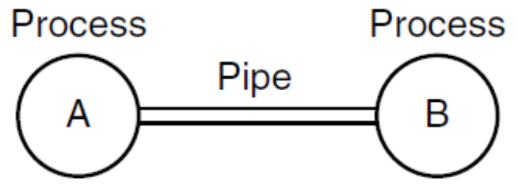
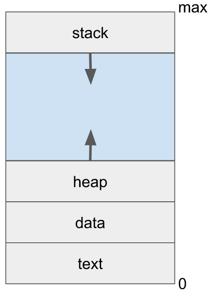

Process is a key concept in all operating systems. A quick definition of a process is <mark>a program in execution</mark>. Process is associated with:

- an address space
- set of resources
- program counter, stack pointer
- unique ID (process ID, **PID**)

Process can be though of as a container that holds all information needed by an OS to run a program.

## Process Tree

Processes are allowed to create new processes.

## Pipes



Pipes is a very powerful thing in Unix. On Unix systems, two processes can communicate with each other via a **pipe**. Pipes are accessed using file I/O APIs. Pipes _can_ be bidirectional, but normally used as one directional.

```bash
ls -altr | tail -10
```

Pipes allow parallelization: two programs will be executed in parallel.

## Unix file APIs

Unix-like OSs make use of files and associated APIs for different operations/services. For example, if pipes are used programmatically, pipe will be used as some file.

---

We want the ability to run multiple programs at the same time, aka <mark>multitasking</mark>. For this we need firm control and compartmentalization of the various programs. To this end we create an abstraction of **program in execution** and call it a **process**.

## Multitasking

Process abstraction is used to implement **multitasking**. Multitasking allows an **illusion** of parallelism:

- running `N` processes with `M` CPUs, `while N > M`
- works even with a single CPU:
  ```
  run program (i) for a fraction of a second
  switch to program (i+1)
  repeat
  ```

Multitasking allows us to reduce CPU idling during I/O. CPU could be given to another process rather than remain idle. Multitasking is only practical when memory is big enough to hold multiple programs.

**Program $\neq$ Process**:

- A _program_ is a **passive** entry
  - an executable file containing a list of instructions, usually stored on disk
- A _process_ is an **active** entity
  - associated with a _program counter_ and other resources

## A process in memory

Each process gets its own **address space**. Part of memory available to a process, decided by OS. On modern OSes it is a _virtual_ address space (0 - max), isolated from other processes.



- **text section**: the program code
- **data section**: global variables, constant variables
- **heap**: memory for dynamic allocation during runtime
- **stack**: temporary data (parameters, return address, local variables)

Other information needed by the OS for management, usually grouped in a Process Control Block data structure.

### Process control block

<!-- NOTE: Remember what goes to PCB -->

Each process is represented in the OS by a PCB that includes:

- process state
- program counter
- CPU registers
- CPU-scheduling info priority, pointers to the queue, other parameters
- memory management info: page tables, segment tables, etc.
- accounting info: CPU time, timeout values, process numbers, etc.
- I/O status info: open files, I/O devices, etc.

On Linux, [`task_struct`](https://github.com/torvalds/linux/blob/master/include/linux/sched.h) is the `struct` that stores information about processes.

The **process table** is a collection of all PCBs. Some of the fields of a PCB

| Process management       | Memory management        | File management   |
| ------------------------ | ------------------------ | ----------------- |
| program counter          | pointer to text segment  | root directory    |
| registers                | pointer to data segment  | working directory |
| stack pointer            | pointer to stack segment | file descriptors  |
| priority                 | user ID                  |                   |
| scheduling parameters    | parent ID                |                   |
| PID                      |                          |                   |
| parent process           |                          |                   |
| process group            |                          |                   |
| signals                  |                          |                   |
| process start time       |                          |                   |
| CPU time used            |                          |                   |
| children's CPU time used |                          |                   |

## Operations on processes

Processes need to be created and deleted dynamically and OS must provide mechanisms for this. Process creation on Unix is done via `fork()`:

- **parent process** - the process that is creating a new process
- **child process** - the newly created process
- processes in the system form a **process tree**
- each process gets **PID**, a unique ID

Process is executed via `fork()`:

- under Unix there's no difference, but under Win, there is (have to create _then_ execute)

Process termination is done via `exit()` or `kill()`:

- to let the OS delete the process
- termination can be (typically) only requested by the process or its parent

There are other operations: synchronization, communication, etc.

## Multiprocess program in C

```c
#include <stdio.h>
#include <unistd.h>

int main() {
  printf("Hello\n");

  // Create & run child process - duplicate of parent
  fork();

  // Both parent and child will execute the next line
  printf("world.\n");
}
```

There can be several possible outputs (due to buffering, or if `fork()` fails):

- If `printf()` is unbuffered
  ```
  Hello
  world.
  world.
  ```
- If first process got interrupted, due to multitasking
  ```
  Hello
  worwold.
  rld.
  ```
- If `fork()` (returns `-1`) fails
  ```
  Hello
  world.
  ```

```c
#include <stdio.h>
#include <unistd.h>

int main() {
  // create & run child process - a duplicate of parent and remember the return value
  pid_t pid = fork();

  // both parent and child will execute the next line, but will have different value for pid
  // 0 for child
  // non-zero for parent
  printf("PID: %d\n", pid);

  return 0;
}
```

<!-- NOTE: what if fork is in a loop? -->

There also can be different outputs:

- If parent was executed first
  ```
  PID: 7
  PID: 0
  ```
- If child was executed first
  ```
  PID: 0
  PID: 7
  ```
- If `fork()` failed
  ```
  PID: -1
  ```

---

<!--fork urself, check if a child, exec a child-->

Executing a process by replacing the current process with a new process using `execl()`, `execlp()`

```c
#include <stdio.h>
#include <unistd.h>

int main() {
  // create and run child process - a duplicate of parent
  pid_t pid = fork();

  // both parent and child will execute this statement
  if (pid < 0) {
    // error ocurred
    fprintf(stderr, "fork failed");
    exit(-1);
  } else if (pid == 0) {
    // child process

    // replace process with `ls -l`
    execlp("/bin/ls", "ls", "-l", NULL);
  } else {
    // parent process will wait for the child to complete

    printf("waiting for child process: %d\n", pid);
    wait(NULL);
    exit(0);
  }

  return 0;
}
```

Another way of doing system calls is using `system()`:

```c
#include <stdlib.h>

int main() {
  /*
    The system() library call uses fork() to create a child process that
    executes the shell command
  */

  system("/bin/ls");

  return 0;
}
```

## Process Tree

## `init` Process

`init` or `systemd` is the first process started after booting. Older Unix systems use `init`, but many popular Linux systems now switched to `systemd`. `init` is the ancestor of all user processes (direct or indirect parent), i.e. root of process tree. PID of `init` is always `PID = 1`. Orphaned processes are adopted by `init`. Process tree can be printed using following:

```bash
pstree # or
ps axjf
```

Note: some special system 'processes', or kernel threads, are created by kernel during bootstrap, and do not have to be descendants of `init`, such as `swapper` and `pagedaemon`.

<!-- 1 cpu & 4 virtual PCs -->
<!-- program becomes a process when it's *loaded* -->
