TODO: Simple table of contents

# Operating Systems: Introduction, History, Basic Concepts

Brief introduction to history of Operating Systems.

## Defining an OS

There's no 'precise' definition. It is a layer of software that provides application programs with a better, simpler, cleaner model of the computer. The OS is there to simplify interaction with the hardware. OS manages all resources.

It is the software that runs all the time (mostly in kernel mode). All other applications need it in order to run (*most* applications will need it).

We can look at an OS from two different perspectives:

- an **extended machine**
- as a **resource manager**

An OS presents an abstraction mechanism that lets you interact with the hardware.

### OS - an extended machine

Abstraction / generalization is key to managing complexity. First we define and implement the abstractions. For example, files - working with files is easier than dealing with raw disk space. Then, using these abstractions, we write applications and solve problems (e.g. file editor, image viewer). An OS doesn't care what's in the file, it is up to the applications to determine how to use the file.

The abstractions allow us to mask the ugly hardware and provide nice interfaces instead. Many OS concepts are abstractions, therefore there are some similarities to OOP.

### OS - a resource manager

OS acts as a resource allocator. It multiplexes available resources.

- Multiplexing resources in time
  - e.g. 3 programs trying to print to the same printer (spooling)
  - e.g. 2 programs trying to run at the same time (scheduling)
- Multiplexing resources in space
  - e.g. 2 programs allocating memory

OS manages conflicts among multiple programs or users.

<!--IMPORTANT: syscalls need to be checked-->

We can also think about OS as a control program. It decides when to run which application. OS monitors improper use and prevents errors. OS is responsible for handling all interrupts and traps.

## History of Operating Systems

OSes often developed by customers instead of HW manufacturers. IBM developed first OS in the 60's.

### First Generation (1945 - 1955): Vacuum Tubes and no OS

Programs were hardwired, later were made on punch cards. Programs were written in machine language. Hardware required complicated wiring. Only single user at a time. Such computers were only able to perform basic calculations. No OS since there was no need for one.

### Second Generation (1955 - 1965): Transistors and Batch Systems

Transistor based mainframe computers replaced old vacuum tube computers. Programs were made with FORTRAN & COBOL. OSes that were used: FMS (Fortran Monitor System) and IBSYS (IBM OS). Important concept was introduced: **batch systems**.

#### Batch Systems

The users of a batch operating system do not interact with the computer directly. Each user prepares his job on an off-line device like punch cards and submits it to the computer operator. To speed up processing, jobs with similar needs are batched together and run as a group. The programmers leave their programs with the operator and the operator then sorts the programs with similar requirements into batches.

### Third Generation (1965 - 1980): ICs and Multiprogramming

Transistors were replaces with Integrated Circuits (ICs). Lots of OSes came out: IBM OS/360, CTSS (by MIT), MULTICS (complicated, but influential), UNIX (inspired by MULTICS). Important concepts:

- **multiprogramming**: a different job in each memory partition, CPU execute other jobs, while waiting for the IO of some jobs. Multiple programs could sit in memory.
- **spooling** (Simultaneous Peripheral Operation On Line): read jobs from cards to disk, load jobs from disk automatically, no more tapes.
- **time-sharing**: multiple users using one computer simultaneously and interactively. Terminals were connected to a central server.

#### Multiprogramming

Refers to the idea, if you have more than one program in the memory, processor will switch between the programs when one program is idle.

#### Spooling

Spooling is typically used to deal with slow devices/peripherals, e.g. printer. Spooling can be used to deal (somewhat) with deadlocks in concurrent programming.

### Fourth Generation (1990 - Now): Personal Computers

Cheap, mass-produced computers, User friendly interfaces on top of OS.

---

# Hardware, Cache, Booting, Kernel

Overview of hardware & how OS is interacting with it.

## Hardware Review

A typical computer contains of several components that are interconnected through a bus.

### CPU

CPU is the "brain" of the computer. It contains different types of registers (registers - very fast memory):

- On-board registers for faster computation.
  - Instead of accessing memory for every instruction
  - Accessing information in registers is faster than memory
- General purpose registers
  - Data & address

A simple CPU cycle:

1. **Fetch** an instruction
2. **Decode** it to determine its type and operands
3. **Execute** it

Steps are repeated for the next instruction, until program finishes.

However, there is a performance issue: fetching from memory takes longer than executing an instruction. A solution would be to **pipeline** the opertaions:

#### CPU Pipelining

- while executing instruction `N`,
- the CPU could be simultaneously decoding instruction `N + 1`,
- and at the same time also fetch instruction `N + 2`

Therefore fetch-execute cycle can be done in parallel. Parallelized app will be as fast as slowest link of the pipeline. Three stage pipeline:

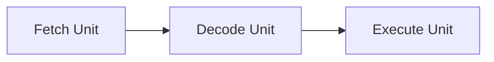

Pros:

- the CPU can execute more than one instruction at a time
- 'hide' the memory access time

Cons:

- more complexity


### Memory

Ideally, memory should be (i) fast, (ii) large and (iii) cheap. In practice, we can get 2 out of 3, but not all three.

Main memory is RAM (Random Access Memory). Memory is a accessible big array of bytes. Memory operations:

- **load**: moves a word from memory to a CPU register
- **store**: moves a content of a register to memory

Both load and store operations are slow compared to the speed of CPU.

## Caching

CPU caching is the process of most heavily used data from memory is kept in a high-speed cache inside or very close to the CPU. When CPU needs to get data from memory, it first checks the cache:

- **cache hit**: the data needed by the CPU is in the cache
      <!--or-->
- **cache miss**: CPU needs to fetch the data from main memory

CPU consists of multiple levels of caches:

- L1 cache (16kB): inside the CPU, usually feeds decoded instructions into CPU execution engine
- L2 cache (xMB): stores recently used memory words, slower than L1
- L3 and L4 are becoming common

<!--core is like a mini cpu-->

### Caching on multicore CPUs

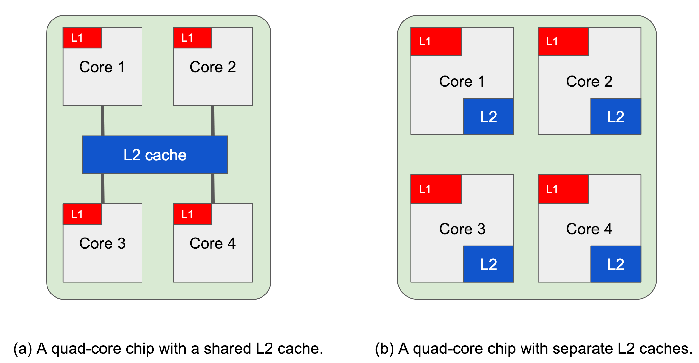
<!--1. can process bigger chunks, bigger parts of the memory because L2 will be bigger-->
Caches can be shared and there are multiple ways of sharing cache.

---

The goal of caching is to increase performance of slower memory/device by adding a small amount of fast memory (cache). Ways of improving read performance:

- keep copy of information obtained from slow storage in cache
- check cache on next read

Improving write performance:

- write info to fast storage, and eventually write to slow storage

Caching is a very useful concept. There are many uses: disk cache, DNS, databases.

Cache storage is fast but expensive, so it's usually much smaller than the slow storage. Some general caching issues:

- when to put a new item into the cache
- which cache line to put the new item in
- which item to remove from the cache when it's full
- where to put a newly evicted item in the larger memory
- multiple cache synchronization
- how long is the data in cache valid

### Memoization

It's a similar concept to caching. It can be used to speed up function that are slow to compute. Optimization technique used to speed up programs, by storing results of expensive computations.

Unoptimized function:

```python
def fib_slow(n):
  if n < 2:
    return n
  else:
    return fib_slow(n - 1) + fib_slow(n - 2)
```

Optimized function:

```python
cache = {}
def fib_fast(n):
  if n not in cache.keys():
    if n < 2:
      cache[n] = n
    else:
      cache[n] = fib_fast(n - 1) + fib_fast(n - 2)

  return cache[n]
```

## Hardware I/O

I/O devices usually implemented in two parts: device controller and the device.

A **device controller** is a chip or a set of chips that physically control the device. Controlling the device is complicated, and CPU could be doing other things, so the controller presents a simpler interface to the OS. A controller presents a unified interface of devices that it can support to the OS.

A **device** connects to the computer through the controller. It follows some agreed standards for communication.

A **device driver** is the software abstraction of the controller, the software that talks to a controller, issues commands and accepts responses. Usually is written by the manufacturer. Driver is needed so the OS knows how to communicate with the device.

## Buses

**Bus** is a communication system for transferring data between different computer components.

## Booting Process

When the computer is booted, the BIOS is started. BIOS (Basic Input Output Program) is a program stored on motherboard.

## Kernel

The central part, or the heart of the OS. Kernel is running at all times on the computer. It is located and started by a bootstrap program (bootloader). Kernel provides services to applications via system calls and handles all interrupts. Much of kernel is a set of routines, some invoked in response to interrupts, others because of application using system calls, etc.

### Kernel mode

Most modern CPUs support at least two privilege levels: **kernel mode** and **user mode**. The mode is usually controlled by modifying the status register. On CPUs without this support, there's only kernel mode.

When CPU is in **kernel mode**:

- all instructions are allowed
- all I/O operations are allowed
- all memory can be accessed

<!--not all kernel runs in kernel mode-->

When CPU is in kernel mode, every instruction are executed.

### User mode

When OS runs a normal application, it runs it in a **user mode**. Only a subset of operations are allowed (e.g. accessing the status register is not allowed). I/O instructions are not allowed, access to some parts of memory is not allowed. Illegal instructions result in traps (exceptions).

Applications that run in user mode must ask kernel to do I/O. Therefore, applications must invoke a **system call**, which is usually accomplished by invoking a **trap** into the OS.

#### Trap

Trap is a special asm instruction (`SWI n`, `INT n`, `TRAP n`). Trap switches from user mode to kernel mode and invokes a **predefined routine**. It 'pauses' the application to execute kernel routine configured by the OS. When kernel routine is done, user mode is restored and application 'resumes'.

---

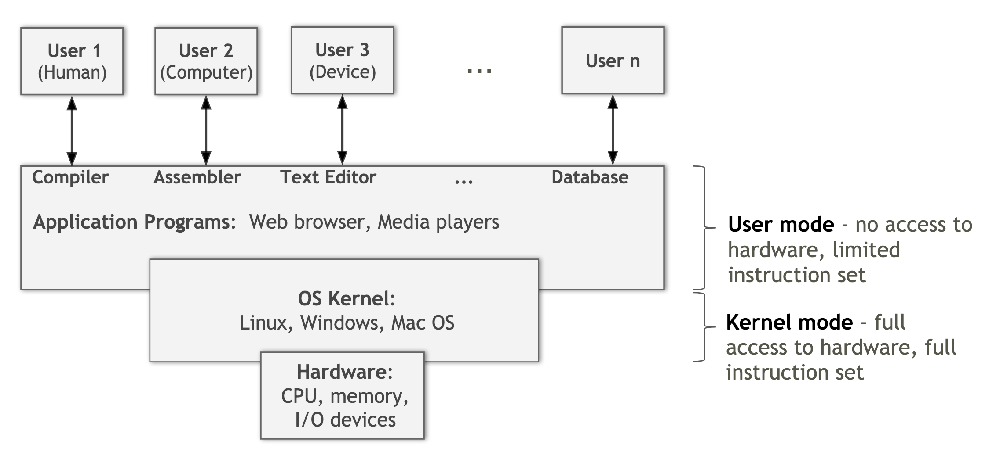

<!--true-->
<!--true-->
<!--most run in kernel, but some are in user mode-->

---

# Interrupts, traps, kernel design, VMs

## Interrupts

Interrupt can happen at any time. When interrupt happens, CPU switches to kernel mode and interrupt handler executes the interrupt. CPU state is saved by the interrupt handler before executing code in interrupt handler. After executing interrupt, CPU restores state and switches back to user mode. Source of the interrupts is usually devices.

### Software interrupts (exception/traps)

Similar to hardware interrupts but the source of the interrupt is the CPU itself. Software interrupts are handled similarly to hardware interrupts.

There are two types of software interrupts: _intentional_ and _unintentional_.

#### Unintentional interrupts

Also called **exceptions**. Occurs when CPU executes invalid instruction (e.g. accessing non-existent memory, write to ROM, division by zero). Unintentional interrupts used by OS to detect when an application attempts an illegal operation.

#### Intentional interrupts (trap)

Trap usually occurs via special instruction, e.g. `INT`. The purpose of a trap is to execute predefined routine in _kernel mode_. OS can use traps to implement system calls.

### Hardware interrupts vs Software interrupts

- **Hardware Interrupts**:
  - External event delivered to the CPU
  - Origins: I/O, timer, user input
  - Asynchronous with the current activity of the CPU
  - The time of the event is not known and not predictable
- **Software Interrupts**:
  - Internal events, e.g. system calls, exceptions
  - Synchronous with the current activity of the CPU
  - Occurs as a result of execution of a machine instruction
- Both hardware and software interrupts:
  - Invoke a kernel routine, defined by the OS
  - Put the CPU in a kernel mode
  - Save the current state of the CPU
  - Eventually resume the original operations when done

### I/O

How does the kernel handle I/O? There are two options.

- _Option 1_: busy waiting/spinning/busy looping (aka polling).
  ```
  cpu -> disk: read a file
  loop:
    cpu -> disk: u done?
    break if done
  cpu -> disk: give result
  ```
  - There are problems with is:
    - the CPU is tied up while slow I/O completes the operation $\implies$ CPU could be doing other operations
    - Power is wasted
- _Option 2_: busy wait with sleep
  ```
  cpu -> disk: read a file
  loop:
    sleep
    cpu -> disk: u done?
    break if done
  cpu -> disk: give result
  ```
  - Sleep could be detected by OS and the CPU could then run another program
  - Problems:
    - Hard to estimate the right amount of sleep
    - Program might end up running longer than necessary
- _Option 3_: Hardware interrupts
  ```
  cpu -> disk: read a file
  cpu -> disk: update when done
  cpu: sleep until interrupted
  disk -> cpu: interrupt
  cpu -> disk: give result
  ```
  - When the I/O device finishes the operation, it generates an interrupt, letting the OS know it's done, or there was an error
  - This approach assumes the I/O device supports interrupts

#### Using interrupts to do I/O

Kernel talks to the device driver to request an operation. The device driver tells the controller what to do by writing into device registers. The controller starts the device and monitors its progress. When the device is done its job, the device controller signals the interrupt controller. The interrupt controller informs the CPU and puts the device information on the bus. The CPU suspends current process and handles the interrupt by executing the appropriate interrupt handler (in kernel mode). The CPU then resumes its original process.

### Limits of interrupts

- CPU can run other programs while waiting for I/O
- CPU could be interrupted for every single byte of I/O
  - many devices/controllers have limited memory
  - these devices could generate an interrupt for every single input byte
  - interrupts take many CPU cycles to save/restore CPU state
  - useful work often a single instruction - to store the data in memory

To solve these problems, introduce a dedicated hardware to deal with interrupts - DMA chip

- DMA absorbs most interrupts
- DMA can save data directly into memory, without CPU knowing
- result is less interrupts for the CPU

#### Direct memory access (DMA)

It is a special piece of hardware on most modern systems. DMA used for bulk data movement such as disk I/O. It is usually used with slow devices so that CPU can do other things, but also could be used with extremely fast devices that could overwhelm CPU.

Device controller transfers an entire block of data directly to the main memory without CPU intervention. Only one interrupt is generated per block - to tell the device driver that the operation has completed. Used for device $\to$ memory, memory $\to$ device, and memory $\to$ memory transfers.

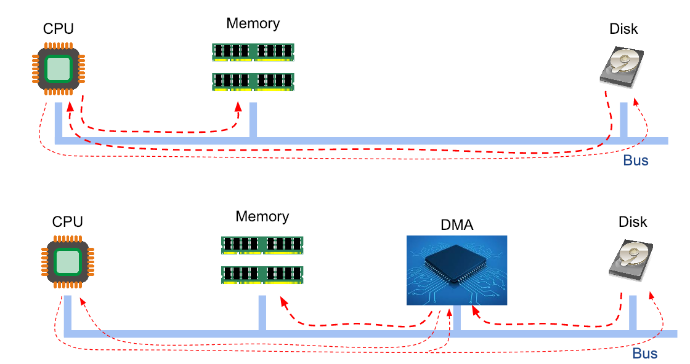

---

## Kernel Designs

What goes into a kernel and what does not? There are trade-offs to consider:

- code in kernel runs faster, but
- big kernels have more bugs $\implies$ higher system instability

There are three main kernel designs: **monolithic kernel**(MS-DOS, Linux), **microkernels**(Mach, QNX), **hybrid kernels**.

#### Monolithic kernel

The entire OS runs as a single program in kernel mode. It is faster but more prone to bugs, harder to port, and potentially less stable.

#### Microkernel

Only essential components in kernel - running in kernel mode (essential = code that must run in kernel mode). The rest is implemented in user mode. Most likely will be less bugs, easier to port and extend, more stable, but slower.

#### Hybrid kernel

Trying to balance the cons/pros of monolithic kernels and microkernels

---

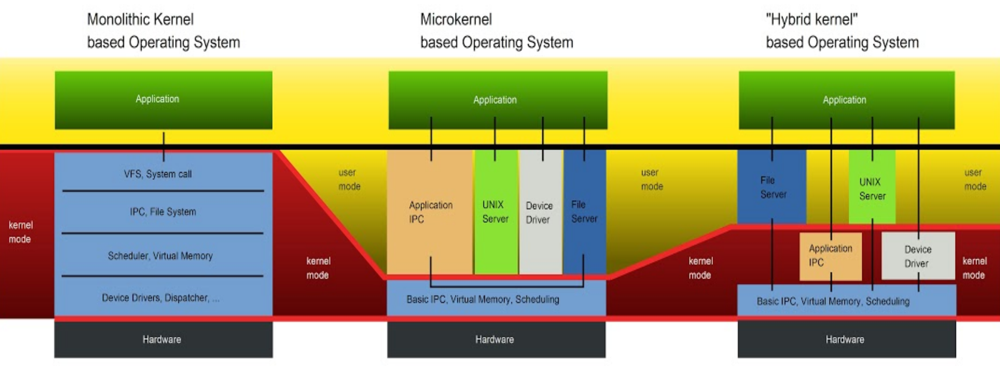

### Kernel modules


Modular kernels are type of hybrid kernels, usually consist of smaller kernel with only essential components plus non-essential, dynamically loadable kernel parts - **kernel modules**. Drivers are often implemented as modules.

Modules are often loaded on demand, when needed or requested. It could be at boot time or later. Modules usually run in kernel mode.

- OS can come with many drivers but only those that needed are loaded which results in faster boot time
- No kernel recompile/reboot necessary to activate a module

### Layered approach

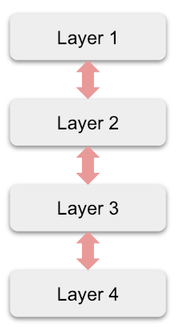

Each layer only talk to layer below or above. Layer design is slow.

## Virtual Machines

Virtual machines emulate computer systems either in software or in specialized hardware, or both. Host machine creates illusion that each guest machine has its own processor and its own hardware. **Hypervisor** - software or hardware that manages VMs. There are several types of hypervisors:

- Bare metal - runs directly on hardware
  - usually runs on big servers
  - XEN, VMWare ESX
- Hosted - runs on top of another OS. Slower that bare metal, has to communicate with hardware through OS.
  - Usually on desktops, slower
  - VMWare Player, VirtualBox
- Hybrid - using kernel itself as a hypervisor through a KVM module.

Virtual machines can save money for companies, time for developers. VMs are isolated from each other, that means a user can run different versions of same program, or run unsafe programs. VMs are perfect solution for sys admins: there's no need to setup multiple servers, instead one big server can be setup with multiple VMs. That makes it easier to maintain.

<!--Containers do not virtualize the machine, containers virtualize the OS. "each user app has it's own os"-->


---

# System calls

OS provides services to application, e.g. access to hardware, via higher level abstractions, resource management. These OS services are accessible through **system calls**, aka kernel calls, usually handled via **traps** (software interrupts).

## System Calls

When an application wants to access a service/resource of the system, the application must make an appropriate **system call**, call a routine by the OS. It is done using **traps**.

Trap is a special CPU instruction that switches from user mode to kernel mode. A trap invokes a pre-defined trap handler, registered by kernel.

Inside trap handler:

- OS saves application state
- OS does the requested operation
- OS switches back to user mode and restores application state

From application perspective, making a system call is just like calling any other routine.

System calls provide an interface to the services made available by OS:

- API provided by the OS
- Interface for system calls varies from OS to OS

### Libraries and system calls

System calls are minimalistic and not easy to use. Usually they are implimented in assembly, optimized for performance. System call number and parameters usually passed in registers.

```asm
mov eax, 4   ; system call # (sys_write)
mov ebx, 1   ; fd = stdout
mov edx, 4   ; message length
mov ecx, msg ; pointer to message
int 0x80     ; trap
```

Quite inconvenient to use from higher level languages. Preferred way to make system calls through higher-level wrappers, e.g. `libc`, `libstdc++`, `libc++`.

A library can provide a set of functions (API). APIs hide implementation details of system calls, making system calls via wrappers is more convenient.

#### Example: `printf()`

- `write()` prepares arguments in registers
- `write()` calls the `write` system call
- `write()` takes the value returned by `write` and passes back to the caller

`printf()` does some formatting and then system calls `write`


#### Syscalls in C

| call                                   | description                               |
|----------------------------------------|-------------------------------------------|
| `fd = open(file, how, ...)`            | open a file for reading, writing, or both |
| `s = close(fd)`                        | close an open file                        |
| `n = read(fd, buffer, nbytes)`         | read data from a file into a buffer       |
| `n = write(fd, buffer, nbytes)`        | write data from a buffer into a file      |
| `position = lseek(fd, offset, whence)` | move the file pointer                     |
| `s = stat(name, &buf)`                 | get file metainfo                         |

System calls can be traced using `strace` (linux) or `dtruss` (macos).

<!-- why open a file and then read it? -->
<!--- open is more expensive, read reuses whatever open has done.-->
<!--- convenience. Always read from the beginning of the file-->


---

# Processes

Process is a key concept in all operating systems. A quick definition of a process is <mark>a program in execution</mark>. Process is associated with:

- an address space
- set of resources
- program counter, stack pointer
- unique ID (process ID, **PID**)

Process can be though of as a container that holds all information needed by an OS to run a program.

## Process Tree

Processes are allowed to create new processes.

## Pipes


Pipes is a very powerful thing in Unix. On Unix systems, two processes can communicate with each other via a **pipe**. Pipes are accessed using file I/O APIs. Pipes _can_ be bidirectional, but normally used as one directional.

```bash
ls -altr | tail -10
```

Pipes allow parallelization: two programs will be executed in parallel.

## Unix file APIs

Unix-like OSs make use of files and associated APIs for different operations/services. For example, if pipes are used programmatically, pipe will be used as some file.

---

We want the ability to run multiple programs at the same time, aka <mark>multitasking</mark>. For this we need firm control and compartmentalization of the various programs. To this end we create an abstraction of **program in execution** and call it a **process**.

## Multitasking

Process abstraction is used to implement **multitasking**. Multitasking allows an **illusion** of parallelism:

- running `N` processes with `M` CPUs, `while N > M`
- works even with a single CPU:
  ```
  run program (i) for a fraction of a second
  switch to program (i+1)
  repeat
  ```

Multitasking allows us to reduce CPU idling during I/O. CPU could be given to another process rather than remain idle. Multitasking is only practical when memory is big enough to hold multiple programs.

**Program $\neq$ Process**:

- A _program_ is a **passive** entry
  - an executable file containing a list of instructions, usually stored on disk
- A _process_ is an **active** entity
  - associated with a _program counter_ and other resources

## A process in memory

Each process gets its own **address space**. Part of memory available to a process, decided by OS. On modern OSes it is a _virtual_ address space (0 - max), isolated from other processes.


- **text section**: the program code
- **data section**: global variables, constant variables
- **heap**: memory for dynamic allocation during runtime
- **stack**: temporary data (parameters, return address, local variables)

Other information needed by the OS for management, usually grouped in a Process Control Block data structure.

### Process control block

<!-- NOTE: Remember what goes to PCB -->

Each process is represented in the OS by a PCB that includes:

- process state
- program counter
- CPU registers
- CPU-scheduling info priority, pointers to the queue, other parameters
- memory management info: page tables, segment tables, etc.
- accounting info: CPU time, timeout values, process numbers, etc.
- I/O status info: open files, I/O devices, etc.

On Linux, [`task_struct`](https://github.com/torvalds/linux/blob/master/include/linux/sched.h) is the `struct` that stores information about processes.

The **process table** is a collection of all PCBs. Some of the fields of a PCB

| Process management       | Memory management        | File management   |
| ------------------------ | ------------------------ | ----------------- |
| program counter          | pointer to text segment  | root directory    |
| registers                | pointer to data segment  | working directory |
| stack pointer            | pointer to stack segment | file descriptors  |
| priority                 | user ID                  |                   |
| scheduling parameters    | parent ID                |                   |
| PID                      |                          |                   |
| parent process           |                          |                   |
| process group            |                          |                   |
| signals                  |                          |                   |
| process start time       |                          |                   |
| CPU time used            |                          |                   |
| children's CPU time used |                          |                   |

## Operations on processes

Processes need to be created and deleted dynamically and OS must provide mechanisms for this. Process creation on Unix is done via `fork()`:

- **parent process** - the process that is creating a new process
- **child process** - the newly created process
- processes in the system form a **process tree**
- each process gets **PID**, a unique ID

Process is executed via `fork()`:

- under Unix there's no difference, but under Win, there is (have to create _then_ execute)

Process termination is done via `exit()` or `kill()`:

- to let the OS delete the process
- termination can be (typically) only requested by the process or its parent

There are other operations: synchronization, communication, etc.

## Multiprocess program in C

```c
#include <stdio.h>
#include <unistd.h>

int main() {
  printf("Hello\n");

  // Create & run child process - duplicate of parent
  fork();

  // Both parent and child will execute the next line
  printf("world.\n");
}
```

There can be several possible outputs (due to buffering, or if `fork()` fails):

- If `printf()` is unbuffered
  ```
  Hello
  world.
  world.
  ```
- If first process got interrupted, due to multitasking
  ```
  Hello
  worwold.
  rld.
  ```
- If `fork()` (returns `-1`) fails
  ```
  Hello
  world.
  ```

```c
#include <stdio.h>
#include <unistd.h>

int main() {
  // create & run child process - a duplicate of parent and remember the return value
  pid_t pid = fork();

  // both parent and child will execute the next line, but will have different value for pid
  // 0 for child
  // non-zero for parent
  printf("PID: %d\n", pid);

  return 0;
}
```

<!-- NOTE: what if fork is in a loop? -->

There also can be different outputs:

- If parent was executed first
  ```
  PID: 7
  PID: 0
  ```
- If child was executed first
  ```
  PID: 0
  PID: 7
  ```
- If `fork()` failed
  ```
  PID: -1
  ```

---

<!--fork urself, check if a child, exec a child-->

Executing a process by replacing the current process with a new process using `execl()`, `execlp()`

```c
#include <stdio.h>
#include <unistd.h>

int main() {
  // create and run child process - a duplicate of parent
  pid_t pid = fork();

  // both parent and child will execute this statement
  if (pid < 0) {
    // error ocurred
    fprintf(stderr, "fork failed");
    exit(-1);
  } else if (pid == 0) {
    // child process

    // replace process with `ls -l`
    execlp("/bin/ls", "ls", "-l", NULL);
  } else {
    // parent process will wait for the child to complete

    printf("waiting for child process: %d\n", pid);
    wait(NULL);
    exit(0);
  }

  return 0;
}
```

Another way of doing system calls is using `system()`:

```c
#include <stdlib.h>

int main() {
  /*
    The system() library call uses fork() to create a child process that
    executes the shell command
  */

  system("/bin/ls");

  return 0;
}
```

## Process Tree

## `init` Process

`init` or `systemd` is the first process started after booting. Older Unix systems use `init`, but many popular Linux systems now switched to `systemd`. `init` is the ancestor of all user processes (direct or indirect parent), i.e. root of process tree. PID of `init` is always `PID = 1`. Orphaned processes are adopted by `init`. Process tree can be printed using following:

```bash
pstree # or
ps axjf
```

Note: some special system 'processes', or kernel threads, are created by kernel during bootstrap, and do not have to be descendants of `init`, such as `swapper` and `pagedaemon`.

<!-- 1 cpu & 4 virtual PCs -->
<!-- program becomes a process when it's *loaded* -->

## CPU utilization

Example: OS is running 4 processes, P1, P2, P3 and P4

- P1 spends 40% of the time waiting on I/O (idle bound)
- P2 spends 20% of the time waiting on I/O
- P3 spends 50% of the time waiting on I/O
- P4 spends 90% of the time waiting on I/O (cpu bound)

If there is only one CPU, what will be CPU's utilization? i.e. what percentage of the time is the CPU going to be running 'something'?

Answer: CPU utilization = probability that at least one of the processes is _not_ waiting on I/O = 1 - (probability that all processes are waiting on I/O) = $1 - (0.4 \cdot 0.2 \cdot 0.5 \cdot 0.9) = 0.964 = 96.4\%$.

Assume $N$ similar processes. Each process spends the same fraction $P$ of its time waiting on I/O, then:

$$
\text{CPU Utilization} = 1 - P^{N}
$$

CPU utilization as a function of the number of processes in memory:

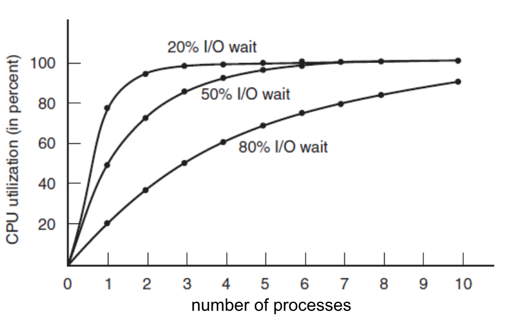

## Resource allocation

There are several options for allocating resources for a new process:

- child obtains resources directly from the OS
  - most common and easiest to implement, most OS do this
  - **drawback**: something like 'for bomb' will destroy the system
- child obtains subset of parent's resources
  - parent decides to give up some of its resources so that a child can use them
- parent shares some/all resources with the child

### Common parent-child execution scenarios

When child process is created, parent process usually does one of three things:

1. The parent waits until the child process **is finished**
   - often used when child executes another program, e.g. `fork()`/`exec()`, or `system()`
   ```python
   pid = fork()
   if pid > 0:
     wait()
   ```
2. The parent continues to execute concurrently and independently of the child process
   - e.g. autosave feature
   ```python
   pid = fork()
   if pid > 0:
     do_something()
     exit()
   ```
3. The parent continues to execute concurrently, but synchronizes with the child
   - can be complicated to synchronize
   ```python
   pid = fork()
   if pid > 0:
     do_something_1()
     synchronize()
     do_something_2()
     synchronize()
     # ...
   ```

## Process termination

Typical conditions which terminate a process:

- **voluntary**
  - _normal exit_ - application decides it's done, or user closes the app
    - `exit()` call
  - _error exit_ - application detects an error, optionally notify the user
    - `exit()` call
- **involuntary**:
  - _fatal error_
    - usually due to a bug in the program, detected by OS
    - e.g. accessing invalid memory, div by zero
  - _involuntary_ - killed by another process
    - parent, or another process calls `kill()`
    - e.g. during shutdown, pressing `<ctrl-c>` in terminal, closing window

Parent may terminate its children for different reasons, for example:

- the child has exceeded its usage of some of the resources
- the task assigned to the child is no longer required
- the parent needs/wants to exit and wants to clean up first

In Unix, when a parent process is terminated, the child processes may be terminated, or assigned to the grandparent process, or to the `init` process. Process hierarchy is always maintained. Default behavior on Linux is to **reparent** the child process to the `init` process. This can be changed (e.g. to kill children, reparent to some other process). Using `prctl()` system call, the behavior can be changed.

When terminating a process, OS must free all related resources, e.g. free memory used by the process, delete PCB, delete process from process table, kill children or assign them to a new parent, close files, close open network connections.

## Process scheduling

Part of multitasking is deciding which process gets the CPU next. Typical objective is to maximize CPU utilization. **Process scheduler** is a kernel routine/algorithm that selects an available process to execute on the CPU. Process is selected from a _ready queue_. OS maintains different scheduling queues:

- job queue: all programs waiting to run, usually found in batch systems
  - e.g. priority queue
- ready queue: all processes that are ready to execute their next instruction
  - e.g. linked list, implemented via pointers
- device queue: processes waiting for a particular device
  - each device has its own queue

### Process states

There are 3 process states:

- **running** - actually running on the CPU
- **blocked** - waiting for some event to occur, e.g. I/O
- **ready** - the process is ready to execute on CPU

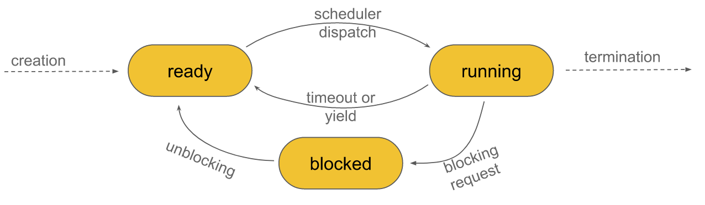

Only 4 transitions are possible:

- ready $\to$ running
- running $\to$ ready
- running $\to$ blocked
- blocked $\to$ ready

### Context switching

Context switching is essential feature of any multitasking OS. It allows illusion of sharing a single CPU (or limited number of CPUs) among many processes.

OS maintains a context (state) for each process which is usually a part of PCB. When OS switches between process A and B:

- OS saves A's state in A's PCB
- OS restores B's state from B's PCB

Context switching occurs in kernel mode, for example when process exceeds its **time slice**. Context switching also introduces time overhead, because CPU spends cycles on not useful work when restoring/saving CPU registers. Therefore, context switching is the most optimized part of the kernel

### Unix signals

A form of **interprocess communication** (IPC):

- It's a similar concept to interrupts on CPUs. Interrupts on the application level. If application sends a signal to another application, that process is interrupted.
- Asynchronous
- Very limited IPC - messages consist of only small set of predefined integers

A signal is used to notify a process that a particular event has occured. One process (or thread) sends a signal, another process (or thread) received it. It is possible for a process to signal itself. Signal lifetime:

- Signal is **generated/sent**, usually as a consequence of some event
- Signal is **delivered/pending** to a process
- Delivered signal is **handled** by the process via a **signal handler**.
- Some signals can be **ignored** - signal delivered to a process that ignores it, is lost
- Some signals can be **blocked** - signal stays pending until it is unblocked

#### Generating signals

Signals are generated:

- manually from process to another process
- periodically via timer
- automatically to handle exceptions
- from command line

#### Signal Handling

**Signal handler** - a function that will be invoked when a signal is delivered. **Default signal handler** - all programs have default handlers with default behaviors. Programs can also override default handlers via **user-defined handlers**, except for `SIGKILL` (`kill -9 PID`), or `SIGSTOP <ctrl-z>`.

Since signals can be delivered anytime, the state of program's data might be in an **inconsistent state** as well as the signal handler _itself_ can be interrupted.

---

# Threads

In many ways threads are similar to processes. Both can be used to write applications that need some parallelism. However, min differences are: threads are more efficient, threads are more complicated to program correctly.

Informally, a thread is "a process within a process", or "mini process". A process can have multiple threads, and a thread is always associated with a process. All threads within one process share the resources of the process. A process is like a container for all its threads. All threads are scheduled independently.

## Process vs Thread

Both processes and threads can be used to write concurrent applications, but there are important differences

- processes are independent and self contained
- threads exists as a subset of process
- threads belonging to the same process share many/most resources with each other
- processes interact only through OS mechanisms (IPC = interprocess communication)
- threads have more options for communication
- processes have easier access to built-in OS mechanisms, but they are usually less efficient than threads

**Per-process items**:

- address space
- global variables
- heap
- open files
- child processes
- signals

**Per-thread items**:

- registers
- PC
- stack
- state

## Common thread scenarios

- **pipeline**
  - a task is broken into a series of stages
  - each stage handled by a different thread
- **manager/worker**
  - one manager thread assigns work to worker threads
  - manager thread handles all I/O
  - worker threads can be static or dynamic
- **peer**
  - all threads work on the same or different tasks in parallel

### Why Threads?

- multithreaded applications can run faster on computers with multiple cores/CPUs
- multiple threads can parallelize access to hardware e.g. 2 threads reading different files

### Thread pool

**Thread pool** is a software design pattern. Program creates and maintained a pool of worker threads. Pool size can be tuned, e.g. to the available computing resources. When program needs a thread, it takes one out of the pool.

Thread queues are often combined with a **task queue**. Instead of asking for a thread, a 'task' is inserted into a task queue. Available threads in the thread pool take tasks from the task queue and finish them.

### Thread libraries

- POSIX threads
- Win32
- Java

#### POSIX threads (aka pthreads)

To use POSIX threads:

- `#include <pthread.h>`
- compile with `gcc -lpthread`

pthread functions:

- `pthread_create(thread, attr, start_routine, arg)` starts a thread, similar to `fork()`
- `pthread_exit(status)` terminates the current thread, similar to `exit()` or you can return from `start_routine`
- `pthread_join(thread, *status)` blocks the main, calling, thread until the specified thread terminates, similar to `wait()`
- `pthread_attr_init(attr)` and `pthread_attr_destroy(attr)`
  - initializes/destroys thread attributes
  - these can be tuned with `pthread_attr_set*()` functions

---

# Concurrent Programming

## Threads and `fork()`

When `fork()` is called in a program with multiple threads. What happens is only the calling thread survives, other threads are not duplicated. This creates a problem if synchronization mechanisms used. It's possible to register a callback in case `fork()` is called using `pthread_atfork()`. However, generally **`fork()` should be avoided** in programs with multiple threads.

Some usages are sage: e.g.:

- `fork()` is immediately followed by `execve()` to execute external program
- `fork()` is executed before creating any threads

## Thread cancellation

Imagine a scenario when threads are used to parallelize database search. Multiple threads are searching different parts of the database. If one thread finds the result, how do we notify the other threads to stop searching?

There are two general approaches:

- Asynchronous cancellation
- Deferred cancellation (aka synchronous cancellation)

### Async cancellation

It's called async because there is no sync with thread that needs to be cancelled, as soon as the signal is received (so data might be missing)

One thread manually terminates the target thread using `pthread_kill(thread_id, SIGUSR1)` and then target is killed instantly.

Common problem is what happens to the data currently updated by the thread that is killed?

- Killed thread has no chance to clean up
- This can likely lead to leaving data in undefined state

Usually, it is better to use synchronous thread cancellation.

### Deferred / Synchronous Thread Cancellation

Controlling thread **indicates** it wishes to cancel a thread. Can be done via some global flag or `pthread_cancel()`. Target thread periodically checks whether it should terminate, checking done only at **cancellation points** at which a thread can be cancelled safely.

Issues:

- Less performance
- Target thread will not react immediately

## Race Conditions

Race condition is a behavior where the output is dependent on the sequence of timing or other uncontrollable events (e.g. context switching, scheduling on multiple CPUs). Often a result of multiple processes/threads operating on a shared state/resource, e.g.:

- modifying shared memory
- reading/writing to files
- modifying filesystems
- reading/writing to databases

Let's take the following code for example

```c
// Global variable counter
int counter;

void incr() {
  // This function is assumes that this is atomic (not interfered by anyone else)
  int x = counter;
  x++;
  counter = x;
}

int main() {
  counter = 0;
  pthread_create(..., incr);
  pthread_create(..., incr);
  pthread_join(...);
  printf("%d\n", counter);
}
```

One possible **execution sequence**, leading to `counter = 2`

|  **Thread 1**  |  **Thread 2**  | **`counter`** |
| :------------: | :------------: | :-----------: |
|                |                |      `0`      |
| `x = counter;` |                |      `0`      |
|     `x++;`     |                |      `0`      |
| `counter = x;` |                |      `1`      |
|                | `x = counter;` |      `1`      |
|                |     `x++;`     |      `1`      |
|                | `counter = x;` |      `2`      |

Another possible execution sequence leading to `counter = 1`

|  **Thread 1**  |  **Thread 2**  | **`counter`** |
| :------------: | :------------: | :-----------: |
|                |                |      `0`      |
| `x = counter;` |                |      `0`      |
|                | `x = counter;` |      `0`      |
|                |     `x++;`     |      `0`      |
|                | `counter = x;` |      `1`      |
|     `x++;`     |                |      `1`      |
| `counter = x;` |                |      `1`      |

Debugging race conditions is hard, in some rare situations the output might be different, e.g. when system was less/more busy.

### Avoiding Race Conditions

We need to prevent more than one process/thread from accessing the shared resource at any given time. One approach is:

- identify **critical sections** in code where this could happen
- enforce **mutual exclusion** to make sure it does not happen

#### Critical Sections and Mutual Exclusion

<mark>Critical section/critical region</mark> is a part of the program that accesses the shared resource in a way that could lead to races or other undefined/unpredictable/unwanted behavior:

```c
int counter; // shared resource

/**
 * Critical section
 */
void incr() {
  int x = counter;
  x++;
  counter = x;
}
```

If we can arrange tasks such that no two processes or threads will ever be in their critical sections at the same time, we could avoid the race condition, therefore achieving <mark>mutual exclusion</mark>.

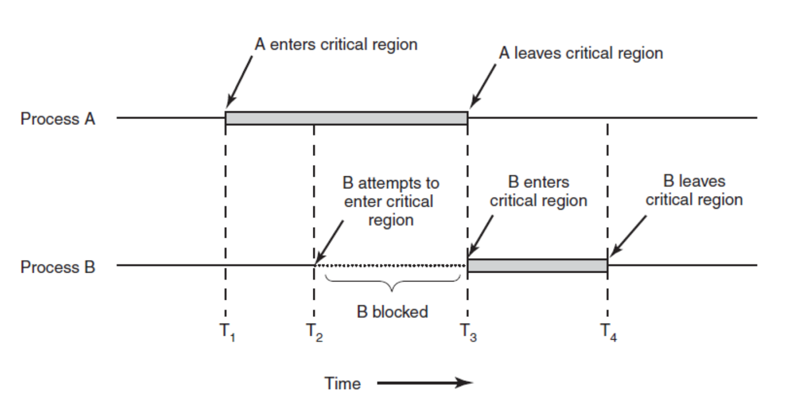

---

Requirements to avoid race conditions:

- No two processes may be simultaneously inside their critical sections
- No assumptions may be made about the speeds or the number of CPUs
- No process running outside its critical region may block other processes
- No process should have to wait forever to enter its critical section
  - a process should not remain in a critical section forever

---

# Mutexes, Locks, 'Dining Philosophers' problem

## 'Dining Philosophers' Problem


There are 5 philosophers sitting around a table. Philosophers want to do 2 things, forever:

- eat, and then
- think

There are 5 bowls of food, one for each philosophers & 5 forks placed between bowls. Before eating, a philosopher must grab two forks, immediately to the left & right. Philosopher then eats for a short time. When done eating, the philosopher puts down the forks in their original positions. Philosopher then thinks for a short time.

**Software scenario**:

- 5 processes/threads, each needs exclusive access to two resources to proceed.

How to allocate resources so that all processes/threads get to execute? What is the **best** algorithm for threads/processes to follow?

Assuming each philosopher eats & thinks for the exact same amount of time, optimal schedule:

```
repeat:
  1 & 3 eat
  2 & 4 eat
  3 & 5 eat
  4 & 1 eat
  5 & 2 eat
```

> There is no solution for every case.

---

**Attempt 1**:

Assuming that philosophers are "perfectly synchronized". Each philosopher follows these steps:

```
repeat forever:
  grab left fork
  grab right fork
  eat
  put forks back
  think
```

This would lead to a <mark>**deadlock**</mark>:

- assuming all philosophers are reasonably synchronized
- each philosopher will end up grabbing the left fork
- each philosopher will be stuck trying to grab the right fork
- nobody gets to eat at all

**Attempt 2**:

```
repeat forever:
  repeat:
    try to grab left fork
    try to grab right fork
    if both forks grabbed:
      break
    else:
      put any grabbed forks back and take a short nap
  eat
  put forks back
  think
```

This would reach <mark>**livelock**</mark>:

- assuming they are all synchronized
- all philosophers will indefinitely switch switch between napping and attempting to eat
- nobody will eat - form of **starvation**

**Attempt 3**:

Same as before, but there is one pink hat that one philosopher is wearing

```
repeat forever:
  wait for hat
  grab forks, eat, put forks back
  give hat to someone else
  think
```

It would work, but:
- only one process get to eat
- but with 5 forks, 2 philosophers could be eating at the same time
- it defeats the purpose of multithreading (no parallelism of eating); not optimal use of resources
- called arbitrator solution

**Attempt 4**:

```
while true:
  repeat
    try to grab left fork
    try to grab right fork
    if both forks grabbed:
      break
    else:
      put any grabbed forks back
      take a short **RANDOM** nap
  eat
  put forks back
  think
```

We introduce a random **timeout** mechanism for preventing deadlocks. Likely to work, often used in real world, for example in networking. However, there is still a small chance for starvation:

- if sleep is the same for all philosophers, then no one gets to eat
- in some cases some philosophers might never get to eat, or some philosophers will get to eat less often than the others - *fairness problem*

**Attempt 5**:

- Label the forks with numbers: 1, ..., 5
- Each philosopher:
  - picks up the fork with the smallest number first, then the larger number second
  - if unable to pick up both forks, put a claimed fork down and take a short nap

This is a **resource hierarchy** solution - by establishing a **partial order** on resources. Starvation is still possible. Also not always practical for large/dynamic number of resources.

---

**Naive algorithm implementation**:

Even trying to implement a naive solution presents problems. Consider algorithm for #1:

```c
/* 
  Utencil state: 
    true = available
    false = unavailable
*/
bool forks[5];

while (true) {
  sleep(s);                          // think for s seconds
  while (!forks[i] || forks[i + 1]); // i + 1 % 5 arithmetic
  forks[i] = false;
  forks[i + 1] = false;
  sleep(m);                          // eat for m seconds
  forks[i] = true;
  forks[i + 1] = true;
}
```

Depending on the execution order (e.g. multicore machines, or timing of context switches):

- both philosophers could start eating at the same time
- i.e. both processes could enter the critical region

In that code, the shared resource is the global variable `forks[]`. The critical sections are:

```c{10-12,14-15}
/* 
  Utencil state: 
    true = available
    false = unavailable
*/
bool forks[5];

while (true) {
  sleep(s);
  while (!forks[i] || forks[i + 1]); // critical section
  forks[i] = false;
  forks[i + 1] = false;
  sleep(m);                          // critical section
  forks[i] = true;
  forks[i + 1] = true;
}
```

---

## Mutex (aka Lock)

**Mutex** is a synchronization mechanism used for ensuring **exclusive access** to a resource in concurrent programs. Think of mutex as a special boolean type that can represent a lock:

- `true` $\to$ locked
- `false` $\to$ unlocked

We can set it to `true` or `false` just like a regular boolean variable. But, if the lock is already locked, and some thread tries to also lock it, then the calling thread will be automatically suspended until whoever locked the lock, unlocks it.

```c
mutex lock;

// Will block if already TRUE
lock = TRUE;

/*
 Critical section

 it is protected by the mutex lock
*/

// May unblock some other thread
lock = FALSE;
```

Mutex is often implemented as an object with two possible states: *locked* and *unlocked*. It implements two operations `lock()` and `unlock()`. If multiple threads call `lock()` simultaneously, only one will proceed, the others will block. Therefore, only the thread *that locks* the mutes can *unlock it*.

A waiting queue is used to keep track of all threads waiting on the mutex to be unlocked. Once the mutex is unlocked, one of the blocked threads will be unlocked. *Note*: which one thread gets unlocked is usually not predictable. It can be implemented in software via busy waiting, but usually supported by hardware + OS. Portable libraries often try to use H/W mutex but are able to fall back to software.

### Mutex in pthread

| API                       | Description                                  |
|---------------------------|----------------------------------------------|
| `pthread_mutex_init()`    | create a mutex                               |
| `pthread_mutex_destroy()` | destroy a mutex                              |
| `pthread_mutex_lock()`    | lock a mutex, block if already locked        |
| `pthread_mutex_trylock()` | lock a mutex, or fail (non-blocking version) |
| `pthread_mutex_unlock()`  | unlock a mutex                               |

**Counter with mutex**:

```c
#include <pthread.h>

// initialized in main() with pthread_mutex_init()
pthread_mutex_t count_mutex;

// initialized in main() with counter = 0
int counter;

void incr() {
  // acquire the lock
  pthread_mutex_lock(&count_mutex);

  int x = counter;
  x++;
  counter = x;

  // release the lock
  pthread_mutex_unlock(&count_mutex);
}
```

**Dining philosopher with mutex**:

```c{7-11,15-18}{numberLines: true}
pthread_mutex_t mutex;
bool forks[5];

while (true) {
  sleep(s);

  pthread_mutex_lock(&mutex);
  while (!forks[i] || forks[i + 1]);
  forks[i] = false;
  forks[i + 1] = false;
  pthread_mutex_unlock(&mutex);

  sleep(m);

  pthread_mutex_lock(&mutex);
  forks[i] = true;
  forks[i + 1] = true;
  pthread_mutex_unlock(&mutex);
}
```

However, this will not work, due to **deadlock**. `while (!forks[i] || forks[i + 1]);` will result in an infinite loop. It can also be argued that this is a **livelock**.

---

## Summary

- **Critical section** - part of the program where a shared resource is accessed & may cause trouble
- **Mutual exclusion** - ensuring only one process accesses a resource at a time, e.g. only one process can enter critical section at a time
- **Mutex/lock** - mechanism to achieve mutual exclusion, two states + queue
- **Deadlock** - a state where each process/thread is waiting on another to release a lock $\to$ no progress is made
- **Livelock** - states of the process change, but none are progressing
- **Starvation** - one process does not get to run at all
- **Unfairness** - not all processes get equal opportunity to progress
- There are some thread issues:
  - `fork()`, cancellation, signals, thread pool
  - race conditions
    - critical section, mutual exclusion
  - dining philosophers problem
  - mutex
  - deadlock, livelock, starvation, fairness

---

# Synchronization Mechanisms. Condition Variables, Semaphores and Other Synchronization Mechanisms

TODO: lec11

## Condition Variables

Condition variables are another type of synchronization primitives. They're used together with mutexes. CVs are perfect for implementing critical sections containing loops waiting for some condition.

```c
mutex &m;

// Critical section is protected with mutex `m`
lock(m);
  while (!condition) { ; }
unlock(m);
```

The condition can only become true, if **another thread runs it's critical section**. A common pattern of using CVs:

- a thread enters it's critical section (locks a mutex)
- inside critical sections, thread needs to wait for some condition to become true
- but the condition can only become true by allowing some other thread to lock the mutex
- the thread has to wait and release the mutex

```c
mutex &m;

lock(m);
  while (!condition) { wait(cv) }
unlock(m);
```

Now, some other thread can lock the mutex and execute code that will satisfy the condition. Eventually, the other thread:

- locks the mutex (optional)
- changes some state that will satisfy the condition
- notifies the waiting thread via condition variable
- releases the mutex (optional)

```c
mutex &m;

lock(m);
  condition = TRUE;
  signal(cv);
unlock(m);
```

POSIX provides with `pthread_cond_t` condition variable with following functions:

- `pthread_cond_wait(&cond, &mutex);`. Atomically releases mutex and causes the calling thread to block, until some other thread calls `pthread_cond_signal(&cond)`. After returning, the mutex is automatically re-acquired, the condition is also must be checked due to _spurious wakeups_.
- `pthread_cond_signal(&cond);`. Wakes (signals) up thread waiting on `cond`. If no threads waiting on condition, the signal is lost. Must be followed by `pthread_mutex_unlock()` **if the blocked thread uses the same mutex**.

**Example**:

Thread 1 decrementing counter, but never below 0, thread 2 incrementing counter. This doesn't have deadlocks and no busy waiting.

```c
// Thread 1

while(true) {
  pthread_mutex_lock(&mutex);
  
  while (count == 0) {
    pthread_cond_wait(&cond, &mutex);
  }
  count--;

  pthread_mutex_unlock(&mutex);
}

// Thread 2

while(true) {
  pthread_mutex_lock(&mutex);

  counter++;
  
  pthread_cond_signal(&cond);
  pthread_mutex_unlock(&mutex);
}
```

## Semaphore

Semaphore is another synchronization primitive. A special integer variable used for signalling. The value could indicate number of available units of some resource. Semaphore supports three operations:

- **Initialization**: can be initialized with any value 0 ... `INT_MAX`
- **Decrement**: reduces semaphore value by 1, blocks the calling process if < 0; `down(s)` or `wait(s)`.
- **Increment**: increases value by 1 and possibly unblocks another blocked prosess; `up(s)` or `signal(s)`.

Semaphore can be used to protect critical sections, similar to a mutex:

```c
semaphore s;

wait(s);
// Critical section ...
signal(s);
```

Each semaphore maintains a queue of processes blocked on the semaphore. When a semaphore is locked by a thread, it can be unlocked by **any thread**, as opposed to a mutex, where locking/unlocking must be done by the same thread. That makes semaphores more suitable for producer-consumer problems.

### Binary semaphore

It is a special type of semaphore, with value `[0, 1]`.

```c
void wait(int &s) {
  while (s == 0) {}
  s = 0;
}

void signal(int &s) {
  s = 1;
}
```

Where the bodies are executed **atomically**. An **atomic operation** is an operation that _appears to execute instanteneously_, with respect to the rest of the system, e.g. it cannot be interrupted by signals, threads, interrupts.

### Counting semaphore

A **general semaphore**, represents an integer value `S`, where:

- `S > 0`: value of `S` is the number of processes/threads that can issue a wait and immediately continue to execute.
- `S = 0`: all resources are busy, the calling thread/process must wait
- `S < 0`: (not all implementations do this), `abs(S)` represents the number of processes/threads that are waiting to be unblocked.

```c
void wait(int &s) {
  while (s <= 0) {}
  s--;
}

void signal(int &s) {
  s++;
}
```

Where the functions are executed **atomically**.

## Semaphores vs. Condition Variables

- `signal()` compared to `cv_signal()`:
  - `cv_signal()` is lost, if no thread is waiting.
  - `signal()` increments the semaphore always, and possibly wakes up a thread.
- `wait()` compared to `cv_wait`:
  - `cv_wait()` does not check the condition, always blocks.
  - `wait()` checks the value of the semaphore and may or may no block.

---

**Possible errors**

You need to be careful with order in which `signal` and `wait` are called.

```c
/*
 * The following will violate mutual exclusivity
 */
signal(s);
// Critical section ...
wait(s);

/*
 * This will lead to deadlock
 */
lock(mutex);
// Critical section ...
lock(mutex);
```

---

# CPU Scheduling

TODO: lec12

Recall multiprogramming:

- Objective is to maximize CPU utilization by having a process running at all time
- Several processes are kept in memory at one time
- A process runs until it must wait
- Instead of having CPU sit idle, the OS takes the CPU away from the waiting and gives it to another process that is ready to run

The software that decides which process runs next is called a **scheduler**. Scheduler is usually a part of a kernel and it is an implementation of some **scheduling algorithm**.

## Process behaviour

Most processes alternate bursts of CPU activity with bursts of I/O activity. **CPU-bound** (or compute-bound) processes - have long CPU bursts and infrequent I/O waits. **I/O bound** processes - have short CPU burst and frequent I/O waits.

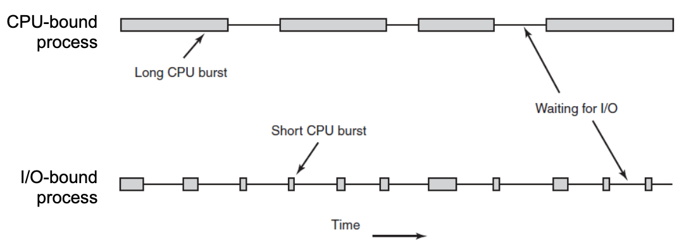

As CPUs get faster, processes tent to get more I/O bound. It takes quite a few I/O bound processes to keep the CPU fully occupied.

## When to schedule

<!-- TODO -->

## Preemptive vs non-preemptive CPU scheduling

- <mark><b>Non-preemptive</b></mark> - Context switch happens only voluntarily
  - Multitasking is possible, but only through cooperation
  - Process runs until it does a blocking syscall (e.g. I/O), terminates, or voluntarily yields CPU
- <mark><b>Preemptive</b></mark> - Context switch can happen without cooperation
  - Usually as a direct or indirect result of some event, but not limited to clock interrupt, e.g. new job is added, existing process is unblocked
  - preemptive is often (mis)used to mean preemptive time-sharing
- <mark><b>Preemptive time-sharing</b></mark> - Special case of preemptive
  - TODO

## Categories of scheduling algorithms

<!-- TODO -->

### Scheduling metrics

- **Arrival time**: the time a process arrives
- **Start time**: the time process first gets to run on CPU
  - different from arrival time for batch systems, identical to arrival on interactive systems
- **Finish time**: when the process is done (time of the last instruction)
- **Response time**: how long before you get first feedback, often response = start - arrival
- **Turnaround time**: time from arrival to finish, runaround = finish - arrival
- **CPU time**: how much time the process spent on CPU
- **Waiting time**: total time spent in waiting queue, waiting = turnaround = CPU - I/O

Overall statistics:

- **average turnaround time, average wait time**...
- **throughput** - number of jobs finished per unit of time

**Goals of scheduling algorithms**:

- All systems
  - **fairness**: giving each process a fair share of the CPU
  - **policy/priority enforcement**:
  - **balance**:
- Batch systems
- Interactive systems
- Real systems

---

## First-come-first-served (FCFS) scheduling

<!-- TODO -->

**Gantt chart**: used to visualize scheduling of 5 processes

List of processes (for simplicity, assume no I/O activity):

| Process | Arrival | Burst |
| ------- | ------- | ----- |
| P1      | 0       | 6     |
| P2      | 0       | 6     |
| P3      | 1       | 3     |
| P4      | 2       | 8     |
| P5      | 3       | 2     |

Gantt chart:

```mermaid-svg
gantt
    title FCFS Scheduling
    dateFormat  DD-MM-YYYY
    section CPU
    P1: p1, 6d
    P2: p2, after p1, 6d
    P3: p3, after p2, 3d
    P4: p4, after p3, 8d
    P5: p5, after p4, 2d
```

**Simulating scheduling**:

<!-- TODO -->

**Calculating statistics**:

<!-- TODO -->

---

### Convoy Effect

Big disadvantage of FCFS is the **convoy effect**. Scenario: one CPU-bound process + many I/O bound processes. Result: the CPU-bound process will tie up the CPU, making the I/O bound processes run for much longer.

**Example**:

- Single CPU-bound process $A$, with 1s long CPU burst cycles
- Many I/O bound processes $B_i$, with each needing 1000 I/O operations, each $\frac{1}{1000}s$ long

<!-- TODO -->

## Round-robin scheduling (RR)

**Round robin** scheduler is a preemptive version of the FCFS scheduler, where each process is assigned a time interval, called a **time slice** or a **quantum**. If the process exceeds the quantum, the process is preempted (context switch), and CPU is given to the next process in ready queue. Preempted process goes at the back of the ready queue.

**Gantt chart**:

Using a quantum = 3msec

| Process | Arrival | Burst | Start | Finish | Turnaround | Waiting |
| ------- | ------- | ----- | ----- | ------ | ---------- | ------- |
| P1      | 0       | 6     |       |        |            |         |
| P2      | 0       | 6     |       |        |            |         |
| P3      | 1       | 3     |       |        |            |         |
| P4      | 2       | 8     |       |        |            |         |
| P5      | 3       | 2     |       |        |            |         |

<!-- TODO -->

```mermaid-svg

```

(Context switches happen when number changes)

**Time Slice**

Performance of RR depends on the size of the time quantum $Q$ and the time required for a context switch $S$. For example, if $S = 1ms$, $Q = 4ms$, then CPU will spend $1/(4 + 1) = 20\%$ of its time on useless tasks. Very small $Q$ implies heavy overhead, but highly responsive system. Very large $Q$ implies minimum overhead, but a non-responsive system. So $Q$ should be large compared to $S$, but not too large:

- Good rule of thumb is that 80% of the CPU bursts should be shorter than the time quantum.
- Quantum of around 20-100ms is often a reasonable compromise.

## Shortest-job-first scheduling (SJF)

**Shortest-job-first scheduler** is non-preemptive scheduling algorithm. It's applicable to batch systems, where job length (expected execution time) is known in advance. It could also be modified to be preemptive (e.g. preemption when new job arrives, or existing one unblocks).

When the CPU is available, it is assigned to the shortest job. Shortest job - shortest _execution time_. Ties are resolved using FCFS. SJF is similar to FCFS, but ready queue is sorted based on submitted estimate of execution time.

**SJF scheduling**

<!-- TODO -->

| Process | Arrival | Burst | Start | Finish | Turnaround | Waiting |
| ------- | ------- | ----- | ----- | ------ | ---------- | ------- |
| P1      | 0       | 6     | 0     | 6      | 6          | 0       |
| P2      | 0       | 6     | 11    | 17     | 17         | 11      |
| P3      | 1       | 3     | 8     | 11     | 10         | 7       |
| P4      | 2       | 8     | 17    | 25     | 23         | 15      |
| P5      | 3       | 2     | 6     | 8      | 5          | 3       |

```mermaid-svg
gantt
    title SJF Scheduling
    dateFormat  DD-MM-YYYY
    section CPU
```

---

**Advantages**

- minimum number of context switches
- optimal turnaround time if all jobs arrive simultaneously
  - minimizes average waiting time

**Disadvantages**

- requires advance knowledge of how long a job will execute
- has a potential for job starvation
  - long programs will never get to run if short programs are continuously added
  - can be solved by **aging** (increasing a job priority based on how long it has waited) and then sorting ready queue based on priority

## Shortest-remaining-time-next scheduling (SRTN)

**Shortest-remaining-time-next** is _preemptive_ version of SJF. Next job is picked based on remaining time: `remaining = (expected execution) - (time spent on CPU)`. **SRTN** is similar to RR, but ready queue is a priority queue, sorted based on remaining time. Preemption happens as a result of adding a job.

**Scheduling**

<!-- TODO -->

| Process | Arrival | Burst | Start | Finish | Turnaround | Waiting |
| ------- | ------- | ----- | ----- | ------ | ---------- | ------- |
| P1      | 0       | 6     | 0     | 6      | 6          | 0       |
| P2      | 0       | 6     | 11    | 17     | 17         | 11      |
| P3      | 1       | 3     | 8     | 11     | 10         | 7       |
| P4      | 2       | 8     | 17    | 25     | 23         | 15      |
| P5      | 3       | 2     | 6     | 8      | 5          | 3       |

```mermaid-svg
gantt
    title SJF Scheduling
    dateFormat  DD-MM-YYYY
    section CPU
```

---

**Advantages**

- **optimal turnaround time** even if jobs don't arrive at the same time

**Disadvantages**

- requires knowledge of how long a job will execute
- has a potential for job starvation
- needs to consider cost of context switch

## Multilevel queues

Preemptive time-sharing scheduling algorithm that supports process priorities.

<!-- TODO -->

---

# Deadlocks

TODO: lec13

**Definitions**:

A set of processes is deadlocked if:

- Each process in the set is waiting for an event, _and_
- All such events can be caused by another process in the set

Such event could be anything: resource becoming available, mutex/semaphore/spinlock being unlocked, message arriving.

---

## System model

System consists of processes and resources:

- $n$ processes: $P_1, P_2, \ldots, P_n$
- $m$ resource types: $R_1, R_2, \ldots, R_m$ (e.g. CPU, memory space, I/O devices)
- Each resource type $R_i$ has $W_i$ instances (e.g. 1 CPU, 5 disks, 3 printers)

Each process utilizes a resource in the same manner:

1. Process **requests** the resource - OS may block process
2. Process **uses** the resource - for a finite amount of time
3. Process **releases** the resource - may result in unblocking of related process(es)

## Deadlock - necessary conditions

- <mark><b>mutual exclusion condition</b></mark> - the involved resources must be unshareable (max. one process per resource)
- <mark><b>hold and wait condition</b></mark> - a process holding at least one resource is waiting to acquire additional resources
- <mark><b>no preemption condition</b></mark> - a resource can be released only by the process holding it (voluntarily)
- <mark><b>circular wait condition</b></mark> - there is an ordering of processes $\{P_1, P_2, \ldots, P_n\}$, such that $P_1$ waits for $P_2$, $P_2$ waits for $P_3$, $P_n$ waits for $P_1$, therefore there is a cycle

Conditions are also called **Coffman conditions**.

## Deadlock with mutex locks

Deadlocks can occur in many different ways, e.g. due to locking. For example, deadlock with 2 mutexes:

```c
// Thread 1
lock(&mutex1);
lock(&mutex2);
// Critical section
unlock(&mutex2);
unlock(&mutex1);
```

```c
// Thread 2
lock(&mutex2);
lock(&mutex1);
// Critical section
unlock(&mutex1);
unlock(&mutex2);
```

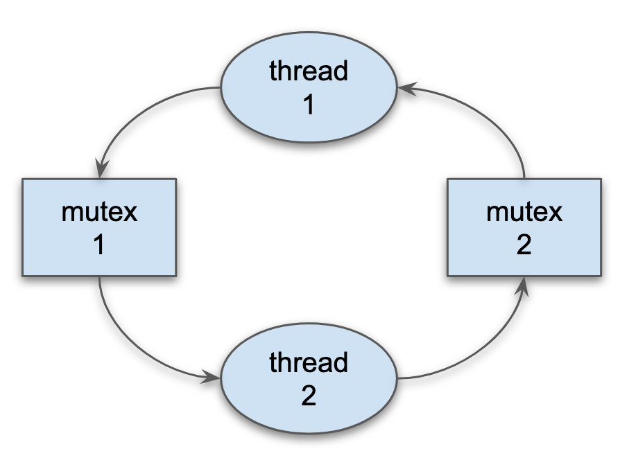

All 4 necessary conditions are present: _mutual exclusion_, _hold and wait_, _no preemption_, _circular wait_.

<!-- TODO -->

## Safe, Unsafe, Deadlock State

- If a system in a **safe state**, then deadlocks are not possible, because they will be avoided by the system.
- If a system is in an **unsafe state**, then deadlocks are possible, but not guaranteed.
- Avoidance algorithm ensures that a system never enters an unsafe state, by rejecting/blocking some requests even if resources are available.

### Deadlock avoidance algorithms

For single instance per resource type, we use **resource-allocation graph algorithm**. For multiple instances per resource, we use **banker's algorithm**.

**Resource-allocation graph algorithm**

- **Claim edge** $P_i \to R_j$ indicates that process $P_j$ _may_ request resource $R_j$.
  - Represented by a dashed line.
  - This is a priori knowledge.
- Claim edge converts to **request edge** when a process actually requests a resource.
  - Represented by a solid line.
- Request edge converts to an **assignment edge** when the resource is allocated to the process.
  - Represented by a solid line, reversed direction.
- When a resource is released by a process, assignment edge converts to a claim edge.
  - Reverse direction & becomes dashed.
- Resources must be claimed **a priori** in the system.

**Algorithm steps**:

- suppose that process requests a resource
- the request can be granted only if allowing such request will not violate **safe state**
- we make sure that converting the request edge to an assignment edge does not result in **formation of a cycle**
- complexity: same as cycle-detection algorithm in a directed i.e. $O(|V| + |E|)$

**Banker's algorithm**

Deadlock avoidance algorithm, more general than resource-allocation graph algorithm, but also a bit slower. It works with multiple instances per resource type. Requirements:

- Each process must declare maximum resources at the beginning
- When a process requests a resource, it may have to wait (even if resource available)
- When a process gets all its resources, it must return them in a finite amount of time

**Data structures for the Banker's algorithm**:

Let `n` = number of processes, and `m` = number of resource types

- **Available** - vector of length `m`
  - `Available[j] = k` means there are `k` instances of resource type $R_j$ available
- **Max** - matrix `n x m`
  - `Max[i][j] = k` means that process $P_i$ may request at most `k` instances of resource type $R_j$
  - `Max[i]` represents i-th row of `Max`
- **Allocation** - matrix `n x m`
  - `Allocation[i][j] = k` means that process $P_i$ is currently allocated `k` instances of $R_j$
- **Need** - matrix `n x m`
  - `Need[i][j] = k` means that $P_i$ may need `k` more instances of $R_j$ to complete its task
- Note: `Need[i][j] = Max[i][j] - Allocation[i][j]`. Only 2 of Need/Max/Allocation are needed, the 3rd can be computed on the fly

Banker's algorithm tries to find whether there is an execution sequence that would finish all running processes, assuming worst case scenario - that each process requests its maximum declared allocation as the next step.

```
; Step 1
Initialize temporary vecors:
Work = Available                        ; vector copy
Finish[i] = false for i = 0, 1, n-1

; Step 2
Find an i such that:
  Finish[i] = false and Need[i] <= Work ; vector comparison

If no such i exists:
  goto step 4

; Step 3
Update Work and Finish:
  Work = Work + Allocation[i]
  Finish[i] = true
goto step 2

; Step 4
If Finish[i] == true for all i, return true ; system is in a safe state
else return false                           ; system is not in a safe state
```

**Complexity**: $O(n^2 * m)$

### Deadlock detection

We allow system to enter a _deadlocked state_, but later we detect the deadlock and recover. Detection algorithm:

- with single instance per resource type
- multiple instances per resource type

**Single instance per resource type**

Maintains an up-to-date **wait-for** graph:

- nodes are **processes**
- edge $P_i \to P_j$ exists if $P_i$ is waiting for $P_j$
- can be obtained by **collapsing** resource allocation graph

A cycle-detection algorithm is invoked periodically. If there's a cycle, there exists a deadlock.

**Multiple instances per resource type**

Very similar to Banker's algorithm:

- try to determine if there is a sequence in which running processes can **finish** executing.
- assumes best case scenario - a process that is given its requested resources will finish without asking for more resources, and then releases all its resources.
- does not require `Max[]` or `Need[]`.

Maintains following:

- `n` number of processes
- `m` number of resource types
- `Available[m]` - indicates the number of available resources of each type
- `Allocation[n][m]` - allocation of resources per process
- `Request[n][m]` - requests for resources per process

**Algorithm**:

```
1. Initialize:
  work = available
  finish[i] = allocation == 0, for all i = 1 .. n

2. Find an index i such that:
  finish[i] == false and request[i] <= work
  if doesnt exist, goto step 4

3. work = work + allocation[i]
   finish[i] = true
   goto step 2

4. if finish[i] == true for 1 <= i <= n, then the system is not in deadlock.
   Otherwise, all processes Pi for which finish[i] is false are deadlocked
```

#### Detection algorithms - when and how often?

Detection algorithms are expensive, cannot invoke on every resource request. Other ways of invoking detections include checking every few minutes, check when CPU goes idle. When and how often depends on how often a deadlock is likely to occur, how many processes will be affected (one for each disjoint cycle). If we check too often, we spend too many CPU cycles on useless work. If we don't check often enough, there may be many cycles in the resource graph and we would not be able to tell which of the many deadlocked processes caused the deadlock.

### Deadlock recovery

Done via **process termination**, **process rollback** or **resource preemption**.

**Process termination**

**Process rollback**

**Process preemption**

---

# Memory

TODO: lec14

---

# Virtual Memory

TODO: lec15

---

# Paging

TODO: lec16

---

# Filesystems

## Long term storage

Long term storage must store a very large amount of information. Information must survive termination of a process using it. Multiple processes must be able to access information concurrently. Easy way to search and manage stored information should be implemented.

## Disks _without_ filesystems

Think of a disk as a linear sequence of **fixed-sized blocks** that support two operations:

- `read-block i`
- `write-block i`

Similar to memory, however it's **block addressable**, **persistent**, and **much slower**.

In order to access information, we need a **filesystem** as an abstraction on `read-block` and `write-block`.

## Files

File is an **abstraction** of long term storage, implemented by OS. OS allows processes to see a file through contiguous logical address space. File contains a sequence of bytes, which can be individually addressed. OS maps files onto physical devices and OS (generally) does not care about the content of files.

File's creator decides on the contents of the file (its format/internal structure). We can construct higher abstractions, e.g. treat files as a sequence of bits, numbers, etc.

### File attributes

Files have contents, but also attributes. **File attributes** vary from one OS to another, but typically consist of these:

- Filename: the symbolic file name is the only information kept in human readable form
- Identifier: unique tag that identifies the file within the FS
- Special type: needed for systems that support different file types (e.g. block device)
- Location: a pointer to the location of the file contents on the device
- Size of the file
- Time/date: time of creation/last modification/last access, used for usage monitoring
- User ID, group ID: identifies owner(s) of the file
- Protection information: access control information (e.g. read/write/execute)

Many variations, including extended file attributes, such as file checksum. This information is usually kept separate from file contents, for example in the directory structure. This metadata is not stored in the same block as the file data.

### File naming

Names are given to files at creation time, but usually can be changed later as well. Different file-naming rules on different systems:

- maximum filename length
- allowed/restricted characters
- capitalization
- filename extensions, enforced vs conventions

### Special file types

Most systems have **special file types**:

- regular files: both text or binary
- directory: special files for maintaining FS structure
- character special files: for I/O on character devices, `/dev/random`
- block special files: for I/O on block devices `/dev/sda`
- links: pointers to other files
- sockets, pipes

### File format (file type)

Regular files can have custom types as well, aka **file format** or **file type**. It is determined by the file creator. If OS recognizes the file format, it can operate on the file in reasonable ways, e.g. automatically using an appropriate program to open a file.

Windows uses file extension to determine a file format. UNIX uses **magic number** technique to determine file format, extension, is only a convention. Format inferred by inspecting the contents of the file, often first few bytes. (e.g. `#!/usr/bin/env bash`).

### File operations

Most systems allow the following operations on regular files:

- `create`
- `delete` - (operation could be on directory)
- `open`
- `close`
- `read`
- `write`
- `append`
- `seek`
- `get attributes` - (operation could be on directory)
- `set attributes` - (operation could be on directory)
- `rename` - (operation could be on directory)

### Open files

OS needs to manage open files, and allow fast access to data in these files. To do this, OS keeps several data structures in memory.

- **Open-file table**: Tracks open files, per-process tables, and a system-wide table.
  - **file pointer**: pointer to last read/write location, per process.
  - **file-open count**: number of times a file is open - to allow removal of data from open-file table when last process closes it, system wide.
  - permissions, pointer to file contents, system wide.

OS keeps various information related to filesystems in various data structures (in memory), to make FS management possible as well as to improve performance. Examples:

- system-wide open-file table: entry for each open file, e.g. starting block number
- per-process open-file table: pointers into system-wide open-file table + file pointer
- mount table: information about each monted volume
- buffer cache: caches FS blocks, to reduce the number of raw reads/write to files, to speed up access to frequently accessed directories, etc.

### Sequential and random file access

There are two general types of accessing files: **sequential & random**. It applies for both reading and writing.

**Sequential access**

Bytes in the file are accessed sequentially, from beginning to end; no skipping, no out-of-order access, although files usually can be rewound.

**Random access**

Bytes can be accessed in any order. Usually implemented via `seek` API.

### Directories

A filesystem is a _collection of files_, where files are the basic units in a filesystem. **Directories** are used to organize files hierarchically.

- Root node of the tree is the **root directory**.
- Internal nodes = directories, leaf nodes = files.
- Path in a tree = filepath.

Directory is usually implemented as a special file. Directory file contains **directory entries**. Entry contains file attributes, filename, size, etc. Entries can represent a file or a directory (_subdirectory_). If subdirectories not allowed, then it is a **single-level directory** system. If subdirectories are allowed, then it is a **hierarchical directory** system.

## Disk partitions

A physical disk can be subdivided into separate regions, called _partitions_. Partition is an abstraction, creaating illusion that there are more disks. OS can manage partitions independently, as if they were separate disks. Information about partitions is stored in a _partition table_.

### Partition and mounting

Partition can be formatted to contain a filesystem, it must be mounted to access. Or it can stay raw (unformatted). **Root partition** with a filesystem contains the OS, mounted at a boot time as root directory `/`.

### Filesystem blocks

Filesystems split files up into fixed-sized blocks. File sizes are sized up to the nearest multiple. Most filesystems suffer from internal fragmentation. **Filesystem block** size is usually a multiple $2^n$ of the underlying _disk block_ size. FS blocks of one file not necessarily adjacent. That results in **fragmented file**, seek time performance issues. Performance and space utilization are inherently in conflict.

## Virtual file systems

**Virtual file systems** provide an 'object-oriented' way of implementing file systems. VFS allows the same system call interface (the API) to be used for different file systems. It separates generic file-system operations from implementation details. VFS implementation can be disk filesystem, RAM FS, archive FS, or even network based FS.

OS accesses all filesystems throught the same VFS interface. 


### VFS Implementation

Linux implements VFS through four object types: `inode`, `file`, `superblock`, `dentry`. VFS defines set of operations on the objects that must be implemented:

- Every object has a pointer to a function table
- Function table contains addresses of routines that implement that function on that object
- example:
  - `int open(...)`: open a file
  - `int close(...)`: close an already-open file
  - `ssize_t read(...)`: read from a file
  - `ssize_t write(...)`: write to a file
  - `int mmap(...)`: memory map a file

A developer of a new FS only needs to implement VFS API. Then the FS can be mounted by Linux.

### Directory implementation

**Linear list** of file names with pointer to the file blocks:

- simple to implement
- O(n) search time
- could be maintaned in sorted order

**Hash table** - linear list with _hash_ data structure

- potentially O(1) search time
- needs good hash function to limit collisions, and the right size table
- big table -> a lot of wasted space, small table -> too many collisions
- dynamically resizable hash table could be used to solve this

Linux (ext3/ext4) uses special data structures called `htrees`.

## File allocation methods

File allocation method refers of how disk blocks are allocated to files.

### Contiguous allocation

**Contiguous allocation** - each file occupies a set of **contiguous** blocks. Results in best performance in most cases. Simple - only starting location (block #) and length (number of blocks) are required. Problems include:

- finding space for files
- either knowing file size at creation, or complications with growing a file
- external fragmentation after file deletion
- need for **compaction** offline (downtime) or online (reduced performance), aka **defragmentation**.

Contiguous allocation is not very common. Useful for tapes & read-only devices, such as CD-ROMs.

**Allocation process**


Mapping from logical to physical address: assuming block size is a power of 2. Logical address: `[    q  |  r ]`, where `q` upper bits, `r` lower bits. Physical address computation:

$$
block = q + \text{ address of first block} \\
\text{displacement within block } = r
$$

### Linked allocation

In **linked allocation** each file is stored in a linked list of blocks. Each block contains file content plus a pointer to the next block. File ends at a block with `NULL` pointer. No external fragmentation -> no compaction needed. Separate free space management needed, e.g. linked list of free blocks. Reliability can be a problem, can lost blocks due to disk failures. **Major problem**: location a block can take many I/Os and disk sees: 1. logical address to physical address mapping requires traversing the list; 2. we could cache the next pointers, but would still need to read entire file first. We could improve efficiency by clustering blocks into larger groups, but that **increases internal fragmentation**.

**Allocation process**

[lec17-linked-alloc.png](Linked allocation process)

Example directory entry:

| filename   | start block | size |
|:----------:|:-----------:|:----:|
| `test.txt` | 10          | 2100 |

Contents of `test.txt` spread over blocks: 10, 11, 14, 5, 17. File size entry is needed, because blocks * block size != filesize.

## File Allocation Table (FAT)

FAT (File Allocation Table) is a variation of linked allocation: all next pointers are stored in a separate table (FAT). FAT can be location e.g. at the beginning or end of the FS volume. FAT is indexed by block number, you can think of it as an array: `fat[N]` contains next pointer to block `N`, where `-1` could denote `NULL` pointer. One FAT table for the entire disk. Directory entry contains index into FAT.

FAT is much like a linked list, but because all pointers stored together, FAT is faster and cache-able. Easier random acces compare to linked allocation. Issues with FAT:

- the entire table must be in memory at all times to achieve efficient random access
- table can be quite big for large disks

### Index Allocation (inodes)

Basic idea behind **index allocation** is to store a per-file FAT-like structure, then we don't need to cache pointers for all files, only the open files. Each file has its own index block(s) called `inode`s. An `inode` block contains:

- direct pointers to blocks with file contents, or more indirect pointers to even more `inode`s.
- optionally, `inode` can contain various file attributes:
  - file size in bytes, device ID, owner, permissions, timestamps, link count
  - `inode` **does not** contain a filename

`dentry` is used to associate filename with `inode`. `dentry = filename + inode*`. Possible to have different filenames associated with the same `inode`, called **hard links** (`ln <src> <target>`).

**inodes in Linux (ext2)**

Example: block size 1KB, block address 4 bytes. Single inode with 12 direct entries, max file size 12KB. If we add a single indirect pointer to inode: 1KB block can have 1KB/4B = 256 entries =. max file sisze 256 + 12 blocks = 268KB. Adding double indirect pointer as well: or 256 blocks each with 256 addresses -> max file size: $2^{16}$ blocks ~= 64MB. Adding triple indirect pointer -> max file size: $2^{24}$ blocks ~= 16GB. ext3 max file size = 2TB. ext4 max file size = 16TB (using 48 bit addresses).

---

**Advantages**:

- random access is reasonable: only need to keep the inodes for opened files in memory
- file size is not limited (practically)
- file can have holes

**Disadvantages**:

- at least one additional block is required for each file

### Hard link vs. soft link

1. create `file.txt`: `echo "yo" > file.txt`
2. create **hard link**: `ln file.txt file_hard_link.txt`. A hard link points to the same `inode`, if we delete `file.txt`, `file_hard_link.txt` will still work.
3. create **soft link**: `ln -s file.txt file_soft_link.txt`. Deleting `file.txt` breaks `file_soft_link.txt`.

Hard links can be created only to regular files; can't hard-link directories, it **could lead to cycles in FS**. Symbolic links can link to anything, can lead to cycles and broken links too (`ln -s file.txt file.txt`).

### Performance

CPU still outperforms I/O operations, whether done via HDDs or SSDs. Important to try to minimize the number of I/O operations: try to group and combine reads//writes.

## Free space management - bimaps

File systems maintain free-space list to track available blocks. Can be implemented as a bit vector or **bitmap**. OS can reserve some blocks for the bitmap. Example:

- block size = 4KiB = $2^{12}$ bytes
- disk size = 1TiB = $2^{40}$ bytes
- total number of blocks = $2^{40}/2^{12}$ = $2^{28}$ blocks
- we need $2^{28}$ bits in bitmap = $2^{25}$ bytes = 32MiB bitmap or $2^{13}$ reserved blocks
- if using clusters of 4 blocks instead -> only $2^{11}$ reserved blocks

**Cons**: requires searching the bitmap to find free space, wastes some blocks. **Pros**: fairly straightforward to obtain contiguous blocks.

---


**Linked free space list**: free list, all free blocks are linked together, pointers stored inside the blocks. Pros: no waste of space, cons: cannot get contiguous space easily.

---

- **Grouping**
  - instead of storing just one pointer, utilize the space of the entire free block
  - store address of next n - 1 free blocks in first free block, plus a pointer to next blok that contains more free-block-pointer
- **Counting**
  - takes advantage of the fact that space is frequently contiguously used and freed
  - keep address of first free block plus the count of following free blocks
  - free list then has entries containing addresses and counts
- **Space maps**
  - divides device space into metaslab units, each representing a chunk of manageable size
  - within each metaslab, a counting algorithm is used to keep track of free space

## File locking

Provided by some operating systems and/or filesystems. Similar to reader-writer locks. **Shared lock** similar to reader lock - several processes can acquire concurrently. **Exclusive lock** similar to writer lock. Mediates access to a file to multiple processes during `open()`. Types: 1. **mandatory** - access is denied, depending on locks held and requested. 2. **advisory** - preocesses can find status of locks and decide what to do.


---

# Disks, Scheduling, RAID

## Magnetic disks

Each disk **platter** has a flat circular shape. Platters rotate 5400 - 15000 RPMs, the **read-write heads** fly just above the surface of each platter. **Head crash**: the head makes contact with the disk surface, causing permanent damage to the disk. Each head is attached to a disk arm that moves all heads at the same time.

### Disk space

The surface of a platter is logically divided into **circular tracks**

- each track is further divided into **sectors**
- the set of tracks that are at the same arm position make up a **cylinder**


### Mapping

A **logicak block** is the smallest unit of transfer between the disk and the memory, e.g. 512 bytes. Software accesses data on disks oly using `write(block #)` and `read(block #)`. **Mapping** is a process of convering a logical block number into physical address that consists of a cylinder number, a head number, and a sector number. The sectors on disk are mapped to large one-dimensional arrays of logical blocks, numbered consecutively. On modern disks this mapping is done by an embedded controller due to complicated geometry.

**Low level format**

**Low level format** or **physical format** writes low level information to the disk, dividing it into series of tracks, each containing some number of sectors, with small gaps between sectors.


- Preamble: starts with a special bit sequence, cylinder number, sector number, etc.
- Data: depends on the format (e.g. 512 bytes)
- Error correction code: redundant information to detect read errors.

The formattet capacity is about 20% **lower** than the unformatted capacity.

## Disk management

In order to use a disk to hold files, the OS needs to record data structures on the disk. **Partition** the disk into one or more regions, each treated as a logical disk. **Logical formatting** or "making a file sysem" on a partition: abstracting blocks into files and directories.

OS can allow raw disk access for applications that want to do their own block management, and want to keep OS out of the way (e.g. databases). Methods such as **sector sparing** can be used to handle bad blocks, either at OS level, or at lower level.

## Disk scheduling

The time required for reading or writing a disk block is determined by several factors. The must important is **seek time** - the time to move the arm holding the heads to the correct cylinder.

The requests for disk I/O are appended to the **disk queue**. OS maintains separate queues of requests for **each disk**. OS can improve the overall I/O performance by reordering disk I/O requests, with the goal of **minimizing the total head movement**.

### FCFS Scheduling

**First come first serve** scheduling processes requests in the same order as they received. It is fair, but it does not provide fasted overall service.


### SSTF Scheduling

**Shortest seek time first** selects the next request that would result in the shortest seek time from the current head position, i.e. picks the closest request next. Seek time = distance to move the heads. May cause starvation of some requests.


### Elevator Scheduling

**SCAN**

The head continuously scans back and forth across the disk and serves the requests as it reaches each cylinder. Head moves all the way to first/lst cylinder before turning back. Requests at either end tend to wait the longest.


**LOOK**

Nearly identical to SCAN, but head does not move al the way to first/last cylinder before turning back. Instead, it only goes as far as necessary. Results in same request order as SCAN, but less overall head movement. 

**C-SCAN**

Same as SCAN in one direction, but after reaching last cylinder head repositions to the first cylinder, and no requests are processed during this ime. Achieves more uniform wait time than SCAN.

**C-LOOK**

Small optimization of C-SCAN, head only goes as far as needed by the next request (same optimization as SCAN -> LOOK).


---

The performance of a scheduling algorithm depends on:

- the number and types of requests
- the file allocation method
- the location of directories and index blocks

Either SSTF or LOOK is a reasonable choince for default algorithm, C-LOOK if we need more consistent wait times. Other scheduling algorithms also consider: rotational latency, priority of the task - requests belonging to higher priority process receive higher priority, prioritize read over write, sicnce read requests usually block processes.

---

## RAID

**RAID** - Redundant array of independent disks. Main concept of RAID is providing _reliability via redundancy_. It can also **improve performance** through parallelization or requests. RAID is accessed as one big disk, therefore there is **increased capacity**. It can be implemented via dedicated hardware, or in software, or a combination. RAID is opposite of partitioning, representing multiple disks as a single disk.

### RAID 0 - Striped volume

- Uses a group of disks as one unit.
- Purpose: highest performance for read & write.
- Consecutive logical blocks distributed across all disks, ideally contents of every file are evenly distributed across all disks.
- Offers no redundancy - a single disk failure leads to entire RAID failure, actually **reduces reliability**.
- With N disks, read & write performance can be up to N times higher than a single disk, because both read & write can be parallelized.
- Often used for high-performance temporary storage, where data loss is tolerable.

### RAID 1 - Mirrored disks

- Keeps 1 or more duplicates of a disk.
- Purpose: very high reliability & fast read performance.
- With N disks, it is tolerant to N - 1 simultaneous disk failures
  - RAID continues to work in **degraded mode**
  - RAID software usually notifies the operator
  - Failed disk can be removed & **rebuilt** from the surviving disks
- With N disks, read performance can be up to N times higher than with a single disk
- Write performance is that of a single disk
- With N disks, only 1 disk worth of space to store data

### RAID 4 - Striping with dedicated parity


- One disk dedicated to contain **parity** information, computed e.g. using XOR
- Purpose: reliability & fast read performance
- Tolerant of a single disk failure
- With N disks, only N - 1 are used for data
- Not common:
  - Write is slow, since parity disk is a bottleneck
  - Parity disk also wears out faster than the other disks in the array

### RAID 5 - Striping with distributed parity


- Similar to RAID 4 but parity is **distributed among all disks**.
- Purpose: Reliability, fast read and write performance, but not as fast as RAID 0
- Tolerant of a single disk failure
- WIth N disks, only N - 1 space is used for data
- Common when both performance and redundancy is needed

### RAID 6 - Striping with double distributed parity


- Similar to RAID 5, but doubles the amount of partity (more complicated than XOR)
- Purpose: reliability, fast read/write performance
- Tolerant of 2 simultaneous disk failures
- With N disks, only N - 2 space is used for data
- Usage: same as RAID 5, but when data is very important

### RAID 1 + 0 - Striped mirrors


- aka RAID 10 is an example of hybrid/nested RAID
  - Nests RAID 1 in RAID 0 configuration
  - Simplest form: 4 disks, 2 groups of 2
- Purpose: very fast & very reliable. Combines advantages of RAID 0 and RAID 1.
- In simplest form, it can survive a least 1 disk failure.
- Common for high-performance uses where data cannot be lost (databases)
- Cant tune redundancy to 3, 4, 5 simultaneous failures.

Consider RAID 10 that has N groups of RAID 1 and each group has M disks, i.e. total number of disks = M * N. It can survive at least M - 1 simultaneous disk failures, but potentially up to N(M - 1) failures. Read performance potentially up to N * M of a single disk, write performance is N times higher. Only N disks worth of space are used for data out of N * M, so it's very expensive RAID. Other nested RAIDs are possible: RAID 5+0, RAID 6+0, RAID 10+0.
