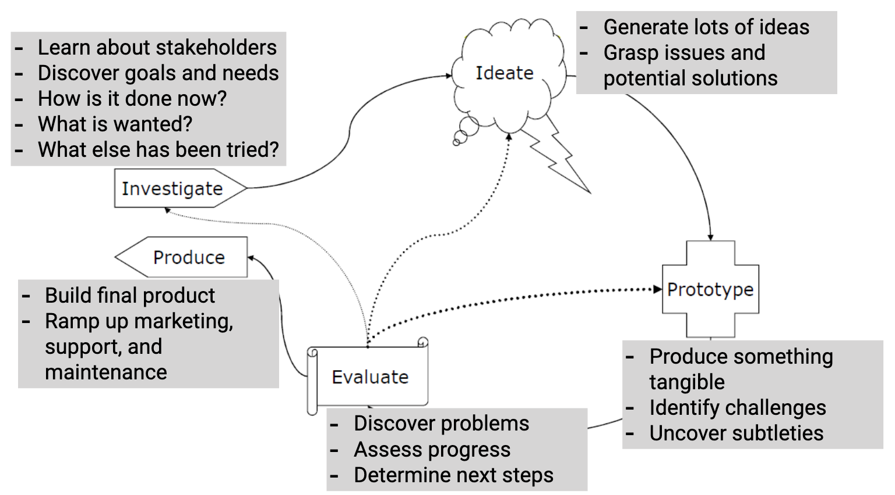

**User-Centered Design** is an iterative design process that makes use of knowledge through **investigation** of a domain of work/play to create **ideas** and **prototypes**.

**Prototypes** are used for **evaluation** and to further stimulate investigation and **idea** and prototype generation. Prototypes and evaluations are used to aid in **production**.

## Investigate

Investigation process is required to identify users, stakeholders, find out what they want and need. Investigation produces requirements, and it's possible to determine how long would it take to implement the project.

**Investigation methods**:

- Interview
- Focus groups
- User surveys

## Ideate

It is necessary to ideate because one of the worst things that can happen is to go with the first idea that you have. Volume maters the most. Success is increased by considering a huge volume of ideas in a systematic way.

**Ideation methods**:

- Structured brainstorming
- Sketching
- Affinity diagramming
- Card sorting
- Personas

## Prototype

Prototyping is cheap and fast. It's easier for users to react to concrete things rather than abstract concepts. Prototyping brings subtleties and nuances to light. And working against some constraints is good.

**Prototyping methods**:

- Paper prototype
- Screenshots
- Flip books
- Hyperlink prototypes
- Functional prototypes

---

Key is to build the prototype fast, concentrate on unknowns and don't be attached to prototypes. Build multiple prototypes concurrently, easier to compare pros/cons.

## Evaluate

Evaluation is an automated process that can find bugs but not usability issues. Evaluation gives you a way to move forward: what needs to be fixed, added, removed? Evaluation answers two questions:

- did we build _the right thing_?
- did we build _the thing right_?

**Evaluation methods**:

- Heuristic evaluation
- Usability testing
- Lab experiments
- Real-world deployments

Evaluation drives iteration:

- Problem: usefulness/appropriateness $\to$ return to investigation phase
- Problem: users don't understand $\to$ return to ideation phase
- Problem: user performance $\to$ return to prototyping phase

## Produce

Steps required to go from functional prototype to **release candidate**:

- software architecture
- programming
- manufacturing
- help systems
- manuals
- training
- marketing
- customer support
- branding

## Summary

Design starts with understanding your user and should keep users' interests central. Design is iterative. Designs are never perfect, rather they can be improved.
