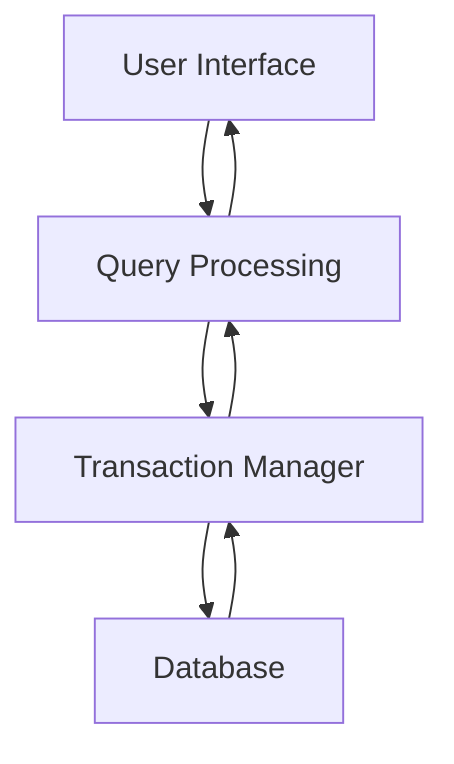
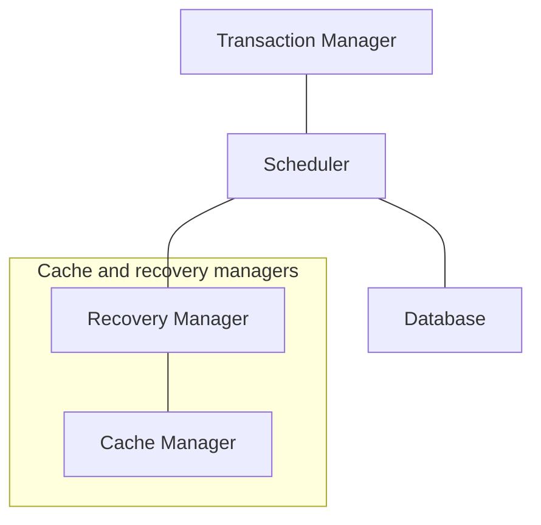
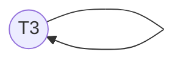
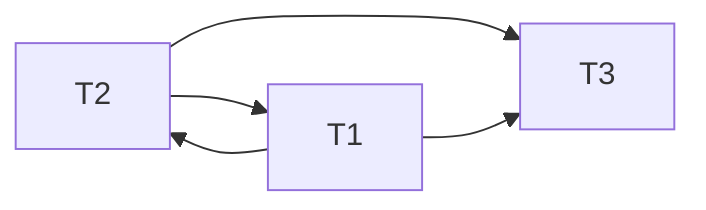
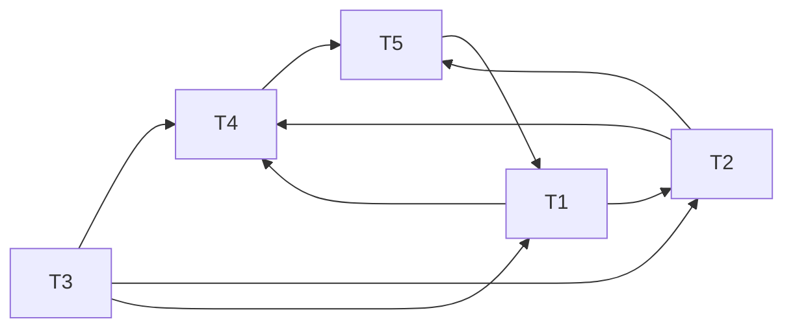

# Transaction Management

The concept of *transaction* provides a mechanism for describing logical units of database processing. **Transaction management** deals with systems with large databases and many concurrent users executing various database transactions.

Database system contains following components:



## Concurrency Control



### Transaction Manager

Transactions interact with DBMS through Transaction manager. It receives database and transaction operation and forwards them to scheduler. Depending on concurrency control and recovery algorithms used, the transaction manager may perform additional functions.

### Scheduler

Responsilbe for determining when to order a transaction's operations:

* Read
* Write
* Commit
* Abort

Scheduler takes the operation and decides to:

* **Execute it**: submit to the data manager for processing
* **Reject it**: refuse the operation for some reason therefore aborting the operation
* **Delay it**: the operation by placing it on the queue until it can be safely submitted - this may block the executing transaction

### Recovery Manager

Responsible for ensuring that only the effects of committed transactions affect the database and that none of the effects of aborted (non-committed) ones do. It's designed to be resilient to failures, such as:

* System failures
* Transaction failures
    * Deadlocks
    * Livelocks
* Catastrophic failures
    * Keep consistent with archive

### Cache Manager

Cache manager works in conjunction with recovery manager. It's responsible for moving data between volatile and stable storages. Database cache is volatile storage set aside for holding parts of the database. Two operations are supported:

* Fetch(x): retreives x from stable storage and places a copy in volatile storage
* Flush(x): transfers x from volatile to stable storage

The cache manager also responsible for ensuring that space is made available when a fetch is issued on a full cache (page replacement algorithms are used here).

## Transactions

A transaction $T_i$ is a partial order $T_i = (\Sigma_i, \prec_i)$ where:

* $\Sigma_i$ is the domain consisting of the operations and a termination condition
* $\prec_i$ is a transitive and irreflexive binary relationship indicating execution order

Such that:

1. $\Sigma_i$ is composed of the read *and* write operations and **either a commit or abort operations**.
2. $\prec_i$ specifies if an operation **reads and writes** a value, the read is performed first.
3. The commit or abort is performed after all other operations.

**Informal definition**: transactions are a collection of **read and write operations**, followed by either a commit or abort operation. The way the transactions are formed is not relevant. All that we care about is the way they are actually executed. We assume that the transactions are well formed.

### Transaction Example

Consider the following transaction

```
Transaction: read(x)
             read(y)
             x += y
             write(x)
             write(z)
             commit;
```

We're only interested in the read and write operations.

To make this entirely correct, we would need to include the partial order

$$
\begin{aligned}
\{r(x) \prec & r(y), r(x) \prec w(x), r(x) \prec w(z), r(x)0 \prec c, \\
           & r(y) \prec w(x), r(y) \prec w(z), r(y) \prec c \\
           &          w(x) \prec w(z), w(x) \prec c, \\
           &                   w(z) \prec c \}
\end{aligned}
$$

However, the full partial order can be ignored, and assume the order indicates suitable timelines as follows

$$
r(x) \prec r(y) \prec w(x) \prec w(z)
$$

## Schedule

The ordering a transation (or set of transactions) execcutes is called a schedule (or history).

Consider the following two transactions:

$$
\begin{array} {c c c c}
T_1: & r_1(x); & T_2: & r_2(y); \\
     & w_1(x); &      & w_2(y); \\
     & c_1;    &      & c_2;  
\end{array}
$$

The ordering of the individual transactions must always be scheduled as indicated by the transaction operation order.

Consider the following possible schedules:

$$
\begin{array}{ c c c c c c }
S_1: & r_1(x); & S_2: & r_2(y); & S_3: & r_1(x) \\
      & w_1(x); &      & w_2(y); &      & r_2(y) \\
      & r_2(y); &      & r_1(x)  &      & w_2(y) \\
      & w_2(y); &      & w_1(x)  &      & w_1(x) \\
      & c_1;    &      & c_2;    &      & c_1    \\
      & c_2;    &      & c_1;    &      & c_2
\end{array}
$$

> 3rd schedude: nothing wrong happened

### Lost Update Problem

**Lost Update** occurs when two transaction that access the same database items have their operations interleaved in a way that makes the value of some database items incorrect.

Assume that the database contains data item $\{x, y, z\}$ with initial values $x = 100, y = 200, z = 300$. Two valid transactions:

$$
\begin{array}{c c c c}
T_1: & r_1(x);  & T_2: & r_2(x); \\
     & x += 10; &      & x *= 10;      \\
     & w_1(x);  &      & w_2(x);      \\
     & c_1;    &      & c_2;    
\end{array}
$$

Consider the following possible schedule:

$$
\begin{array} {c c c c}
S_1: & r_2(x);   & 100  & 100 \\
     & x *= 10;  &      & 1000 \\
     & r_1(x);   & 100  & 1000 \\ 
     & x += 10;  &      & 1010 \\
     & w_1(x);   & 110  & 1010 \\
     & w_2(x);   & 1000 & 1010
\end{array}
$$

Lost update **leaves the database in an inconsistent state**.

### Inconsistent Read Problem

**Inconsistent Read** occurs when one transaction updates a database item and then the transaction fails for some reason. Meanwhile the updated item is accessed (read) by another transaction before it is changed back to its original value.

* $T_1: r_1(x); x++; w_1(x); c_1;$
* $T_2: r_2(x); x+=10; w_2(x); c_2;$

Consider the following schedule

$$
\begin{array}{c c c c}
S_1: & r_1(x) & 100 &     \\
     & x++    &     & 101 \\
     & r_2(x) & 100 & 101 \\
     & x+= 10 & 110 & 111 \\
     & w_2(x) &     & 110 \\
     & c_2    &     &     \\
     & w_1(x) &     & 101 \\
     & c_1    &     &
\end{array}
$$

Reading from inconsistent database on the next read.

### Phantom Problem

Occurs when a transaction is adding records to the database while other prooccessing is underway. While the other processing is occuring another transaction inserts another record in the database, the result the fiirst transaction's sum is now not consistent with the actual values in the database. Phantom problem can occurr when adding or deleting records.

## A Transaction's Semantic

Determining precisely what a transaction is supposed to do is difficult. We assume that **transactions are well formed and its semantica are fully captured by its syntax**.

### Execution Orders

A transaction's execution is correct if and only if it moves the database from one consistent state to another (move from one committed state to another). Assumption is that transaction are well-formed.

### Serial Execution

Any set of transactions that completely follow each other will produce a correct execution no matter what the actual order is.

$$
\begin{array}{c c c c}
T_1: & r_1(x) & T_2: & r_2(y) \\
     & w_1(x) &      & w_2(x) \\
     & c_1    &        c_2    
\end{array}
$$

With following schedules

$$
\begin{array}{c c c c c c}
S_1: & r_1(x) & S_2: & r_2(y) & S_3: & r_1(y) \\
     & w_1(x) &      & w_2(y) &      & r_2(y) \\
     & r_2(y) &      & r_1(x) &      & w_2(y) \\
     & w_2(y) &      & w_1(x) &      & w_1(x) \\
     & c_1    &      & c_2    &      & c_2    \\
     & c_2    &      & c_1    &      & c_1 
\end{array}
$$

### Serializable Executions

An execution is **serializable** if the effects on the database are the same as some serial execution. Since **serial executions are correct**, and since each serializable execution has the same effect as a serial execution, **serializable executions are correct** as well. Executions, which result in lost updates and inconsistent retrievals are **not serializable**.

#### Conflict Serializability

A database history $H = \{T_1, T_2, \dots, T_n\}$ is **serial** if and only if
$$
(\exists p_i \in T_i, \exists q_i \in T_j \ \text{such that}\ p_i \prec q_j \vdash (\forall r_i \in T_i, \forall s_j \in T_j, r_i \prec s_j))
$$

For any operations, if there's a conflict among them, the order persists.

**Equivalence** - Two histories are **conflict equivalent** if they are defined over the same set of transactions with identical operation and they order conflicting operations in non-aborted transaction in the same way.

**Serializable** - a history $H$ is serializable if and only if it is equivalent to a serial history.

### Serialization Graph

Searching through histories to determine if they leave the database in a consistent state is not an ideal approach. A tool called a **serialization graph** (or precedence grpah) is extremely helpful. It is defined foemally as:

* $G(V, E)$, where $V$ is a set of vertices one for each transaction. $E$ is the set of directed edges constructed by drawing an edge between two versices when

- [ ] TODO

#### Example
1. Example 1

- [ ] TODO



Because of transitivity, we know that $T_1$ and $T_3$ conflict. If $T_2$ were removed, they wouldn't conflict.

2. Consider the following history: &S: r_1(x); r_2(x); w_2(x); w_1(x);&

### Serializability Theorem

A history $H$ is serializable if and only if its serialization graph is acyclic.
- [ ] TODO

#### Serializability Test

* **Input**: A history $H$ for some set of transactions
* **Output**: The corresponding serial schedule for $H$ (if it exists)

**Steps**:

1. Create a serialization graph $G$
    * From the nodes for $\{T_1, T_2, \dots, T_k\}$
    * Insert the edges as follows
      1. Select a $w_i(x)$
      2. If $\some r_j(x)$ which immediately follows it $(i \neq j)$, then insert an edge $T_i \to T_j$
      3. [ ] TODO
2. If $G$ is acyclic, then there exists a topological sort of the transactions as follows
    * $S_{sched} \gets \empty$
    * Find a $T_i$ such that there are no edges entering $T_i$ (this is the next transaction in the serial schedule). **else if** no $T_i$ exists, there is no serial schedule, **exit**.
    * **Remove** $T_i$ from the graph and its corresponding edges

- [ ] TODO

```
1    2    3
r(y)    
          r(w)
     r(y)
w(y)
```

1. Excercise 1


2. Excercise 2
$S = r_1(x) r_3(x) w_3(y) w_2(x) r_4(y) c_2 w_4(x) c_4 r_5(x) c_3 w_5(z) c_5 w_1(x) c_1$



> non-serializable

commits can matter in execution
