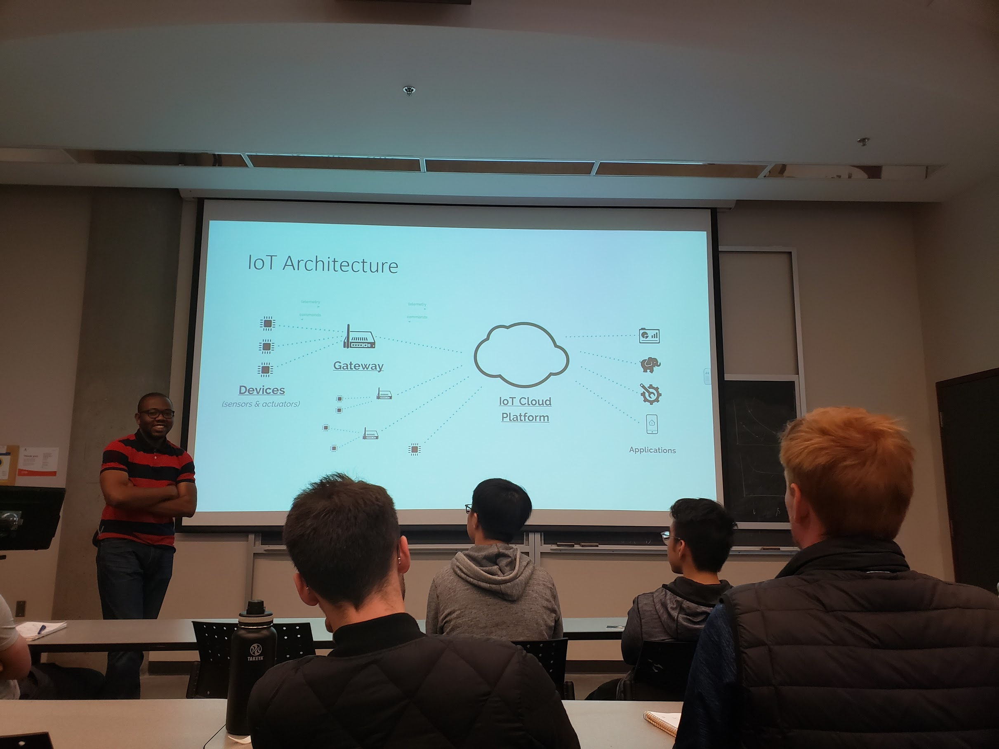

## What is IoT

The Internet of Things is the network of physical objects ("things") that are embedded with sensors, software, and other technologies for the purpose of connecting and exchanging data with other devices and systems over the Internet.

## Applications of IoT

- Wearables
- Smart homes
- Smart cities
- Energy management in power grids
- Agriculture
  - Uniquely detect and track animals

## IoT Architecture

**Devices** can be any device connected to the Internet. An animal or a human can also be a thing, given that a living creature has a smart implant (e.g. a chip). **Actuator** is a smart thing that does something, for example, a smart lightbulb, controlled over the Internet. IoT **Gateway** (or Controller) aggregates data from the things and then sends it over to the cloud. **IoT Cloud Platform** stores and processes the collected data. In IoT world, data is collected very quickly, IoT devices collect large amount of data over small time span. After processing the data, it could be presented to the **applications** and visualize that data. Another example is to send some command to the application _based_ on the collected data.

## IoT Data Management Problems

1. **Security**. Once the devices are connected to the Internet, you've exposed yourself to any possible cyber attack.
2. **Data Storage**. Data storage is a significant problem, because IoT devices collect a lot of data.
3. **Privacy**.
4. Ensuring data security and accountability for data transferred to third parties. Sometimes, third parties are envolved, therefore how do we protect data from thirt parties?

### Security

An IoT device can be attacked in one way or another, since it's connected to the Internet. Another possible attack is a MITM attack. Unsolicited data access is possible as well.

### Data Storage

IoT devices scale very fast, therefore scalability is the problem. How our data storage and network can adopt and be able to allow the big data flowing through it fast enough?

After the data is collected, we have some data analysis going on. Performance is the key management in terms of data management.

Lastly, availability is the problem. IoT devices need to be available 24/7 in order to store and process the incoming data.

### Privacy

One key privacy problem comes with data mining. The problem is not with mining itself, but with the way that data might be processed.

### Data Security and Accountability

Companies need to be accountable for possible data breaches, therefore we need to monitor the data flow between companies.

### Possible Solutions

|             Problem              |                                 Solution                                  |
| :------------------------------: | :-----------------------------------------------------------------------: |
|             Security             |                       Cryptography, access control                        |
|           Data Storage           |                              NoSQL databases                              |
|             Privacy              | Privacy policy, user's preferences, privacy-preserving data mining (PPDM) |
| Data security and accountability |                          Blockchains (possibly)                           |

Using NoSQL is more benefitial, because the Big Data is not very structured, when the relational databases require enforced structure.

## Overview of Blockchains

Blockchain is just overhyped linked list. Blockchain technology uses data transaction processing of the form **SALT** - Sequential, Agreed-on, Ledgered, and Tamper Resistant. Out of many views on blockchains and corresponding definitions that exists;

- A blockchain is a **peer-to-peer** protocol for trustless execution and recording of transactions secured by assymetric cryptography in a consistent and immutable chain of blocks.
- A blockchain is a **shared append-only distributed** database with full replication and a cryptographic transaction permissing model

### Ok, Why?

No one knows.
