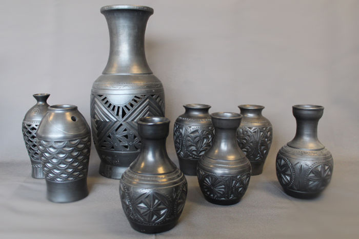

## Geographical features

China is located in East Asia. To the east of China, there's South China sea and the Pacific Ocean. In the west, China is bounded by the mountains, the Himalayas, and by the Taklamakan Desert. In the north, there's Gobi Desert, by the Yellow (Huang) River.

---

China proper, Inner China was a term used by Western writers on the Manchu Qing dynasty to express a distinction between the core and frontier regions of China.

Sub-regions of China proper:

### 1. North China Plain

Vast expensive farmlands. Very easy to travel. It used to be warm, wet region, but after years of flying, it became dry. It is here, where the first Chinese communities originated. Today, the north China Plain is where most of the people are.

### 2. South China

Located South of Yahtzee (?) River. South china is very different from North China Plain. Region is mountaneous in contrast to North China. The lowlands along the Yahtzee (?) river divided into farmlands and settlements.

### 3. Sichuan Basin

Important region of China. The homeland of pandas. Sichuan is flat area and very good farmland. In ancient times it was hard to get there. The culture in Sichuan Basin is different from the other parts due to its isolated location. During the war time, the mountains protect people.

### 4. North West

Harsh weather, high mountains, deeply cut valleys. The area is not very populated. In the ancient times, criminals would be sent there as punishment.

---

Chinese describe people living outside of China proper as Di, Yi, Man, Rong (N, E, S, W respectively). Basically each term means "barbarian". Chinese see themselves as civilized because of writing, unlike those "barbarians". There's very little information about the development of writing system.

China proper is defined by the two rivers: Yellow River and Yangtze River. Both of the rivers flow from East to West.

### Yellow River

Flows from East to West, flowing into the sea. Yellow river is called "yellow" because lots of the sud (?). Yellow river mouth caused lots of floods, therefore controlling the river means dealing with a lot of natural disasters. However, in the Tibet, the origin of Yellow River, the water is clear, so the river isn't always actually yellow.

> Need to know location and the shape for the tests.

### Yangtze (Chang-Jiang) River

In Chinese called Chang-Jiang, "long" river. Also flows from East to West. The scenery along the river has changed due to the construction of dam(s) (?).

> (Assuming) Need to know location and the shape for the tests.

## Chinese Population

China is a multi-ethnic country. **The Han People** is the majority of chinese people. Other 55 ethnic groups - 5% of the population.

---

## Early Chinese Civilization

Early human ancestors are found in China. For example, **Peking Man**. The fossils of the Peking Man were found in the caves near the Beijing (Peking). Similar fossils were founds in far West of China. 40,000 yrs ago, Homo Sapiens fossils were found in China, showing there were people coming out of China as well (?).

About 12,000 years ago, important development takes place in Ancient China. This development is domestication of grain - **rice**. (Not all chineese/asians like rice, north ppl prefer flour food to rice.) Earliest evidence of rice farming could be found in **Jiangsu province**.

The domestication of rice brings shift from hunting to cultivation of crops that keeps people located in the same spot - **emergence of villages**. Emerges of villages marks the beginning of new lifestyle - sedimentary lifestyle, ppl stay in villages for years.

Early civilization lives along the river valleys, specifically along the Yellow River valley.

### Yellow River Settlements

This civilization can be specified by the pottery. How the pottery was made, we can tell the history of the group of people that lived there. They provide us with clues about such early civilization.

### Yangshao Culture

Located in the (north-)west, primarily Shannxi and Gansu provice. It is dated from around 5000 BC to 3000 BC.

Yangshao villages and dwellings were built by digging a rounded rectangular pit a few feet deep. Judging by the graves, there was some hierarchy in the culture. Wealthy people were buried with their possessions. Emerging society has women leadership.

### Longshan Culture

Literally means Dragon Mountain. Located in the middle and lower Yellow River valley areas of northern China from about 3000 to 1900 BC, what is now Shandong province. Longshan culture is sometimes referred to as **Black Pottery Culture**.

The pottery in Longshan isn't as decorated as in Yangshao.

Longshan culture dominated the North of Yellow river. (?)

### Liangzhu Culture

Located in **Jiangsu province**, in the Yangtze River Delta of China, around 2500 BC.

### Sanxingdui Culture

Located in **Sichuan Province**, around 1600-221 BC.

> "The discovery at Sanxingdui, as well as other discoveries such as the Xingan tombs in Jiangxi, challenges the traditional narrative of Chinese civilization spreading from the central plain of the Yellow River, and Chinese archaeologists have begun to speak of multiple centers of innovation jointly ancestral to Chinese civilization." [wiki/Sanxingdui](https://en.wikipedia.org/wiki/Sanxingdui)
